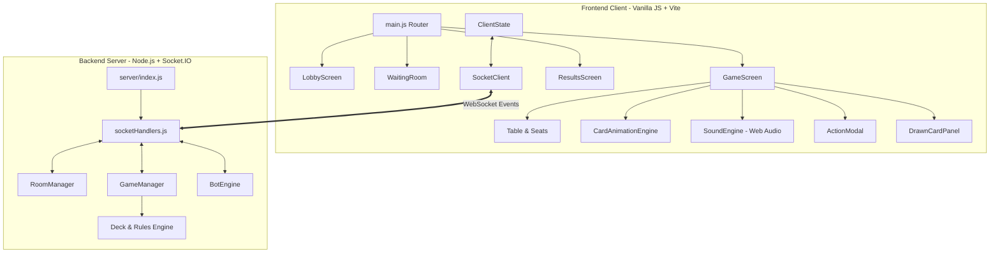

# MIND F*CK — Architecture & Complete Source Code

This document provides a comprehensive technical breakdown of the system architecture, design patterns, state machines, networking protocols, animation/sound engines, followed by the complete and exact source code of every file in the project.

---

## Table of Contents
1. [System Architecture Overview](#1-system-architecture-overview)
2. [Directory Structure](#2-directory-structure)
3. [Game State Machine & Lifecycle](#3-game-state-machine--lifecycle)
4. [WebSocket Networking Protocol](#4-websocket-networking-protocol)
5. [Action Card Mechanics & Resolution](#5-action-card-mechanics--resolution)
6. [Trigonometric Table Layout & User-Centric Perspective](#6-trigonometric-table-layout--user-centric-perspective)
7. [Procedural Audio Engine](#7-procedural-audio-engine)
8. [3D Flight & Action Animation Engine](#8-3d-flight--action-animation-engine)
9. [AI Bot Strategy Engine](#9-ai-bot-strategy-engine)
10. [Complete Source Code Listing](#10-complete-source-code-listing)

---

## 1. System Architecture Overview

**MIND F*CK** (formerly Undercut) is a real-time multiplayer strategic memory card game designed for 2 to 10 players with full mobile responsiveness, AI bot fill, multi-round scoring, procedural Web Audio effects, and 3D card animation flight physics.

### Tech Stack
- **Client**: Pure Vanilla ES6+ JavaScript, Modular Component Architecture, Vite Dev Server & Bundler.
- **Server**: Node.js + Express + Socket.IO WebSocket Engine.
- **Styling**: Vanilla CSS3 Custom Properties (Design Tokens), Glassmorphism, CSS 3D Transforms (`perspective`, `rotateY`, `transform-style: preserve-3d`), Spring Transitions.
- **Audio**: Web Audio API Procedural Synthesizer (0 external audio asset dependencies).
- **Network**: Socket.IO Bidirectional Event Streams with room-based multiplexing and spectator broadcasting.



---

## 2. Directory Structure

```
card-game/
├── index.html                   # HTML5 Entry point & CSS imports
├── package.json                 # Dependencies & scripts (express, socket.io, vite)
├── vite.config.js               # Vite config with LAN host binding & proxy
├── server/                      # Node.js + Socket.IO backend
│   ├── index.js                 # Server entry point & Express setup
│   ├── GameManager.js           # Authoritative rules & game state machine
│   ├── RoomManager.js           # Room code generation, lobby & spectator management
│   ├── socketHandlers.js        # Socket.IO event controllers & broadcasts
│   ├── Deck.js                  # 52-card deck generator, shuffling & card value rules
│   └── BotEngine.js             # AI bot heuristics, decision tree & simulated latency
├── src/                         # Frontend client application
│   ├── main.js                  # Client entry point & SPA screen router
│   ├── game/                    # Client game engine modules
│   │   ├── ClientState.js       # Reactive client-side game state store
│   │   ├── SocketClient.js      # Socket.IO connection manager & wrapper
│   │   ├── SoundEngine.js       # Procedural Web Audio API sound synthesizer
│   │   ├── CardUtils.js         # Card formatting & value helpers
│   │   └── CardAnimationEngine.js # 3D card flight, arcs, auras & slot highlights
│   ├── components/              # Modular DOM UI components
│   │   ├── Table.js             # Trigonometric round table container & pile manager
│   │   ├── Seat.js              # Player seat with 3-card fan & slot targeting
│   │   ├── Card.js              # 3D flippable card DOM generator
│   │   ├── DrawPile.js          # Stacked draw pile component
│   │   ├── DiscardPile.js       # Discard pile with top-card display
│   │   ├── DrawnCardPanel.js    # Modal action panel for active player turn
│   │   ├── ActionModal.js       # Modals for King, Queen, Jack, Seven action choices
│   │   └── Toast.js             # Non-intrusive floating toast notifications
│   ├── screens/                 # Full-page screens
│   │   ├── LobbyScreen.js       # Create/Join game with 1-tap paste button
│   │   ├── WaitingRoom.js       # Pre-game lobby with bot controls & invite links
│   │   ├── GameScreen.js        # Main game orchestration, HUD & socket handlers
│   │   └── ResultsScreen.js     # Round/Match scoreboard & play-again workflow
│   └── styles/                  # Modular Vanilla CSS
│       ├── index.css            # Design tokens, typography & global reset
│       ├── table.css            # Round green velvet table & responsive seat layout
│       ├── cards.css            # 3D card faces, back patterns & fans
│       └── animations.css       # Keyframes, floating badges, trade arcs & vortexes
└── public/
    └── favicon.svg              # Card suit SVG favicon
```

---

## 3. Game State Machine & Lifecycle

The authoritative state resides in `server/GameManager.js`. A single game transitions through four primary phases:

1. **`waiting`**: Players join via room code or link. Host can add bots and configure match rounds.
2. **`peek_phase`**: 3 cards are dealt to each player. Players view their dealt cards and signal readiness via `peek-done` (bots automatically signal done). When all players are ready, the phase advances to `playing`.
3. **`playing`**: Players take turns drawing from the deck. When drawing, they can either:
   - **Swap** with any of their 3 card slots (the displaced card goes to discard).
   - **Discard** the drawn card directly.
   - **Play Action Card immediately** (if King, Queen, Jack, or Seven).
   - **Bank Action Card** into a hand slot to trigger when displaced later.
4. **`round_over`**: Triggered when the draw pile is depleted. All cards are revealed, hand totals are scored (lowest total wins). In multi-round matches, cumulative scores are tracked across rounds.

---

## 4. WebSocket Networking Protocol

### Client-to-Server Events
| Event | Payload | Purpose |
|---|---|---|
| `create-room` | `{ playerName, maxPlayers, totalRounds }` | Create a new room with custom settings |
| `join-room` | `{ roomCode, playerName, playerId?, reconnectToken? }` | Join room as player or spectator |
| `reconnect-room` | `{ roomCode, playerId, reconnectToken? }` | Reconnect to existing session with security token |
| `add-bot` | `null` | Host adds an AI bot to empty seat |
| `remove-bot` | `{ botId }` | Host removes an AI bot |
| `start-game` | `null` | Host begins game (deals cards) |
| `peek-done` | `null` | Player signals completion of initial card peek |
| `draw-card` | `null` | Active player draws from deck |
| `swap-card` | `{ slotIndex }` | Active player swaps drawn card into slot 0, 1, or 2 |
| `discard-drawn` | `null` | Active player discards drawn card |
| `play-action-immediately` | `null` | Active player activates drawn action card |
| `resolve-peek-own` | `null` | King resolution (peek own cards) |
| `resolve-peek-opponent` | `{ targetPlayerId }` | Queen resolution (peek opponent cards) |
| `resolve-blind-trade` | `{ mySlot, targetPlayerId, targetSlot }` | Jack resolution (blind swap slots) |
| `resolve-scramble` | `{ targetPlayerId }` | Seven resolution (shuffle opponent cards) |
| `resolve-triggered-action` | `{ actionType, targetPlayerId, mySlot, targetSlot }` | Displaced action card resolution |
| `start-next-round` | `null` | Host starts next round in multi-round match |

### Server-to-Client Broadcasts
| Event | Payload | Purpose |
|---|---|---|
| `game-started` | `{ phase, myCards, playerOrder, players, drawPileCount, roundNumber, totalRounds, currentPlayerId }` | Signals game start & initial deal |
| `peek-phase-complete` | `{ currentPlayerId }` | Signals end of peek phase |
| `turn-change` | `{ currentPlayerId, drawPileCount }` | Advances active turn |
| `player-drew-card` | `{ playerId, drawPileCount }` | Broadcasts draw action |
| `draw-pile-update` | `{ count }` | Broadcasts updated draw pile card count |
| `player-swapped` | `{ playerId, slotIndex, discardedCard }` | Broadcasts slot swap & discarded card |
| `player-discarded` | `{ playerId, card }` | Broadcasts direct discard |
| `player-played-action` | `{ playerId, actionType }` | Triggers broadcast action banner & FX |
| `you-were-peeked` | `{ byPlayerId }` | Notifies target player of Queen peek |
| `blind-trade-complete` | `{ playerId, mySlot, targetPlayerId, targetSlot }` | Dual-slot trade animation & update |
| `cards-scrambled` | `{ playerId, targetPlayerId }` | Seven scramble animation & memory wipe |
| `turn-timer-warning` | `{ playerId, playerName, seconds }` | Warning for disconnected player grace period |
| `player-skipped` | `{ playerId, playerName, reason }` | Broadcasts turn auto-skip on timeout/disconnect |
| `spectator-count-update` | `{ count }` | Broadcasts current spectator viewer count |
| `round-over` | `{ results }` | Final round scores & winner reveal |
| `spectator-game-sync` | `{ phase, roundNumber, totalRounds, players, drawPileCount, discardPile, currentPlayerId }` | Game state sync for spectators |

---

## 5. Action Card Mechanics & Resolution

| Card | Action | Hand Total Value (Lowest Wins) | Effect |
|---|---|---|---|
| **King (K)** | `peek-own` | 13 | Secretly view all 3 of your own cards |
| **Queen (Q)** | `peek-opponent` | 12 | Secretly view all 3 cards of any chosen opponent |
| **Jack (J)** | `blind-trade` | 11 | Swap any 1 of your cards with any 1 of an opponent's cards without looking |
| **Seven (7)** | `scramble` | 7 | Randomly shuffle the 3 cards of any chosen opponent (wiping memory) |
| **Ace (A)** | Number | 1 | Lowest regular card (ideal to keep) |
| **2 - 6, 8 - 10** | Number | Face value | Regular number cards (lower is better) |

*Note: In MIND F*CK, the lowest hand total wins the round. The values above count towards end-of-round penalty totals.*

---

## 6. Trigonometric Table Layout & User-Centric Perspective

The table UI calculates seat positions dynamically around a circular/stadium felt table using polar-to-Cartesian trigonometry in `src/components/Table.js`:

```javascript
// Current user is always index 0 (positioned at 6 o'clock, bottom of screen)
const relativeIndex = (index - myIndex + numPlayers) % numPlayers;
const angle = (Math.PI / 2) + (2 * Math.PI * relativeIndex) / numPlayers;
const x = 50 + radiusPct * Math.cos(angle);
const y = 50 + radiusPct * Math.sin(angle);
```

---

## 7. Procedural Audio Engine

Implemented in `src/game/SoundEngine.js` using Web Audio API synthesis (0 external audio files):
- **Card Flip / Deal**: High-frequency bandpass-filtered noise burst with exponential decay.
- **Turn Notification**: Sine wave chord arpeggio (`C5 -> E5`).
- **Action Card Activation**: Deep brass / orchestral impact using saw oscillators + lowpass sweep.
- **Trade Whoosh**: Frequency-modulated dual saw sweep across stereophonic space.
- **Scramble Shuffle**: Rapid burst sequence of filtered clicks simulating cards ruffling.
- **Round Win / Lose**: Major vs Minor triadic fanfares.

---

## 8. 3D Flight & Action Animation Engine

Implemented in `src/game/CardAnimationEngine.js` & `src/styles/animations.css`:
- **Slot-Targeted Swaps**: Displaced cards launch directly from the exact slot index (`#1 Left`, `#2 Mid`, `#3 Right`), with `.slot-card-replaced` golden pop and floating badges.
- **Jack Arcing Dual Spirits**: Spirits launch directly from source slot and target slot, arcing over/under with scaling and rotation before landing.
- **Queen Holographic Beam**: Rotated CSS beam calculating Euclidean distance between players with pulsating holographic scanner overlay.
- **Seven Scramble Vortex**: 3D wild physical shuffle keyframes animating all 3 cards swapping positions.

---

## 9. AI Bot Strategy Engine

Implemented in `server/BotEngine.js`:
- **Fair Memory Model**: Maintains memory only of its own dealt cards and cards revealed via actions (no omniscient view of human hands).
- **Value Optimization**: Evaluates drawn cards against memory of current slot values.
- **Action Card Heuristics**: Evaluates whether to play immediately or bank for displaced triggers.
- **Strategic Targeting**: Selects trade and peek targets based on observed score totals and unknown cards.
- **Scramble Memory Wiping**: Wipes targeted player's memory model when scrambled.
- **Simulated Latency**: Natural thinking delays (1.0s - 2.2s) with typing/drawing simulation.

---

## 10. Complete Source Code Listing

### `package.json`

```json
{
  "name": "mind-fuck-card-game",
  "version": "1.0.0",
  "description": "MIND F*CK — Online multiplayer card game",
  "type": "module",
  "scripts": {
    "dev": "concurrently \"nodemon --watch server server/index.js\" \"vite\"",
    "dev:server": "nodemon --watch server server/index.js",
    "dev:client": "vite",
    "build": "vite build",
    "build:start": "vite build && node server/index.js",
    "start": "node server/index.js",
    "test": "node --test server/tests/*.test.js"
  },
  "dependencies": {
    "express": "^4.18.2",
    "socket.io": "^4.7.4",
    "socket.io-client": "^4.7.4",
    "uuid": "^9.0.0"
  },
  "devDependencies": {
    "vite": "^5.4.0",
    "concurrently": "^8.2.2",
    "nodemon": "^3.1.0"
  }
}
```

---

### `vite.config.js`

```javascript
import { defineConfig } from 'vite';

export default defineConfig({
  root: '.',
  publicDir: 'public',
  server: {
    host: true,
    port: 3000,
    strictPort: true,
    proxy: {
      '/socket.io': {
        target: 'http://localhost:3002',
        ws: true,
        changeOrigin: true
      },
      '/api': {
        target: 'http://localhost:3002',
        changeOrigin: true
      }
    }
  },
  build: {
    outDir: 'dist',
    emptyOutDir: true
  }
});
```

---

### `.gitignore`

```text
node_modules/
dist/
.DS_Store
*.log
.env
.env.local
.env.*.local
```

---

### `.env.example`

```shell
# Server Port
PORT=3002

# Allowed Client Origin for CORS (comma-separated for multiple origins)
# Default: http://localhost:3000
CLIENT_ORIGIN=http://localhost:3000
```

---

### `index.html`

```html
<!DOCTYPE html>
<html lang="en">
<head>
  <meta charset="UTF-8" />
  <meta name="viewport" content="width=device-width, initial-scale=1.0" />
  <meta name="description" content="MIND F*CK — A strategic multiplayer card game. Play online with friends around a virtual green velvet table." />
  <title>MIND F*CK — Card Game</title>
  <link rel="icon" href="/favicon.svg" type="image/svg+xml" />
  <link rel="preconnect" href="https://fonts.googleapis.com" />
  <link rel="preconnect" href="https://fonts.gstatic.com" crossorigin />
  <link href="https://fonts.googleapis.com/css2?family=Outfit:wght@400;500;600;700;800&family=Inter:wght@400;500;600&display=swap" rel="stylesheet" />
  <link rel="stylesheet" href="/src/styles/index.css" />
  <link rel="stylesheet" href="/src/styles/animations.css" />
  <link rel="stylesheet" href="/src/styles/cards.css" />
  <link rel="stylesheet" href="/src/styles/table.css" />
</head>
<body>
  <div id="app"></div>
  <div id="toast-container"></div>
  <div id="modal-overlay"></div>
  <script type="module" src="/src/main.js"></script>
</body>
</html>
```

---

### `public/favicon.svg`

```xml
<svg xmlns="http://www.w3.org/2000/svg" viewBox="0 0 32 32" fill="none">
  <rect width="32" height="32" rx="6" fill="#1a1a2e"/>
  <rect x="3" y="3" width="26" height="26" rx="4" fill="#16213e" stroke="#d4a843" stroke-width="1.5"/>
  <text x="16" y="21" text-anchor="middle" font-family="serif" font-weight="bold" font-size="12" fill="#d4a843" letter-spacing="0.5">MF</text>
</svg>
```

---

### `server/index.js`

```javascript
// server/index.js — Express + Socket.IO entry point

import express from 'express';
import { createServer } from 'http';
import { Server } from 'socket.io';
import { fileURLToPath } from 'url';
import { dirname, join } from 'path';
import RoomManager from './RoomManager.js';
import GameManager from './GameManager.js';
import setupSocketHandlers from './socketHandlers.js';

const __filename = fileURLToPath(import.meta.url);
const __dirname = dirname(__filename);

const app = express();
const httpServer = createServer(app);

const allowedOrigins = process.env.CLIENT_ORIGIN
  ? process.env.CLIENT_ORIGIN.split(',').map(s => s.trim()).filter(Boolean)
  : ['http://localhost:3000'];

const io = new Server(httpServer, {
  cors: {
    origin: allowedOrigins,
    methods: ['GET', 'POST']
  }
});

// Managers
const roomManager = new RoomManager();
const gameManager = new GameManager();

// Per-socket event rate limiting middleware
io.use((socket, next) => {
  const eventTimestamps = [];
  const MAX_EVENTS_PER_SECOND = 25;

  socket.use(([event, ...args], packetNext) => {
    const now = Date.now();
    while (eventTimestamps.length > 0 && eventTimestamps[0] <= now - 1000) {
      eventTimestamps.shift();
    }
    if (eventTimestamps.length >= MAX_EVENTS_PER_SECOND) {
      console.warn(`[Security] Rate limit exceeded on socket ${socket.id} (event: ${event})`);
      return packetNext(new Error('Rate limit exceeded. Please slow down.'));
    }
    eventTimestamps.push(now);
    packetNext();
  });
  next();
});

// API routes
app.use(express.json());

app.get('/health', (req, res) => {
  res.json({
    status: 'ok',
    uptime: process.uptime(),
    activeRooms: roomManager.rooms.size,
    timestamp: Date.now()
  });
});

app.get('/api/room/:code/status', (req, res) => {
  const room = roomManager.getRoom(req.params.code);
  if (!room) {
    return res.status(404).json({ error: 'Room not found' });
  }
  res.json({
    code: room.code,
    status: room.status,
    playerCount: room.players.length,
    maxPlayers: room.maxPlayers
  });
});

// Serve static files in production
const distPath = join(__dirname, '..', 'dist');
app.use(express.static(distPath));
app.get('*', (req, res) => {
  res.sendFile(join(distPath, 'index.html'));
});

// Socket handlers
setupSocketHandlers(io, roomManager, gameManager);

// Start server
const PORT = process.env.PORT || 3002;
httpServer.listen(PORT, () => {
  console.log(`\n  🃏 MIND F*CK Server running on http://localhost:${PORT}\n`);
});
```

---

### `server/GameManager.js`

```javascript
// server/GameManager.js — Game state machine & Undercut rules engine

import { createDeck, shuffle, draw, isActionCard, getActionType, getCardValue } from './Deck.js';

/**
 * Game phases:
 *  PEEK_PHASE  — Players look at their 3 dealt cards
 *  PLAYING     — Active gameplay, turns rotate clockwise
 *  ROUND_OVER  — Draw pile exhausted, reveal & score
 */
const PHASE = {
  PEEK_PHASE: 'peek_phase',
  PLAYING: 'playing',
  ROUND_OVER: 'round_over'
};

class GameManager {
  constructor() {
    /** @type {Map<string, GameState>} roomCode -> gameState */
    this.games = new Map();
  }

  /**
   * Private helper to build a shuffled deck and deal 3 cards to each player.
   * @param {object} room
   * @returns {{ deck: Array, hands: object }}
   * @private
   */
  _dealHands(room) {
    const numDecks = room.players.length >= 5 ? 2 : 1;
    const deck = shuffle(createDeck(numDecks));

    const hands = {};
    for (const player of room.players) {
      hands[player.id] = {
        cards: [deck.pop(), deck.pop(), deck.pop()],
        isBot: !!player.isBot
      };
    }
    return { deck, hands };
  }

  /**
   * Initialize a new game for a room.
   * @param {object} room — The room object from RoomManager
   * @returns {GameState}
   */
  startGame(room) {
    const { deck, hands } = this._dealHands(room);

    const state = {
      roomCode: room.code,
      phase: PHASE.PEEK_PHASE,
      drawPile: deck,
      discardPile: [],
      hands,
      playerOrder: room.players.map(p => p.id),
      currentPlayerIndex: 0,
      drawnCard: null,        // The card the current player has drawn (held in hand, not yet placed)
      drawnByPlayerId: null,  // Who drew it
      peeksDone: new Set(),   // Player IDs who have finished peeking
      pendingAction: null,    // { type, playerId, isTriggered } | null
      turnTimer: null,
      roundNumber: 1,
      totalRounds: room.totalRounds || 1,
      scores: {},  // playerId -> cumulative score across rounds
      roundHistory: [], // [{ roundNumber, results }]
      roundOverEmitted: false
    };

    // Initialize scores
    for (const player of room.players) {
      state.scores[player.id] = 0;
    }

    this.games.set(room.code, state);
    return state;
  }

  /**
   * Start next round in a multi-round match
   */
  startNextRound(room) {
    const game = this.games.get(room.code);
    if (!game) return null;

    const { deck, hands } = this._dealHands(room);

    if (game.turnTimer) {
      clearTimeout(game.turnTimer);
      game.turnTimer = null;
    }

    game.phase = PHASE.PEEK_PHASE;
    game.drawPile = deck;
    game.discardPile = [];
    game.hands = hands;
    game.currentPlayerIndex = 0;
    game.drawnCard = null;
    game.drawnByPlayerId = null;
    game.peeksDone = new Set();
    game.pendingAction = null;
    game.roundNumber += 1;
    game.roundOverEmitted = false;

    return game;
  }

  isMatchOver(roomCode) {
    const game = this.games.get(roomCode);
    if (!game) return true;
    return game.roundNumber >= game.totalRounds;
  }

  /**
   * Get game state for a room.
   */
  getGame(roomCode) {
    return this.games.get(roomCode) || null;
  }

  /**
   * Mark a player as done peeking.
   * @returns {boolean} true if all players have finished peeking
   */
  markPeekDone(roomCode, playerId) {
    const game = this.games.get(roomCode);
    if (!game || game.phase !== PHASE.PEEK_PHASE) return false;

    game.peeksDone.add(playerId);

    if (game.peeksDone.size >= game.playerOrder.length) {
      game.phase = PHASE.PLAYING;
      return true; // All peeked — game starts
    }
    return false;
  }

  /**
   * Get the current player's ID.
   */
  getCurrentPlayerId(roomCode) {
    const game = this.games.get(roomCode);
    if (!game) return null;
    return game.playerOrder[game.currentPlayerIndex];
  }

  /**
   * Draw a card from the draw pile.
   * @returns {{ card: object, pileCount: number } | null}
   */
  drawCard(roomCode, playerId) {
    const game = this.games.get(roomCode);
    if (!game || game.phase !== PHASE.PLAYING) return null;
    if (this.getCurrentPlayerId(roomCode) !== playerId) return null;
    if (game.drawnCard) return null; // Already holding a drawn card

    const card = draw(game.drawPile);
    if (!card) {
      // Draw pile exhausted — end round
      this._endRound(roomCode);
      return null;
    }

    game.drawnCard = card;
    game.drawnByPlayerId = playerId;

    return {
      card,
      pileCount: game.drawPile.length
    };
  }

  /**
   * Swap the drawn card into a hand slot.
   * For plain cards: must be lower than the slot card's value.
   * For action cards (banking): can go into any slot.
   * @returns {{ success: boolean, displaced?: object, actionTriggered?: string, error?: string }}
   */
  swapCard(roomCode, playerId, slotIndex) {
    const game = this.games.get(roomCode);
    if (!game || game.phase !== PHASE.PLAYING) return { success: false, error: 'Not in play phase' };
    if (game.drawnByPlayerId !== playerId) return { success: false, error: 'Not your drawn card' };
    if (!game.drawnCard) return { success: false, error: 'No card drawn' };
    if (slotIndex < 0 || slotIndex > 2) return { success: false, error: 'Invalid slot' };

    const hand = game.hands[playerId];
    const drawnCard = game.drawnCard;
    const slotCard = hand.cards[slotIndex];
    const isDrawnAction = isActionCard(drawnCard);

    // Validate swap rules
    if (!isDrawnAction) {
      // Plain card: must be lower than slot card
      if (drawnCard.value >= slotCard.value) {
        return { success: false, error: 'Drawn card must be lower than the card in that slot' };
      }
    }
    // Action cards can always be banked (swapped into any slot)

    // Perform the swap
    hand.cards[slotIndex] = drawnCard;

    // Discard the displaced card
    game.discardPile.push(slotCard);

    // Check if displaced card triggers an action
    let actionTriggered = null;
    if (isActionCard(slotCard)) {
      // The displaced action card triggers
      actionTriggered = getActionType(slotCard);
    }

    game.drawnCard = null;
    game.drawnByPlayerId = null;

    // If an action was triggered, set pendingAction; otherwise advance turn
    if (actionTriggered) {
      game.pendingAction = {
        type: actionTriggered,
        playerId,
        isTriggered: true
      };
    } else {
      game.pendingAction = null;
      this._advanceTurn(roomCode);
    }

    return {
      success: true,
      displaced: slotCard,
      actionTriggered,
      pileCount: game.drawPile.length
    };
  }

  /**
   * Discard the drawn card without swapping.
   */
  discardDrawn(roomCode, playerId) {
    const game = this.games.get(roomCode);
    if (!game || game.phase !== PHASE.PLAYING) return false;
    if (game.drawnByPlayerId !== playerId) return false;
    if (!game.drawnCard) return false;

    game.discardPile.push(game.drawnCard);
    game.drawnCard = null;
    game.drawnByPlayerId = null;
    game.pendingAction = null;

    this._advanceTurn(roomCode);
    return true;
  }

  /**
   * Play an action card immediately (drawn action card played without banking).
   * The action card is discarded after use.
   * @returns {{ success: boolean, error?: string }}
   */
  playActionImmediately(roomCode, playerId) {
    const game = this.games.get(roomCode);
    if (!game || game.phase !== PHASE.PLAYING) return { success: false, error: 'Not in play phase' };
    if (game.drawnByPlayerId !== playerId) return { success: false, error: 'Not your drawn card' };
    if (!game.drawnCard || !isActionCard(game.drawnCard)) {
      return { success: false, error: 'No action card drawn' };
    }

    const actionType = getActionType(game.drawnCard);
    game.discardPile.push(game.drawnCard);
    game.drawnCard = null;
    game.drawnByPlayerId = null;

    game.pendingAction = {
      type: actionType,
      playerId,
      isTriggered: false
    };

    // The action will be resolved by the socket handler after getting target info
    return { success: true, actionType };
  }

  /**
   * Resolve King — Peek Own: returns the player's own 3 cards.
   */
  resolvePeekOwn(roomCode, playerId) {
    const game = this.games.get(roomCode);
    if (!game || game.phase !== PHASE.PLAYING) return null;
    const hand = game.hands[playerId];
    if (!hand) return null;
    game.pendingAction = null;
    return hand.cards.map(c => ({ ...c }));
  }

  /**
   * Resolve Queen — Peek Opponent: returns all 3 cards of an opponent.
   * @param {string} targetPlayerId
   */
  resolvePeekOpponent(roomCode, playerId, targetPlayerId) {
    const game = this.games.get(roomCode);
    if (!game || game.phase !== PHASE.PLAYING) return null;
    if (targetPlayerId === playerId) return null;
    const targetHand = game.hands[targetPlayerId];
    if (!targetHand) return null;
    game.pendingAction = null;
    return targetHand.cards.map(c => ({ ...c }));
  }

  /**
   * Resolve Jack — Blind Trade: swap one of your cards with one of an opponent's, neither looks.
   */
  resolveBlindTrade(roomCode, playerId, mySlot, targetPlayerId, targetSlot) {
    const game = this.games.get(roomCode);
    if (!game || game.phase !== PHASE.PLAYING) return false;
    if (targetPlayerId === playerId) return false;

    const myHand = game.hands[playerId];
    const targetHand = game.hands[targetPlayerId];
    if (!myHand || !targetHand) return false;
    if (mySlot < 0 || mySlot > 2 || targetSlot < 0 || targetSlot > 2) return false;

    // Swap
    const temp = myHand.cards[mySlot];
    myHand.cards[mySlot] = targetHand.cards[targetSlot];
    targetHand.cards[targetSlot] = temp;

    game.pendingAction = null;
    return true;
  }

  /**
   * Resolve Seven — Scramble: randomly rearrange an opponent's 3 cards.
   */
  resolveScramble(roomCode, playerId, targetPlayerId) {
    const game = this.games.get(roomCode);
    if (!game || game.phase !== PHASE.PLAYING) return false;
    if (targetPlayerId === playerId) return false;

    const targetHand = game.hands[targetPlayerId];
    if (!targetHand) return false;

    // Fisher-Yates on the 3 cards
    const cards = targetHand.cards;
    for (let i = 2; i > 0; i--) {
      const j = Math.floor(Math.random() * (i + 1));
      [cards[i], cards[j]] = [cards[j], cards[i]];
    }

    game.pendingAction = null;
    return true;
  }

  /**
   * After an action resolves (triggered from a swap), advance the turn.
   */
  finishActionAndAdvance(roomCode) {
    const game = this.games.get(roomCode);
    if (game) {
      game.pendingAction = null;
    }
    this._advanceTurn(roomCode);
  }

  /**
   * Get the sanitized game state for a specific player (hides other players' cards).
   */
  getPlayerView(roomCode, playerId) {
    const game = this.games.get(roomCode);
    if (!game) return null;

    const view = {
      phase: game.phase,
      drawPileCount: game.drawPile.length,
      discardPile: game.discardPile.length > 0
        ? [{ ...game.discardPile[game.discardPile.length - 1] }]
        : [],
      currentPlayerId: game.playerOrder[game.currentPlayerIndex],
      playerOrder: game.playerOrder,
      roundNumber: game.roundNumber,
      totalRounds: game.totalRounds || 1,
      scores: { ...game.scores },
      myHand: null,
      otherPlayers: {},
      drawnCard: null,
      isMyTurn: game.playerOrder[game.currentPlayerIndex] === playerId
    };

    // Own hand
    if (game.hands[playerId]) {
      view.myHand = game.hands[playerId].cards.map(c => ({ ...c }));
    }

    // Other players — show card count but not values (face-down)
    for (const pid of game.playerOrder) {
      if (pid !== playerId && game.hands[pid]) {
        view.otherPlayers[pid] = {
          cardCount: game.hands[pid].cards.length
        };
      }
    }

    // Drawn card (only for the player who drew it)
    if (game.drawnByPlayerId === playerId && game.drawnCard) {
      view.drawnCard = { ...game.drawnCard };
    }

    return view;
  }

  /**
   * Get round results (only when round is over).
   */
  getRoundResults(roomCode) {
    const game = this.games.get(roomCode);
    if (!game || game.phase !== PHASE.ROUND_OVER) return null;

    const results = [];
    for (const playerId of game.playerOrder) {
      const hand = game.hands[playerId];
      const roundTotal = hand.cards.reduce((sum, c) => sum + getCardValue(c), 0);
      results.push({
        playerId,
        cards: hand.cards.map(c => ({ ...c })),
        roundTotal,
        total: roundTotal, // alias for backwards compatibility
        cumulativeScore: game.scores[playerId]
      });
    }

    // Sort by roundTotal ascending (lowest wins round)
    results.sort((a, b) => a.roundTotal - b.roundTotal);
    results[0].isWinner = true;

    return {
      roundNumber: game.roundNumber,
      totalRounds: game.totalRounds || 1,
      isMatchOver: this.isMatchOver(roomCode),
      scores: { ...game.scores },
      playerResults: results
    };
  }

  /**
   * Advance to the next player's turn.
   */
  _advanceTurn(roomCode) {
    const game = this.games.get(roomCode);
    if (!game) return;

    game.currentPlayerIndex = (game.currentPlayerIndex + 1) % game.playerOrder.length;

    // Check if draw pile is empty — if so, end the round
    if (game.drawPile.length === 0) {
      this._endRound(roomCode);
    }
  }

  /**
   * End the current round.
   */
  _endRound(roomCode) {
    const game = this.games.get(roomCode);
    if (!game) return;

    if (game.turnTimer) {
      clearTimeout(game.turnTimer);
      game.turnTimer = null;
    }

    game.phase = PHASE.ROUND_OVER;
    game.pendingAction = null;

    // Calculate scores
    for (const playerId of game.playerOrder) {
      const hand = game.hands[playerId];
      const total = hand.cards.reduce((sum, c) => sum + getCardValue(c), 0);
      game.scores[playerId] += total;
    }

    // Discard any held drawn card
    if (game.drawnCard) {
      game.discardPile.push(game.drawnCard);
      game.drawnCard = null;
      game.drawnByPlayerId = null;
    }
  }

  /**
   * Remove a game.
   */
  removeGame(roomCode) {
    const game = this.games.get(roomCode);
    if (game?.turnTimer) {
      clearTimeout(game.turnTimer);
      game.turnTimer = null;
    }
    this.games.delete(roomCode);
  }
}

export { PHASE };
export default GameManager;
```

---

### `server/RoomManager.js`

```javascript
// server/RoomManager.js — Room lifecycle & player management

import { v4 as uuidv4 } from 'uuid';

class RoomManager {
  constructor() {
    /** @type {Map<string, Room>} */
    this.rooms = new Map();
    /** @type {Map<string, string>} socketId -> roomCode */
    this.socketToRoom = new Map();
  }

  /**
   * Generate a unique 6-char room code.
   */
  _generateCode() {
    const chars = 'ABCDEFGHJKLMNPQRSTUVWXYZ23456789'; // no confusing chars
    let code;
    do {
      code = '';
      for (let i = 0; i < 6; i++) {
        code += chars[Math.floor(Math.random() * chars.length)];
      }
    } while (this.rooms.has(code));
    return code;
  }

  /**
   * Validate and sanitize player name.
   * @param {string} name
   * @returns {{ valid: boolean, name?: string, error?: string }}
   */
  validateAndSanitizeName(name) {
    if (typeof name !== 'string') {
      return { valid: false, error: 'Player name is required.' };
    }
    const trimmed = name.trim();
    if (!trimmed) {
      return { valid: false, error: 'Player name cannot be empty.' };
    }
    // Strip HTML tags, control characters and brackets
    const sanitized = trimmed
      .replace(/<[^>]*>/g, '')
      .replace(/[\x00-\x1F\x7F-\x9F<>]/g, '')
      .replace(/\s+/g, ' ')
      .trim();

    if (!sanitized) {
      return { valid: false, error: 'Player name contains invalid characters.' };
    }
    if (sanitized.length > 20) {
      return { valid: false, error: 'Player name must be 20 characters or fewer.' };
    }
    return { valid: true, name: sanitized };
  }

  /**
   * Create a new room.
   * @param {string} hostName
   * @param {string} hostSocketId
   * @param {number} maxPlayers
   * @param {number} totalRounds
   * @returns {Room}
   */
  createRoom(hostName, hostSocketId, maxPlayers = 4, totalRounds = 1) {
    const validated = this.validateAndSanitizeName(hostName);
    if (!validated.valid) {
      throw new Error(validated.error);
    }
    const cleanHostName = validated.name;

    const code = this._generateCode();
    const reconnectToken = uuidv4();
    const host = {
      id: uuidv4(),
      reconnectToken,
      name: cleanHostName,
      socketId: hostSocketId,
      seatIndex: 0,
      connected: true,
      isHost: true,
      isBot: false
    };

    const room = {
      code,
      maxPlayers: Math.min(Math.max(maxPlayers, 2), 10),
      totalRounds: Math.min(Math.max(totalRounds || 1, 1), 10),
      players: [host],
      spectators: [],
      hostId: host.id,
      status: 'waiting', // waiting | playing | finished
      gameState: null,
      createdAt: Date.now()
    };

    this.rooms.set(code, room);
    this.socketToRoom.set(hostSocketId, code);
    return room;
  }

  /**
   * Add a bot to a waiting room
   */
  addBot(code, botName) {
    const room = this.rooms.get(code.toUpperCase());
    if (!room || room.status !== 'waiting') return null;
    if (room.players.length >= room.maxPlayers) return null;

    const botPlayer = {
      id: `bot_${uuidv4().substring(0, 8)}`,
      name: botName,
      socketId: null,
      seatIndex: room.players.length,
      connected: true,
      isHost: false,
      isBot: true
    };

    room.players.push(botPlayer);
    return botPlayer;
  }

  /**
   * Remove a bot from a waiting room
   */
  removeBot(code, botId) {
    const room = this.rooms.get(code.toUpperCase());
    if (!room || room.status !== 'waiting') return false;

    const idx = room.players.findIndex(p => p.id === botId && p.isBot);
    if (idx === -1) return false;

    room.players.splice(idx, 1);
    room.players.forEach((p, i) => { p.seatIndex = i; });
    return true;
  }

  /**
   * Join an existing room (as player or spectator).
   * @param {string} code
   * @param {string} playerName
   * @param {string} socketId
   * @param {string} [playerId]
   * @returns {{ success: boolean, room?: Room, player?: object, isSpectator?: boolean, isReconnect?: boolean, error?: string }}
   */
  joinRoom(code, playerName, socketId, playerId = null, reconnectToken = null) {
    const validated = this.validateAndSanitizeName(playerName);
    if (!validated.valid) {
      return { success: false, error: validated.error };
    }
    const cleanPlayerName = validated.name;

    const room = this.rooms.get(code?.toUpperCase());
    if (!room) {
      return { success: false, error: 'Room not found. Check the code and try again.' };
    }

    // Check if client is reconnecting to an existing player seat
    if (playerId) {
      const existingPlayer = room.players.find(p => p.id === playerId);
      if (existingPlayer) {
        if (existingPlayer.reconnectToken && reconnectToken && existingPlayer.reconnectToken !== reconnectToken) {
          return { success: false, error: 'Unauthorized reconnection attempt.' };
        }
        existingPlayer.socketId = socketId;
        existingPlayer.connected = true;
        existingPlayer.name = cleanPlayerName;
        delete existingPlayer.disconnectedAt;
        this.socketToRoom.set(socketId, room.code);
        return { success: true, room, player: existingPlayer, isSpectator: false, isReconnect: true };
      }
    }

    // If game is in progress or room is full, join as spectator
    if (room.status === 'playing' || room.players.length >= room.maxPlayers) {
      const spectator = {
        id: playerId || uuidv4(),
        reconnectToken: uuidv4(),
        name: cleanPlayerName,
        socketId,
        connected: true,
        isSpectator: true
      };
      room.spectators.push(spectator);
      this.socketToRoom.set(socketId, room.code);
      return { success: true, room, player: spectator, isSpectator: true };
    }

    // Check for duplicate names among active players
    if (room.players.some(p => p.name.toLowerCase() === cleanPlayerName.toLowerCase())) {
      return { success: false, error: 'That name is already taken in this room.' };
    }

    const player = {
      id: playerId || uuidv4(),
      reconnectToken: uuidv4(),
      name: cleanPlayerName,
      socketId,
      seatIndex: room.players.length,
      connected: true,
      isHost: false,
      isBot: false
    };

    room.players.push(player);
    this.socketToRoom.set(socketId, code);
    return { success: true, room, player, isSpectator: false };
  }

  /**
   * Handle player disconnect. Returns the room and player, or null.
   */
  handleDisconnect(socketId) {
    const code = this.socketToRoom.get(socketId);
    if (!code) return null;

    const room = this.rooms.get(code);
    if (!room) return null;

    // Check spectators
    const specIdx = room.spectators.findIndex(s => s.socketId === socketId);
    if (specIdx !== -1) {
      const spec = room.spectators.splice(specIdx, 1)[0];
      this.socketToRoom.delete(socketId);
      return { room, player: spec, isSpectator: true };
    }

    const player = room.players.find(p => p.socketId === socketId);
    if (!player) return null;

    player.connected = false;
    player.disconnectedAt = Date.now();
    this.socketToRoom.delete(socketId);

    // If in waiting state, remove the player entirely
    if (room.status === 'waiting') {
      room.players = room.players.filter(p => p.id !== player.id);
      // Re-index seats
      room.players.forEach((p, i) => { p.seatIndex = i; });

      // If host left and there are still human players, transfer host
      if (player.isHost && room.players.length > 0) {
        const nextHuman = room.players.find(p => !p.isBot) || room.players[0];
        nextHuman.isHost = true;
        room.hostId = nextHuman.id;
      }

      // If no human players left, delete room
      const hasHumans = room.players.some(p => !p.isBot);
      if (!hasHumans && room.spectators.length === 0) {
        this.rooms.delete(code);
        return { room: null, player, removed: true, roomCode: code };
      }
    }

    return { room, player, removed: false, roomCode: code };
  }

  /**
   * Attempt to reconnect a player.
   */
  reconnectPlayer(code, playerId, newSocketId, reconnectToken = null) {
    const room = this.rooms.get(code?.toUpperCase());
    if (!room) return null;

    const player = room.players.find(p => p.id === playerId);
    if (player) {
      if (player.reconnectToken && reconnectToken && player.reconnectToken !== reconnectToken) {
        return null;
      }
      player.socketId = newSocketId;
      player.connected = true;
      delete player.disconnectedAt;
      this.socketToRoom.set(newSocketId, room.code);
      return { room, player, isSpectator: false };
    }

    const spectator = room.spectators?.find(s => s.id === playerId);
    if (spectator) {
      if (spectator.reconnectToken && reconnectToken && spectator.reconnectToken !== reconnectToken) {
        return null;
      }
      spectator.socketId = newSocketId;
      spectator.connected = true;
      delete spectator.disconnectedAt;
      this.socketToRoom.set(newSocketId, room.code);
      return { room, player: spectator, isSpectator: true };
    }

    return null;
  }

  /**
   * Get room by code.
   */
  getRoom(code) {
    return this.rooms.get(code?.toUpperCase()) || null;
  }

  /**
   * Get room by socket ID.
   */
  getRoomBySocket(socketId) {
    const code = this.socketToRoom.get(socketId);
    return code ? this.rooms.get(code) : null;
  }

  /**
   * Get player by socket ID.
   */
  getPlayerBySocket(socketId) {
    const room = this.getRoomBySocket(socketId);
    if (!room) return null;
    return room.players.find(p => p.socketId === socketId) ||
           room.spectators.find(s => s.socketId === socketId) || null;
  }

  /**
   * Get sanitized player list (no socket IDs exposed to clients).
   */
  getPlayerList(room) {
    return room.players.map(p => ({
      id: p.id,
      name: p.name,
      seatIndex: p.seatIndex,
      connected: p.connected,
      isHost: p.isHost,
      isBot: !!p.isBot
    }));
  }

  getSpectatorCount(room) {
    return room.spectators ? room.spectators.length : 0;
  }

  /**
   * Delete a room.
   */
  deleteRoom(code) {
    const cleanCode = code?.toUpperCase();
    const room = this.rooms.get(cleanCode);
    if (room) {
      room.players.forEach(p => {
        if (p.socketId) this.socketToRoom.delete(p.socketId);
      });
      room.spectators.forEach(s => {
        if (s.socketId) this.socketToRoom.delete(s.socketId);
      });
      this.rooms.delete(cleanCode);
    }
  }
}

export default RoomManager;
```

---

### `server/socketHandlers.js`

```javascript
// server/socketHandlers.js — Socket.IO event handlers

import { isActionCard, getActionType } from './Deck.js';
import botEngine from './BotEngine.js';

/**
 * Wire up all socket events.
 * @param {import('socket.io').Server} io
 * @param {import('./RoomManager.js').default} roomManager
 * @param {import('./GameManager.js').default} gameManager
 */
export default function setupSocketHandlers(io, roomManager, gameManager) {
  io.on('connection', (socket) => {
    console.log(`[Socket] Connected: ${socket.id}`);

    // ─── Room Management ───────────────────────────────────────

    socket.on('create-room', ({ playerName, maxPlayers, totalRounds }, callback) => {
      try {
        const room = roomManager.createRoom(playerName, socket.id, maxPlayers, totalRounds);
        socket.join(room.code);
        const player = room.players[0];
        callback({
          success: true,
          roomCode: room.code,
          playerId: player.id,
          reconnectToken: player.reconnectToken,
          totalRounds: room.totalRounds,
          players: roomManager.getPlayerList(room)
        });
        console.log(`[Room] ${playerName} created room ${room.code} (max ${room.maxPlayers} players, ${room.totalRounds} rounds)`);
      } catch (err) {
        callback({ success: false, error: err.message });
      }
    });

    socket.on('add-bot', (_, callback) => {
      const room = roomManager.getRoomBySocket(socket.id);
      const player = roomManager.getPlayerBySocket(socket.id);
      if (!room || !player || !player.isHost) {
        callback?.({ success: false, error: 'Only host can add bots' });
        return;
      }

      const existingNames = room.players.map(p => p.name);
      const botName = botEngine.getRandomName(existingNames);
      const bot = roomManager.addBot(room.code, botName);
      if (!bot) {
        callback?.({ success: false, error: 'Room is full or game started' });
        return;
      }

      io.to(room.code).emit('player-joined', {
        players: roomManager.getPlayerList(room),
        newPlayer: bot
      });

      callback?.({ success: true, bot, players: roomManager.getPlayerList(room) });
    });

    socket.on('remove-bot', ({ botId }, callback) => {
      const room = roomManager.getRoomBySocket(socket.id);
      const player = roomManager.getPlayerBySocket(socket.id);
      if (!room || !player || !player.isHost) {
        callback?.({ success: false, error: 'Only host can remove bots' });
        return;
      }

      const success = roomManager.removeBot(room.code, botId);
      if (success) {
        io.to(room.code).emit('player-joined', {
          players: roomManager.getPlayerList(room)
        });
      }
      callback?.({ success, players: roomManager.getPlayerList(room) });
    });

    socket.on('join-room', ({ roomCode, playerName, playerId, reconnectToken }, callback) => {
      const result = roomManager.joinRoom(roomCode, playerName, socket.id, playerId, reconnectToken);
      if (!result.success) {
        callback({ success: false, error: result.error });
        return;
      }
      socket.join(result.room.code);

      const game = gameManager.getGame(result.room.code);
      if (result.isReconnect && game?.turnTimer) {
        clearTimeout(game.turnTimer);
        game.turnTimer = null;
      }

      let gameView = null;
      if (game && result.room.status === 'playing' && !result.isSpectator) {
        gameView = gameManager.getPlayerView(result.room.code, result.player.id);
      }

      callback({
        success: true,
        roomCode: result.room.code,
        playerId: result.player.id,
        reconnectToken: result.player.reconnectToken,
        isHost: !!result.player.isHost,
        isSpectator: !!result.isSpectator,
        status: result.room.status,
        totalRounds: result.room.totalRounds,
        spectatorCount: roomManager.getSpectatorCount(result.room),
        players: roomManager.getPlayerList(result.room),
        gameView
      });

      if (result.isReconnect) {
        io.to(result.room.code).emit('player-joined', {
          players: roomManager.getPlayerList(result.room)
        });
      } else if (result.isSpectator) {
        // If joining as spectator to active game, send current game view
        if (game) {
          socket.emit('spectator-game-sync', {
            phase: game.phase,
            roundNumber: game.roundNumber,
            totalRounds: game.totalRounds,
            players: roomManager.getPlayerList(result.room),
            drawPileCount: game.drawPile.length,
            discardPile: game.discardPile.slice(-1),
            currentPlayerId: gameManager.getCurrentPlayerId(result.room.code)
          });
        }
        io.to(result.room.code).emit('spectator-count-update', {
          count: roomManager.getSpectatorCount(result.room)
        });
      } else {
        // Notify all others in the room
        socket.to(result.room.code).emit('player-joined', {
          players: roomManager.getPlayerList(result.room),
          newPlayer: {
            id: result.player.id,
            name: result.player.name,
            seatIndex: result.player.seatIndex,
            isBot: false
          }
        });
      }

      console.log(`[Room] ${playerName} joined room ${result.room.code} (${result.isSpectator ? 'Spectator' : (result.isReconnect ? 'Reconnected Player' : 'Player')})`);
    });

    socket.on('reconnect-room', ({ roomCode, playerId, reconnectToken }, callback) => {
      if (!roomCode || !playerId) {
        callback?.({ success: false, error: 'Missing roomCode or playerId' });
        return;
      }

      const result = roomManager.reconnectPlayer(roomCode, playerId, socket.id, reconnectToken);
      if (!result) {
        callback?.({ success: false, error: 'Could not reconnect to room. Invalid credentials or expired session.' });
        return;
      }

      const { room, player, isSpectator } = result;
      socket.join(room.code);

      const game = gameManager.getGame(room.code);
      if (game?.turnTimer) {
        clearTimeout(game.turnTimer);
        game.turnTimer = null;
      }

      let gameView = null;
      if (game && room.status === 'playing' && !isSpectator) {
        gameView = gameManager.getPlayerView(room.code, player.id);
      }

      callback?.({
        success: true,
        roomCode: room.code,
        playerId: player.id,
        playerName: player.name,
        reconnectToken: player.reconnectToken,
        isHost: !!player.isHost,
        isSpectator: !!isSpectator,
        status: room.status,
        totalRounds: room.totalRounds,
        spectatorCount: roomManager.getSpectatorCount(room),
        players: roomManager.getPlayerList(room),
        gameView
      });

      if (isSpectator && game) {
        socket.emit('spectator-game-sync', {
          phase: game.phase,
          roundNumber: game.roundNumber,
          totalRounds: game.totalRounds,
          players: roomManager.getPlayerList(room),
          drawPileCount: game.drawPile.length,
          discardPile: game.discardPile.slice(-1),
          currentPlayerId: gameManager.getCurrentPlayerId(room.code)
        });
      }

      io.to(room.code).emit('player-joined', {
        players: roomManager.getPlayerList(room)
      });

      console.log(`[Room] ${player.name} reconnected to room ${room.code} (status: ${room.status})`);
    });

    // ─── Game Start ────────────────────────────────────────────

    socket.on('start-game', (_, callback) => {
      const room = roomManager.getRoomBySocket(socket.id);
      const player = roomManager.getPlayerBySocket(socket.id);
      if (!room || !player) {
        callback?.({ success: false, error: 'Not in a room' });
        return;
      }
      if (!player.isHost) {
        callback?.({ success: false, error: 'Only the host can start the game' });
        return;
      }
      if (room.players.length < 2) {
        callback?.({ success: false, error: 'Need at least 2 players (add bots if playing solo!)' });
        return;
      }

      room.status = 'playing';
      const gameState = gameManager.startGame(room);
      room.gameState = gameState;

      // Initialize bot memory
      botEngine.initRoom(room.code, gameState);

      // Auto-mark peek done for bots
      for (const p of room.players) {
        if (p.isBot) {
          gameManager.markPeekDone(room.code, p.id);
        }
      }

      // Send each human player their own cards for the peek phase
      for (const p of room.players) {
        if (!p.isBot && p.socketId) {
          const hand = gameState.hands[p.id];
          io.to(p.socketId).emit('game-started', {
            phase: 'peek_phase',
            myCards: hand.cards.map(c => ({ ...c })),
            playerOrder: gameState.playerOrder,
            players: roomManager.getPlayerList(room),
            drawPileCount: gameState.drawPile.length,
            roundNumber: gameState.roundNumber,
            totalRounds: gameState.totalRounds,
            currentPlayerId: gameState.playerOrder[gameState.currentPlayerIndex]
          });
        }
      }

      // Notify spectators
      for (const spec of room.spectators) {
        if (spec.socketId) {
          io.to(spec.socketId).emit('game-started', {
            phase: 'peek_phase',
            myCards: [],
            isSpectator: true,
            playerOrder: gameState.playerOrder,
            players: roomManager.getPlayerList(room),
            drawPileCount: gameState.drawPile.length,
            roundNumber: gameState.roundNumber,
            totalRounds: gameState.totalRounds,
            currentPlayerId: gameState.playerOrder[gameState.currentPlayerIndex]
          });
        }
      }

      callback?.({ success: true });
      console.log(`[Game] Game started in room ${room.code} with ${room.players.length} players (${gameState.totalRounds} rounds)`);
    });

    // ─── Start Next Round (Multi-round match) ──────────────────

    socket.on('start-next-round', (_, callback) => {
      const room = roomManager.getRoomBySocket(socket.id);
      const player = roomManager.getPlayerBySocket(socket.id);
      if (!room || !player || !player.isHost) {
        callback?.({ success: false, error: 'Only host can start next round' });
        return;
      }

      const gameState = gameManager.startNextRound(room);
      if (!gameState) {
        callback?.({ success: false, error: 'Could not start next round' });
        return;
      }

      botEngine.initRoom(room.code, gameState);

      // Auto-mark peek done for bots
      for (const p of room.players) {
        if (p.isBot) {
          gameManager.markPeekDone(room.code, p.id);
        }
      }

      for (const p of room.players) {
        if (!p.isBot && p.socketId) {
          const hand = gameState.hands[p.id];
          io.to(p.socketId).emit('game-started', {
            phase: 'peek_phase',
            myCards: hand.cards.map(c => ({ ...c })),
            playerOrder: gameState.playerOrder,
            players: roomManager.getPlayerList(room),
            drawPileCount: gameState.drawPile.length,
            roundNumber: gameState.roundNumber,
            totalRounds: gameState.totalRounds,
            scores: { ...gameState.scores },
            currentPlayerId: gameState.playerOrder[gameState.currentPlayerIndex]
          });
        }
      }

      for (const spec of room.spectators) {
        if (spec.socketId) {
          io.to(spec.socketId).emit('game-started', {
            phase: 'peek_phase',
            myCards: [],
            isSpectator: true,
            playerOrder: gameState.playerOrder,
            players: roomManager.getPlayerList(room),
            drawPileCount: gameState.drawPile.length,
            roundNumber: gameState.roundNumber,
            totalRounds: gameState.totalRounds,
            scores: { ...gameState.scores },
            currentPlayerId: gameState.playerOrder[gameState.currentPlayerIndex]
          });
        }
      }

      callback?.({ success: true });
    });

    // ─── Peek Phase ────────────────────────────────────────────

    socket.on('peek-done', () => {
      const room = roomManager.getRoomBySocket(socket.id);
      const player = roomManager.getPlayerBySocket(socket.id);
      if (!room || !player) return;

      const allDone = gameManager.markPeekDone(room.code, player.id);

      if (allDone) {
        const startPid = gameManager.getCurrentPlayerId(room.code);
        io.to(room.code).emit('peek-phase-complete', {
          currentPlayerId: startPid
        });
        console.log(`[Game] Peek phase complete in room ${room.code}`);

        const startingPlayer = room.players.find(p => p.id === startPid);
        if (startingPlayer && startingPlayer.isBot) {
          botEngine.processBotTurn(room.code, startPid, gameManager, roomManager, io, (ioInstance, code, gmMgr) => {
            emitTurnChange(ioInstance, code, gmMgr, roomManager);
          });
        }
      }
    });

    // ─── Draw Card ─────────────────────────────────────────────

    socket.on('draw-card', (_, callback) => {
      const room = roomManager.getRoomBySocket(socket.id);
      const player = roomManager.getPlayerBySocket(socket.id);
      if (!room || !player) {
        callback?.({ success: false, error: 'Not in a room' });
        return;
      }

      const result = gameManager.drawCard(room.code, player.id);
      if (!result) {
        // Could be round over
        const game = gameManager.getGame(room.code);
        if (game && game.phase === 'round_over') {
          if (!game.roundOverEmitted) {
            game.roundOverEmitted = true;
            const results = gameManager.getRoundResults(room.code);
            io.to(room.code).emit('round-over', { results });
          }
          callback?.({ success: false, roundOver: true });
        } else {
          callback?.({ success: false, error: 'Cannot draw right now' });
        }
        return;
      }

      // Send the drawn card privately to the drawing player
      callback?.({
        success: true,
        card: result.card,
        isAction: isActionCard(result.card),
        actionType: isActionCard(result.card) ? getActionType(result.card) : null
      });

      // Notify others that a card was drawn (no card details)
      socket.to(room.code).emit('player-drew-card', {
        playerId: player.id,
        drawPileCount: result.pileCount
      });

      // Update draw pile count for all
      io.to(room.code).emit('draw-pile-update', { count: result.pileCount });
    });

    // ─── Swap Card ─────────────────────────────────────────────

    socket.on('swap-card', ({ slotIndex }, callback) => {
      const room = roomManager.getRoomBySocket(socket.id);
      const player = roomManager.getPlayerBySocket(socket.id);
      if (!room || !player) return;

      const parsedSlot = parseInt(slotIndex, 10);
      if (Number.isNaN(parsedSlot) || parsedSlot < 0 || parsedSlot > 2) {
        callback?.({ success: false, error: 'Invalid slot index (must be 0, 1, or 2)' });
        return;
      }

      const result = gameManager.swapCard(room.code, player.id, parsedSlot);
      if (!result.success) {
        callback?.({ success: false, error: result.error });
        return;
      }

      callback?.({
        success: true,
        displaced: result.displaced,
        actionTriggered: result.actionTriggered
      });

      // Notify others
      socket.to(room.code).emit('player-swapped', {
        playerId: player.id,
        slotIndex: parsedSlot,
        discardedCard: result.displaced  // Displaced card goes to discard (visible)
      });

      // If no action triggered, emit turn change
      if (!result.actionTriggered) {
        emitTurnChange(io, room.code, gameManager, roomManager);
      } else {
        // Start action resolution timeout (30s) to prevent stalling on open action modal
        const game = gameManager.getGame(room.code);
        if (game) {
          if (game.turnTimer) clearTimeout(game.turnTimer);
          game.turnTimer = setTimeout(() => {
            const g = gameManager.getGame(room.code);
            if (g && g.pendingAction && g.pendingAction.playerId === player.id) {
              console.log(`[Game] Timing out pending action for player ${player.name} in room ${room.code}`);
              gameManager.finishActionAndAdvance(room.code);
              io.to(room.code).emit('player-skipped', {
                playerId: player.id,
                playerName: player.name,
                reason: 'Action resolution timeout'
              });
              emitTurnChange(io, room.code, gameManager, roomManager);
            }
          }, 30000);
        }
      }
    });

    // ─── Discard Drawn Card ────────────────────────────────────

    socket.on('discard-drawn', (_, callback) => {
      const room = roomManager.getRoomBySocket(socket.id);
      const player = roomManager.getPlayerBySocket(socket.id);
      if (!room || !player) return;

      const game = gameManager.getGame(room.code);
      const discardedCard = game?.drawnCard ? { ...game.drawnCard } : null;

      const success = gameManager.discardDrawn(room.code, player.id);
      callback?.({ success });

      if (success) {
        // Notify others
        io.to(room.code).emit('player-discarded', {
          playerId: player.id,
          card: discardedCard
        });

        emitTurnChange(io, room.code, gameManager, roomManager);
      }
    });

    // ─── Play Action Card Immediately ──────────────────────────

    socket.on('play-action-immediately', (_, callback) => {
      const room = roomManager.getRoomBySocket(socket.id);
      const player = roomManager.getPlayerBySocket(socket.id);
      if (!room || !player) return;

      const result = gameManager.playActionImmediately(room.code, player.id);
      callback?.({
        success: result.success,
        actionType: result.actionType,
        error: result.error
      });

      if (result.success) {
        socket.to(room.code).emit('player-played-action', {
          playerId: player.id,
          actionType: result.actionType
        });

        // Start action resolution timeout (30s) to prevent stalling on open action modal
        const game = gameManager.getGame(room.code);
        if (game) {
          if (game.turnTimer) clearTimeout(game.turnTimer);
          game.turnTimer = setTimeout(() => {
            const g = gameManager.getGame(room.code);
            if (g && g.pendingAction && g.pendingAction.playerId === player.id) {
              console.log(`[Game] Timing out pending action for player ${player.name} in room ${room.code}`);
              gameManager.finishActionAndAdvance(room.code);
              io.to(room.code).emit('player-skipped', {
                playerId: player.id,
                playerName: player.name,
                reason: 'Action resolution timeout'
              });
              emitTurnChange(io, room.code, gameManager, roomManager);
            }
          }, 30000);
        }
      }
    });

    // ─── Action Card Resolutions ───────────────────────────────

    // King — Peek Own
    socket.on('resolve-peek-own', (_, callback) => {
      const room = roomManager.getRoomBySocket(socket.id);
      const player = roomManager.getPlayerBySocket(socket.id);
      if (!room || !player) {
        callback?.({ success: false, error: 'Not in a room' });
        return;
      }

      const game = gameManager.getGame(room.code);
      const auth = _canResolveAction(game, player.id, 'peek-own');
      if (!auth.allowed) {
        callback?.({ success: false, error: auth.error });
        return;
      }

      const cards = gameManager.resolvePeekOwn(room.code, player.id);
      if (!cards) {
        callback?.({ success: false, error: 'Failed to resolve peek own' });
        return;
      }

      callback?.({ success: true, cards });

      gameManager.finishActionAndAdvance(room.code);
      emitTurnChange(io, room.code, gameManager, roomManager);
    });

    // Queen — Peek Opponent
    socket.on('resolve-peek-opponent', ({ targetPlayerId }, callback) => {
      const room = roomManager.getRoomBySocket(socket.id);
      const player = roomManager.getPlayerBySocket(socket.id);
      if (!room || !player) {
        callback?.({ success: false, error: 'Not in a room' });
        return;
      }

      const game = gameManager.getGame(room.code);
      const auth = _canResolveAction(game, player.id, 'peek-opponent');
      if (!auth.allowed) {
        callback?.({ success: false, error: auth.error });
        return;
      }

      const cards = gameManager.resolvePeekOpponent(room.code, player.id, targetPlayerId);
      if (!cards) {
        callback?.({ success: false, error: 'Failed to resolve peek opponent' });
        return;
      }

      callback?.({ success: true, cards });

      // Notify the target they were peeked at
      const targetPlayer = room.players.find(p => p.id === targetPlayerId);
      if (targetPlayer && targetPlayer.socketId) {
        io.to(targetPlayer.socketId).emit('you-were-peeked', {
          byPlayerId: player.id
        });
      }

      gameManager.finishActionAndAdvance(room.code);
      emitTurnChange(io, room.code, gameManager, roomManager);
    });

    // Jack — Blind Trade
    socket.on('resolve-blind-trade', ({ mySlot, targetPlayerId, targetSlot }, callback) => {
      const room = roomManager.getRoomBySocket(socket.id);
      const player = roomManager.getPlayerBySocket(socket.id);
      if (!room || !player) {
        callback?.({ success: false, error: 'Not in a room' });
        return;
      }

      const myParsed = parseInt(mySlot, 10);
      const targetParsed = parseInt(targetSlot, 10);
      if (Number.isNaN(myParsed) || myParsed < 0 || myParsed > 2 ||
          Number.isNaN(targetParsed) || targetParsed < 0 || targetParsed > 2) {
        callback?.({ success: false, error: 'Invalid slot index (must be 0, 1, or 2)' });
        return;
      }

      const game = gameManager.getGame(room.code);
      const auth = _canResolveAction(game, player.id, 'blind-trade');
      if (!auth.allowed) {
        callback?.({ success: false, error: auth.error });
        return;
      }

      const success = gameManager.resolveBlindTrade(room.code, player.id, myParsed, targetPlayerId, targetParsed);
      if (!success) {
        callback?.({ success: false, error: 'Failed to resolve blind trade' });
        return;
      }

      botEngine.updateMemorySlot(room.code, player.id, myParsed, null);
      botEngine.updateMemorySlot(room.code, targetPlayerId, targetParsed, null);

      callback?.({ success: true });

      io.to(room.code).emit('blind-trade-complete', {
        playerId: player.id,
        mySlot: myParsed,
        targetPlayerId,
        targetSlot: targetParsed
      });

      gameManager.finishActionAndAdvance(room.code);
      emitTurnChange(io, room.code, gameManager, roomManager);
    });

    // Seven — Scramble
    socket.on('resolve-scramble', ({ targetPlayerId }, callback) => {
      const room = roomManager.getRoomBySocket(socket.id);
      const player = roomManager.getPlayerBySocket(socket.id);
      if (!room || !player) {
        callback?.({ success: false, error: 'Not in a room' });
        return;
      }

      const game = gameManager.getGame(room.code);
      const auth = _canResolveAction(game, player.id, 'scramble');
      if (!auth.allowed) {
        callback?.({ success: false, error: auth.error });
        return;
      }

      const success = gameManager.resolveScramble(room.code, player.id, targetPlayerId);
      if (!success) {
        callback?.({ success: false, error: 'Failed to resolve scramble' });
        return;
      }

      botEngine.scrambleMemory(room.code, targetPlayerId);

      callback?.({ success: true });

      io.to(room.code).emit('cards-scrambled', {
        playerId: player.id,
        targetPlayerId
      });

      gameManager.finishActionAndAdvance(room.code);
      emitTurnChange(io, room.code, gameManager, roomManager);
    });

    // ─── Action triggered from swap (displaced card) ───────────
    socket.on('resolve-triggered-action', ({ actionType, targetPlayerId, mySlot, targetSlot }, callback) => {
      const room = roomManager.getRoomBySocket(socket.id);
      const player = roomManager.getPlayerBySocket(socket.id);
      if (!room || !player) {
        callback?.({ success: false, error: 'Not in a room' });
        return;
      }

      const VALID_ACTIONS = new Set(['peek-own', 'peek-opponent', 'blind-trade', 'scramble']);
      if (!VALID_ACTIONS.has(actionType)) {
        callback?.({ success: false, error: `Invalid action type: ${actionType}` });
        return;
      }

      const game = gameManager.getGame(room.code);
      const auth = _canResolveAction(game, player.id, actionType);
      if (!auth.allowed) {
        callback?.({ success: false, error: auth.error });
        return;
      }

      let success = false;
      let data = {};

      switch (actionType) {
        case 'peek-own': {
          const cards = gameManager.resolvePeekOwn(room.code, player.id);
          success = !!cards;
          data = { cards };
          break;
        }
        case 'peek-opponent': {
          const cards = gameManager.resolvePeekOpponent(room.code, player.id, targetPlayerId);
          success = !!cards;
          data = { cards };
          if (success) {
            const target = room.players.find(p => p.id === targetPlayerId);
            if (target && target.socketId) {
              io.to(target.socketId).emit('you-were-peeked', {
                byPlayerId: player.id
              });
            }
          }
          break;
        }
        case 'blind-trade': {
          const myParsed = parseInt(mySlot, 10);
          const targetParsed = parseInt(targetSlot, 10);
          if (Number.isNaN(myParsed) || myParsed < 0 || myParsed > 2 ||
              Number.isNaN(targetParsed) || targetParsed < 0 || targetParsed > 2) {
            callback?.({ success: false, error: 'Invalid slot index (must be 0, 1, or 2)' });
            return;
          }
          success = gameManager.resolveBlindTrade(room.code, player.id, myParsed, targetPlayerId, targetParsed);
          if (success) {
            botEngine.updateMemorySlot(room.code, player.id, myParsed, null);
            botEngine.updateMemorySlot(room.code, targetPlayerId, targetParsed, null);
            io.to(room.code).emit('blind-trade-complete', {
              playerId: player.id,
              mySlot: myParsed,
              targetPlayerId,
              targetSlot: targetParsed
            });
          }
          break;
        }
        case 'scramble': {
          success = gameManager.resolveScramble(room.code, player.id, targetPlayerId);
          if (success) {
            botEngine.scrambleMemory(room.code, targetPlayerId);
            io.to(room.code).emit('cards-scrambled', {
              playerId: player.id,
              targetPlayerId
            });
          }
          break;
        }
        default: {
          callback?.({ success: false, error: `Unknown action type: ${actionType}` });
          return;
        }
      }

      if (!success) {
        callback?.({ success: false, error: 'Failed to resolve action' });
        return;
      }

      callback?.({ success: true, ...data });

      gameManager.finishActionAndAdvance(room.code);
      emitTurnChange(io, room.code, gameManager, roomManager);
    });

    // ─── Disconnect ────────────────────────────────────────────

    socket.on('disconnect', () => {
      const result = roomManager.handleDisconnect(socket.id);
      if (result) {
        if (result.removed && result.roomCode) {
          gameManager.removeGame(result.roomCode);
          console.log(`[Room] Room ${result.roomCode} removed and game state cleared (no human players left)`);
        } else if (result.room) {
          io.to(result.room.code).emit('player-disconnected', {
            playerId: result.player.id,
            playerName: result.player.name,
            players: roomManager.getPlayerList(result.room)
          });
          console.log(`[Socket] ${result.player.name} disconnected from room ${result.room.code}`);

          // If game is active and it is currently the disconnected player's turn, trigger grace-period auto-skip
          const game = gameManager.getGame(result.room.code);
          if (game && result.room.status === 'playing') {
            const currentPid = game.playerOrder[game.currentPlayerIndex];
            if (currentPid === result.player.id && !game.turnTimer) {
              emitTurnChange(io, result.room.code, gameManager, roomManager);
            }
          }
        }
      }
      console.log(`[Socket] Disconnected: ${socket.id}`);
    });
  });
}

/**
 * Shared validation step to authorize action resolution.
 * Verifies:
 *  1. game exists
 *  2. game.pendingAction exists
 *  3. game.pendingAction.playerId === playerId
 *  4. game.pendingAction.type matches expected action type
 * @param {object} game
 * @param {string} playerId
 * @param {string} [expectedType]
 * @returns {{ allowed: boolean, error?: string }}
 */
function _canResolveAction(game, playerId, expectedType) {
  if (!game) {
    return { allowed: false, error: 'Game not found' };
  }
  if (!game.pendingAction) {
    return { allowed: false, error: 'No pending action to resolve' };
  }
  if (game.pendingAction.playerId !== playerId) {
    return { allowed: false, error: 'You are not authorized to resolve this action' };
  }
  if (expectedType && game.pendingAction.type !== expectedType) {
    return { allowed: false, error: `Action type mismatch: expected ${game.pendingAction.type}, got ${expectedType}` };
  }
  return { allowed: true };
}

/**
 * Emit turn change to all players in a room.
 */
function emitTurnChange(io, roomCode, gameManager, roomManager) {
  const game = gameManager.getGame(roomCode);
  const room = roomManager?.getRoom(roomCode);
  if (!game) return;

  // Clear any existing turn timer
  if (game.turnTimer) {
    clearTimeout(game.turnTimer);
    game.turnTimer = null;
  }

  if (game.phase === 'round_over') {
    if (!game.roundOverEmitted) {
      game.roundOverEmitted = true;
      const results = gameManager.getRoundResults(roomCode);
      io.to(roomCode).emit('round-over', { results });
    }
  } else {
    const currentPid = game.playerOrder[game.currentPlayerIndex];
    io.to(roomCode).emit('turn-change', {
      currentPlayerId: currentPid,
      drawPileCount: game.drawPile.length
    });

    const currentPlayer = room?.players.find(p => p.id === currentPid);
    if (!currentPlayer) return;

    if (currentPlayer.isBot) {
      botEngine.processBotTurn(roomCode, currentPid, gameManager, roomManager, io, (ioInstance, code, gmMgr) => {
        emitTurnChange(ioInstance, code, gmMgr, roomManager);
      });
    } else if (!currentPlayer.connected) {
      // Human player is currently disconnected — start grace period timer
      const gracePeriodMs = 6000;
      io.to(roomCode).emit('turn-timer-warning', {
        playerId: currentPid,
        playerName: currentPlayer.name,
        seconds: Math.round(gracePeriodMs / 1000)
      });

      game.turnTimer = setTimeout(() => {
        game.turnTimer = null;
        const activeGame = gameManager.getGame(roomCode);
        const activeRoom = roomManager?.getRoom(roomCode);
        if (!activeGame || !activeRoom || activeGame.phase !== 'playing') return;

        const nowPid = activeGame.playerOrder[activeGame.currentPlayerIndex];
        if (nowPid !== currentPid) return;

        const p = activeRoom.players.find(pl => pl.id === currentPid);
        if (p && p.connected) return;

        // Check if ANY human players or spectators remain connected in the room
        const hasConnectedHumans = activeRoom.players.some(pl => !pl.isBot && pl.connected) || (activeRoom.spectators && activeRoom.spectators.length > 0);
        if (!hasConnectedHumans) {
          console.log(`[Game] All human players disconnected in room ${roomCode} — tearing down abandoned room and game`);
          gameManager.removeGame(roomCode);
          roomManager.deleteRoom(roomCode);
          return;
        }

        console.log(`[Game] Auto-skipping disconnected player ${currentPlayer.name} (${currentPid}) in room ${roomCode}`);

        // If player has a pending action awaiting resolution, finish it directly without drawing an extra card
        if (activeGame.pendingAction) {
          gameManager.finishActionAndAdvance(roomCode);
        } else if (activeGame.drawnCard) {
          const discarded = { ...activeGame.drawnCard };
          gameManager.discardDrawn(roomCode, currentPid);
          io.to(roomCode).emit('player-discarded', {
            playerId: currentPid,
            card: discarded
          });
        } else {
          const drawRes = gameManager.drawCard(roomCode, currentPid);
          if (drawRes) {
            io.to(roomCode).emit('player-drew-card', {
              playerId: currentPid,
              drawPileCount: drawRes.pileCount
            });
            io.to(roomCode).emit('draw-pile-update', { count: drawRes.pileCount });
            gameManager.discardDrawn(roomCode, currentPid);
            io.to(roomCode).emit('player-discarded', {
              playerId: currentPid,
              card: drawRes.card
            });
          } else {
            // Draw pile was empty or end of round reached
            gameManager.finishActionAndAdvance(roomCode);
          }
        }

        io.to(roomCode).emit('player-skipped', {
          playerId: currentPid,
          playerName: currentPlayer.name,
          reason: 'Disconnected'
        });

        emitTurnChange(io, roomCode, gameManager, roomManager);
      }, gracePeriodMs);
    } else {
      // Connected human player — idle turn stall protection (45s timeout)
      const idleTimeoutMs = 45000;
      game.turnTimer = setTimeout(() => {
        game.turnTimer = null;
        const activeGame = gameManager.getGame(roomCode);
        const activeRoom = roomManager?.getRoom(roomCode);
        if (!activeGame || !activeRoom || activeGame.phase !== 'playing') return;

        const nowPid = activeGame.playerOrder[activeGame.currentPlayerIndex];
        if (nowPid !== currentPid) return;

        console.log(`[Game] Auto-skipping idle/unresponsive player ${currentPlayer.name} (${currentPid}) in room ${roomCode}`);

        if (activeGame.pendingAction) {
          gameManager.finishActionAndAdvance(roomCode);
        } else if (activeGame.drawnCard) {
          const discarded = { ...activeGame.drawnCard };
          gameManager.discardDrawn(roomCode, currentPid);
          io.to(roomCode).emit('player-discarded', {
            playerId: currentPid,
            card: discarded
          });
        } else {
          const drawRes = gameManager.drawCard(roomCode, currentPid);
          if (drawRes) {
            io.to(roomCode).emit('player-drew-card', {
              playerId: currentPid,
              drawPileCount: drawRes.pileCount
            });
            io.to(roomCode).emit('draw-pile-update', { count: drawRes.pileCount });
            gameManager.discardDrawn(roomCode, currentPid);
            io.to(roomCode).emit('player-discarded', {
              playerId: currentPid,
              card: drawRes.card
            });
          } else {
            gameManager.finishActionAndAdvance(roomCode);
          }
        }

        io.to(roomCode).emit('player-skipped', {
          playerId: currentPid,
          playerName: currentPlayer.name,
          reason: 'Turn timeout'
        });

        emitTurnChange(io, roomCode, gameManager, roomManager);
      }, idleTimeoutMs);
    }
  }
}
```

---

### `server/Deck.js`

```javascript
// server/Deck.js — Deck creation, shuffle, and card utilities

const SUITS = ['hearts', 'diamonds', 'clubs', 'spades'];
const RANKS = ['A', '2', '3', '4', '5', '6', '7', '8', '9', '10', 'J', 'Q', 'K'];

const VALUE_MAP = {
  'A': 1, '2': 2, '3': 3, '4': 4, '5': 5, '6': 6, '7': 7,
  '8': 8, '9': 9, '10': 10, 'J': 11, 'Q': 12, 'K': 13
};

const ACTION_RANKS = new Set(['7', 'J', 'Q', 'K']);

/**
 * Create a deck of cards. For 5+ players, use numDecks=2.
 * @param {number} numDecks Number of standard 52-card decks to combine
 * @returns {Array<{id: string, suit: string, rank: string, value: number}>}
 */
export function createDeck(numDecks = 1) {
  const cards = [];
  for (let d = 0; d < numDecks; d++) {
    for (const suit of SUITS) {
      for (const rank of RANKS) {
        cards.push({
          id: `${rank}_${suit}_${d}`,
          suit,
          rank,
          value: VALUE_MAP[rank]
        });
      }
    }
  }
  return cards;
}

/**
 * Fisher-Yates shuffle (in-place).
 * @param {Array} cards
 * @returns {Array}
 */
export function shuffle(cards) {
  for (let i = cards.length - 1; i > 0; i--) {
    const j = Math.floor(Math.random() * (i + 1));
    [cards[i], cards[j]] = [cards[j], cards[i]];
  }
  return cards;
}

/**
 * Draw the top card from the pile.
 * @param {Array} pile
 * @returns {object|null} The drawn card, or null if pile is empty
 */
export function draw(pile) {
  if (pile.length === 0) return null;
  return pile.pop();
}

/**
 * Get the numeric value of a card.
 * @param {object} card
 * @returns {number}
 */
export function getCardValue(card) {
  return VALUE_MAP[card.rank] || 0;
}

/**
 * Check if a card is an action card (7, J, Q, K).
 * @param {object} card
 * @returns {boolean}
 */
export function isActionCard(card) {
  return ACTION_RANKS.has(card.rank);
}

/**
 * Get the action type for an action card.
 * @param {object} card
 * @returns {string|null} 'scramble' | 'blind-trade' | 'peek-opponent' | 'peek-own' | null
 */
export function getActionType(card) {
  switch (card.rank) {
    case '7': return 'scramble';
    case 'J': return 'blind-trade';
    case 'Q': return 'peek-opponent';
    case 'K': return 'peek-own';
    default: return null;
  }
}

/**
 * Get the suit symbol for display.
 */
export function getSuitSymbol(suit) {
  const symbols = { hearts: '♥', diamonds: '♦', clubs: '♣', spades: '♠' };
  return symbols[suit] || suit;
}

/**
 * Format a card for logging/display.
 */
export function formatCard(card) {
  return `${card.rank}${getSuitSymbol(card.suit)}`;
}

export default { createDeck, shuffle, draw, getCardValue, isActionCard, getActionType, getSuitSymbol, formatCard };
```

---

### `server/BotEngine.js`

```javascript
// server/BotEngine.js — AI Bot Strategy & Execution Engine

import { isActionCard, getActionType, getCardValue } from './Deck.js';

const BOT_NAMES = [
  'AceBot 🤖', 'NeonCard 🤖', 'ShadowKing 🤖', 'CyberQueen 🤖',
  'ByteJack 🤖', 'LuckySeven 🤖', 'VelvetAI 🤖', 'PokerBot 🤖'
];

class BotEngine {
  constructor() {
    /** @type {Map<string, { [botId: string]: Array<object|null> }>} roomCode -> botId -> knownCards[3] */
    this.botMemories = new Map();
  }

  getRandomName(existingNames = []) {
    const available = BOT_NAMES.filter(name => !existingNames.includes(name));
    if (available.length === 0) {
      return `Bot ${Math.floor(Math.random() * 900 + 100)} 🤖`;
    }
    return available[Math.floor(Math.random() * available.length)];
  }

  /**
   * Initialize bot memory for a room at game start
   */
  initRoom(roomCode, gameState) {
    const roomMemory = {};
    for (const pid of gameState.playerOrder) {
      const hand = gameState.hands[pid];
      if (hand) {
        // Bots initially remember only their own dealt cards.
        // Opponent cards start completely unknown.
        if (hand.isBot || pid.startsWith('bot_')) {
          roomMemory[pid] = hand.cards.map(c => ({ ...c }));
        } else {
          roomMemory[pid] = [null, null, null];
        }
      }
    }
    this.botMemories.set(roomCode, roomMemory);
  }

  getMemory(roomCode, botId) {
    let roomMem = this.botMemories.get(roomCode);
    if (!roomMem) {
      roomMem = {};
      this.botMemories.set(roomCode, roomMem);
    }
    if (!roomMem[botId]) {
      roomMem[botId] = [null, null, null];
    }
    return roomMem[botId];
  }

  updateMemorySlot(roomCode, botId, slotIndex, card) {
    const mem = this.getMemory(roomCode, botId);
    mem[slotIndex] = card ? { ...card } : null;
  }

  scrambleMemory(roomCode, targetId) {
    const roomMem = this.botMemories.get(roomCode);
    if (roomMem && roomMem[targetId]) {
      roomMem[targetId] = [null, null, null];
    }
  }

  /**
   * Main turn processor for a bot
   */
  async processBotTurn(roomCode, botId, gameManager, roomManager, io, emitTurnChange) {
    const game = gameManager.getGame(roomCode);
    const room = roomManager.getRoom(roomCode);
    if (!game || !room || game.phase !== 'playing') return;
    if (gameManager.getCurrentPlayerId(roomCode) !== botId) return;

    // Realistic thinking delay
    await new Promise(res => setTimeout(res, 1200 + Math.random() * 1000));

    // Check again after delay
    if (game.phase !== 'playing' || gameManager.getCurrentPlayerId(roomCode) !== botId) return;

    // 1. Draw Card
    const drawResult = gameManager.drawCard(roomCode, botId);
    if (!drawResult) {
      if (game.phase === 'round_over') {
        const results = gameManager.getRoundResults(roomCode);
        io.to(roomCode).emit('round-over', { results });
      }
      return;
    }

    const drawnCard = drawResult.card;
    io.to(roomCode).emit('player-drew-card', {
      playerId: botId,
      drawPileCount: drawResult.pileCount
    });
    io.to(roomCode).emit('draw-pile-update', { count: drawResult.pileCount });

    // Thinking delay after drawing
    await new Promise(res => setTimeout(res, 1000 + Math.random() * 800));

    // 2. Decide action
    const mem = this.getMemory(roomCode, botId);
    const isAction = isActionCard(drawnCard);

    if (isAction) {
      // Decide whether to play immediately or bank
      const actionType = getActionType(drawnCard);
      // Play immediately ~80% of time unless banking is advantageous
      const shouldPlay = Math.random() < 0.8;

      if (shouldPlay) {
        const playRes = gameManager.playActionImmediately(roomCode, botId);
        if (playRes.success) {
          io.to(roomCode).emit('player-played-action', {
            playerId: botId,
            actionType
          });

          await this._resolveBotAction(actionType, roomCode, botId, gameManager, roomManager, io, emitTurnChange);
          return;
        }
      }

      // If banking: find slot with highest estimated value card based on memory
      let bestSlot = 0;
      let maxVal = -1;
      for (let i = 0; i < 3; i++) {
        const val = mem[i] ? getCardValue(mem[i]) : 6;
        if (val > maxVal) {
          maxVal = val;
          bestSlot = i;
        }
      }

      const swapRes = gameManager.swapCard(roomCode, botId, bestSlot);
      if (swapRes.success) {
        this.updateMemorySlot(roomCode, botId, bestSlot, drawnCard);
        io.to(roomCode).emit('player-swapped', {
          playerId: botId,
          slotIndex: bestSlot,
          discardedCard: swapRes.displaced
        });

        if (swapRes.actionTriggered) {
          io.to(roomCode).emit('player-played-action', {
            playerId: botId,
            actionType: swapRes.actionTriggered
          });
          await this._resolveBotAction(swapRes.actionTriggered, roomCode, botId, gameManager, roomManager, io, emitTurnChange);
        } else {
          emitTurnChange(io, roomCode, gameManager);
        }
      } else {
        gameManager.discardDrawn(roomCode, botId);
        io.to(roomCode).emit('player-discarded', { playerId: botId, card: drawnCard });
        emitTurnChange(io, roomCode, gameManager);
      }
    } else {
      // Plain card: find slot where drawn card is lower than memory of slot card
      let candidateSlots = [];
      for (let i = 0; i < 3; i++) {
        const slotMem = mem[i];
        if (slotMem) {
          if (drawnCard.value < slotMem.value) {
            const diff = slotMem.value - drawnCard.value;
            candidateSlots.push({ slot: i, diff });
          }
        } else {
          // Unknown slot: if drawn card is low (<= 4), taking a shot is good strategy
          if (drawnCard.value <= 4) {
            const diff = 7 - drawnCard.value;
            candidateSlots.push({ slot: i, diff });
          }
        }
      }

      if (candidateSlots.length > 0) {
        // Pick the slot with biggest expected improvement
        candidateSlots.sort((a, b) => b.diff - a.diff);
        const targetSlot = candidateSlots[0].slot;

        const swapRes = gameManager.swapCard(roomCode, botId, targetSlot);
        if (swapRes.success) {
          this.updateMemorySlot(roomCode, botId, targetSlot, drawnCard);
          io.to(roomCode).emit('player-swapped', {
            playerId: botId,
            slotIndex: targetSlot,
            discardedCard: swapRes.displaced
          });

          if (swapRes.actionTriggered) {
            io.to(roomCode).emit('player-played-action', {
              playerId: botId,
              actionType: swapRes.actionTriggered
            });
            await this._resolveBotAction(swapRes.actionTriggered, roomCode, botId, gameManager, roomManager, io, emitTurnChange);
          } else {
            emitTurnChange(io, roomCode, gameManager);
          }
        } else {
          gameManager.discardDrawn(roomCode, botId);
          io.to(roomCode).emit('player-discarded', { playerId: botId, card: drawnCard });
          emitTurnChange(io, roomCode, gameManager);
        }
      } else {
        // Discard
        gameManager.discardDrawn(roomCode, botId);
        io.to(roomCode).emit('player-discarded', { playerId: botId, card: drawnCard });
        emitTurnChange(io, roomCode, gameManager);
      }
    }
  }

  /**
   * Helper to select the most strategic opponent target
   */
  _getOpponentTarget(roomCode, botId, gameManager, strategy = 'lowest') {
    const game = gameManager.getGame(roomCode);
    if (!game) return null;
    const opponents = game.playerOrder.filter(id => id !== botId);
    if (opponents.length === 0) return null;

    const roomMem = this.botMemories.get(roomCode) || {};

    const scored = opponents.map(oppId => {
      const oppMem = roomMem[oppId] || [null, null, null];
      const known = oppMem.filter(c => c !== null);
      const knownSum = known.reduce((sum, c) => sum + getCardValue(c), 0);
      const unknownCount = 3 - known.length;
      const estimatedTotal = knownSum + unknownCount * 6;
      return { id: oppId, estimatedTotal, unknownCount, oppMem };
    });

    if (strategy === 'lowest') {
      scored.sort((a, b) => a.estimatedTotal - b.estimatedTotal);
      return scored[0].id;
    } else if (strategy === 'most_unknown') {
      scored.sort((a, b) => b.unknownCount - a.unknownCount);
      return scored[0].id;
    }

    return opponents[Math.floor(Math.random() * opponents.length)];
  }

  async _resolveBotAction(actionType, roomCode, botId, gameManager, roomManager, io, emitTurnChange) {
    const game = gameManager.getGame(roomCode);
    const room = roomManager.getRoom(roomCode);
    if (!game || !room) return;

    await new Promise(res => setTimeout(res, 600));

    switch (actionType) {
      case 'peek-own': {
        const cards = gameManager.resolvePeekOwn(roomCode, botId);
        if (cards) {
          const roomMem = this.botMemories.get(roomCode) || {};
          roomMem[botId] = cards.map(c => ({ ...c }));
          this.botMemories.set(roomCode, roomMem);
        }
        break;
      }
      case 'peek-opponent': {
        const targetOpponent = this._getOpponentTarget(roomCode, botId, gameManager, 'most_unknown');
        if (targetOpponent) {
          const cards = gameManager.resolvePeekOpponent(roomCode, botId, targetOpponent);
          if (cards) {
            const roomMem = this.botMemories.get(roomCode) || {};
            roomMem[targetOpponent] = cards.map(c => ({ ...c }));
            this.botMemories.set(roomCode, roomMem);
          }
          const targetPlayer = room.players.find(p => p.id === targetOpponent);
          if (targetPlayer && targetPlayer.socketId) {
            io.to(targetPlayer.socketId).emit('you-were-peeked', {
              byPlayerId: botId
            });
          }
        }
        break;
      }
      case 'blind-trade': {
        const targetOpponent = this._getOpponentTarget(roomCode, botId, gameManager, 'lowest');
        if (targetOpponent) {
          // Identify bot's highest known card slot to give away
          const myMem = this.getMemory(roomCode, botId);
          let mySlot = 0;
          let myMax = -1;
          for (let i = 0; i < 3; i++) {
            const val = myMem[i] ? getCardValue(myMem[i]) : 5;
            if (val > myMax) {
              myMax = val;
              mySlot = i;
            }
          }

          // Identify opponent's best slot to steal (lowest known or unknown)
          const oppMem = (this.botMemories.get(roomCode) || {})[targetOpponent] || [null, null, null];
          let targetSlot = 0;
          let oppMin = 999;
          let hasKnown = false;
          for (let i = 0; i < 3; i++) {
            if (oppMem[i]) {
              const v = getCardValue(oppMem[i]);
              if (v < oppMin) {
                oppMin = v;
                targetSlot = i;
                hasKnown = true;
              }
            }
          }
          if (!hasKnown) {
            const unknownSlots = [0, 1, 2].filter(i => !oppMem[i]);
            targetSlot = unknownSlots.length > 0 ? unknownSlots[0] : Math.floor(Math.random() * 3);
          }

          const success = gameManager.resolveBlindTrade(roomCode, botId, mySlot, targetOpponent, targetSlot);
          if (success) {
            this.updateMemorySlot(roomCode, botId, mySlot, null);
            this.updateMemorySlot(roomCode, targetOpponent, targetSlot, null);
            io.to(roomCode).emit('blind-trade-complete', {
              playerId: botId,
              mySlot,
              targetPlayerId: targetOpponent,
              targetSlot
            });
          }
        }
        break;
      }
      case 'scramble': {
        const targetOpponent = this._getOpponentTarget(roomCode, botId, gameManager, 'lowest');
        if (targetOpponent) {
          const success = gameManager.resolveScramble(roomCode, botId, targetOpponent);
          if (success) {
            this.scrambleMemory(roomCode, targetOpponent);
            io.to(roomCode).emit('cards-scrambled', {
              playerId: botId,
              targetPlayerId: targetOpponent
            });
          }
        }
        break;
      }
    }

    gameManager.finishActionAndAdvance(roomCode);
    emitTurnChange(io, roomCode, gameManager);
  }
}

const botEngine = new BotEngine();
export default botEngine;
```

---

### `src/main.js`

```javascript
// src/main.js — App entry point, router & socket bootstrap

import socketClient from './game/SocketClient.js';
import clientState from './game/ClientState.js';
import { renderLobbyScreen } from './screens/LobbyScreen.js';
import { renderWaitingRoom } from './screens/WaitingRoom.js';
import { renderGameScreen } from './screens/GameScreen.js';
import { renderResultsScreen } from './screens/ResultsScreen.js';
import { showToast } from './components/Toast.js';

// ─── Router ────────────────────────────────────────────
const screens = {
  lobby: renderLobbyScreen,
  waiting: renderWaitingRoom,
  game: renderGameScreen,
  results: renderResultsScreen
};

function navigate(screen) {
  console.log(`[Router] Navigating to: ${screen}`);
  clientState.screen = screen;
  const renderer = screens[screen];
  if (renderer) {
    renderer(navigate);
  }
}

// ─── Socket Connection ─────────────────────────────────
socketClient.connect();

socketClient.on('_connected', () => {
  console.log('[App] Socket connected');
});

socketClient.on('_disconnected', (reason) => {
  showToast('Connection lost. Reconnecting...', { type: 'error', icon: '🔌' });
});

socketClient.on('_error', (err) => {
  showToast('Connection error. Retrying...', { type: 'error' });
});

// ─── Global Game Events ────────────────────────────────
// These need to be registered once, not per-screen

socketClient.on('game-started', (data) => {
  clientState.startGame(data);
  navigate('game');
});

// ─── Reconnection on Boot ──────────────────────────────
const savedSession = clientState.getSavedSession();

if (savedSession) {
  let attempted = false;
  const attemptReconnect = () => {
    if (attempted) return;
    attempted = true;

    socketClient.emit('reconnect-room', {
      roomCode: savedSession.roomCode,
      playerId: savedSession.playerId,
      reconnectToken: savedSession.reconnectToken
    }, (res) => {
      if (res && res.success) {
        clientState.resumeGame(
          res.roomCode,
          res.playerId,
          res.players,
          res.isHost,
          res.isSpectator,
          res.totalRounds,
          res.gameView,
          res.reconnectToken || savedSession.reconnectToken
        );

        if (res.status === 'playing') {
          navigate('game');
        } else {
          navigate('waiting');
        }
        showToast('Reconnected to game!', { type: 'success', icon: '🔌' });
      } else {
        clientState.clearSession();
        navigate('lobby');
      }
    });
  };

  if (socketClient.connected) {
    attemptReconnect();
  } else {
    socketClient.on('_connected', attemptReconnect);
    // Timeout fallback if socket connection doesn't happen quickly (10s matches socket timeout)
    setTimeout(() => {
      if (!attempted && !clientState.roomCode) {
        navigate('lobby');
      }
    }, 10000);
  }
} else {
  // Initialize default lobby
  navigate('lobby');
}

console.log('🃏 MIND F*CK loaded');
```

---

### `src/game/ClientState.js`

```javascript
// src/game/ClientState.js — Client-side game state management

class ClientState {
  constructor() {
    this.reset();
    this._listeners = new Map();
  }

  reset() {
    // Room state
    this.roomCode = null;
    this.playerId = null;
    this.playerName = null;
    this.isHost = false;
    this.isSpectator = false;
    this.spectatorCount = 0;
    this.players = [];
    this.maxPlayers = 4;
    this.totalRounds = 1;

    // Game state
    this.phase = null; // 'peek_phase' | 'playing' | 'round_over'
    this.myCards = []; // Array of card objects (known during peek, then memory-only)
    this.knownCards = [null, null, null]; // What we remember / have peeked
    this.playerOrder = [];
    this.currentPlayerId = null;
    this.drawPileCount = 0;
    this.discardPile = [];
    this.drawnCard = null;
    this.roundNumber = 1;
    this.scores = {};
    this.isMatchOver = false;

    // UI state
    this.screen = 'lobby'; // 'lobby' | 'waiting' | 'game' | 'results'
    this.roundResults = null;
    this.pendingAction = null; // { type, triggeredBy? }
    this.peekCards = null; // Cards shown during peek
    this.peekTimerSeconds = 0;
  }

  /**
   * Subscribe to state changes.
   */
  on(event, handler) {
    if (!this._listeners.has(event)) {
      this._listeners.set(event, new Set());
    }
    this._listeners.get(event).add(handler);
  }

  off(event, handler) {
    const handlers = this._listeners.get(event);
    if (handlers) handlers.delete(handler);
  }

  _emit(event, data) {
    const handlers = this._listeners.get(event);
    if (handlers) {
      handlers.forEach(h => {
        try { h(data); } catch (e) { console.error(e); }
      });
    }
  }

  // ─── Mutations ──────────────────────────────────────

  setRoom(roomCode, playerId, players, isHost = false, isSpectator = false, totalRounds = 1, reconnectToken = null) {
    this.roomCode = roomCode;
    this.playerId = playerId;
    this.isHost = isHost;
    this.isSpectator = isSpectator;
    this.players = players || [];
    this.totalRounds = totalRounds || 1;

    const me = this.players.find(p => p.id === playerId);
    if (me) {
      this.playerName = me.name;
    }

    this.screen = isSpectator ? 'game' : 'waiting';
    if (!isSpectator) {
      this.saveSession(roomCode, playerId, reconnectToken);
    }
    this._emit('stateChange', { type: 'room-set' });
  }

  resumeGame(roomCode, playerId, players, isHost = false, isSpectator = false, totalRounds = 1, gameView = null, reconnectToken = null) {
    this.roomCode = roomCode;
    this.playerId = playerId;
    this.players = players || [];
    this.isHost = isHost;
    this.isSpectator = isSpectator;
    this.totalRounds = totalRounds || 1;

    const me = this.players.find(p => p.id === playerId);
    if (me) {
      this.playerName = me.name;
    }

    if (!isSpectator && reconnectToken) {
      this.saveSession(roomCode, playerId, reconnectToken);
    }

    if (gameView) {
      this.phase = gameView.phase;
      this.drawPileCount = gameView.drawPileCount;
      this.discardPile = gameView.discardPile || [];
      this.currentPlayerId = gameView.currentPlayerId;
      this.playerOrder = gameView.playerOrder || [];
      this.roundNumber = gameView.roundNumber || 1;
      this.scores = gameView.scores || {};
      this.myCards = gameView.myHand || [];
      this.knownCards = (gameView.myHand || []).map(c => (c ? { ...c } : null));
      this.drawnCard = gameView.drawnCard || null;
      this.screen = 'game';
    } else {
      this.screen = isSpectator ? 'game' : 'waiting';
    }

    if (!isSpectator) {
      this.saveSession(roomCode, playerId);
    }

    this._emit('stateChange', { type: 'game-resumed' });
  }

  updatePlayers(players) {
    this.players = players;
    // Check if we're still host
    const me = players.find(p => p.id === this.playerId);
    if (me) this.isHost = me.isHost;
    this._emit('stateChange', { type: 'players-updated' });
  }

  startGame(data) {
    this.phase = data.phase;
    this.myCards = data.myCards || [];
    this.knownCards = (data.myCards || []).map(c => ({ ...c })); // Copy for memory
    this.playerOrder = data.playerOrder || [];
    this.players = data.players || this.players;
    this.drawPileCount = data.drawPileCount;
    this.currentPlayerId = data.currentPlayerId;
    this.roundNumber = data.roundNumber || 1;
    this.totalRounds = data.totalRounds || this.totalRounds || 1;
    if (data.isSpectator !== undefined) this.isSpectator = data.isSpectator;
    if (data.scores) this.scores = { ...data.scores };
    this.screen = 'game';
    this._emit('stateChange', { type: 'game-started' });
  }

  setPeekComplete(currentPlayerId) {
    this.phase = 'playing';
    this.currentPlayerId = currentPlayerId;
    this.peekCards = null;
    this._emit('stateChange', { type: 'peek-complete' });
  }

  setDrawnCard(card) {
    this.drawnCard = card;
    this._emit('stateChange', { type: 'card-drawn' });
  }

  clearDrawnCard() {
    this.drawnCard = null;
    this._emit('stateChange', { type: 'drawn-card-cleared' });
  }

  updateTurn(currentPlayerId, drawPileCount) {
    this.currentPlayerId = currentPlayerId;
    if (drawPileCount !== undefined) this.drawPileCount = drawPileCount;
    this.drawnCard = null;
    this._emit('stateChange', { type: 'turn-changed' });
  }

  updateDrawPile(count) {
    this.drawPileCount = count;
    this._emit('stateChange', { type: 'draw-pile-updated' });
  }

  addToDiscard(card) {
    this.discardPile.push(card);
    this._emit('stateChange', { type: 'discard-updated' });
  }

  updateKnownCard(slotIndex, card) {
    this.knownCards[slotIndex] = card ? { ...card } : null;
    this._emit('stateChange', { type: 'known-card-updated' });
  }

  setAllKnownCards(cards) {
    this.knownCards = (cards || []).map(c => c ? { ...c } : null);
    this._emit('stateChange', { type: 'all-cards-peeked' });
  }

  // After a swap, we know the drawn card is now in the slot
  recordSwap(slotIndex, newCard) {
    this.knownCards[slotIndex] = { ...newCard };
    this.drawnCard = null;
    this._emit('stateChange', { type: 'swap-recorded' });
  }

  // After a blind trade, we no longer know what's in that slot
  recordBlindTrade(mySlot) {
    this.knownCards[mySlot] = null; // Unknown now
    this._emit('stateChange', { type: 'trade-recorded' });
  }

  // After a scramble on us, all positions are unknown
  recordScramble() {
    this.knownCards = [null, null, null];
    this._emit('stateChange', { type: 'scramble-recorded' });
  }

  setPendingAction(action) {
    this.pendingAction = action;
    this._emit('stateChange', { type: 'pending-action' });
  }

  clearPendingAction() {
    this.pendingAction = null;
    this._emit('stateChange', { type: 'action-cleared' });
  }

  setRoundResults(data) {
    this.phase = 'round_over';
    this.roundResults = data;
    this.screen = 'results';

    const playerList = Array.isArray(data) ? data : (data.playerResults || []);
    this.isMatchOver = data.isMatchOver !== undefined ? data.isMatchOver : true;
    if (data.totalRounds) this.totalRounds = data.totalRounds;
    if (data.roundNumber) this.roundNumber = data.roundNumber;

    // Update scores
    playerList.forEach(r => {
      this.scores[r.playerId] = r.cumulativeScore;
    });

    if (this.isMatchOver) {
      this.clearSession();
    }

    this._emit('stateChange', { type: 'round-over' });
  }

  /**
   * Helpers
   */
  get isMyTurn() {
    return this.currentPlayerId === this.playerId;
  }

  getPlayerById(id) {
    return this.players.find(p => p.id === id);
  }

  getPlayerName(id) {
    const p = this.getPlayerById(id);
    return p ? p.name : 'Unknown';
  }

  get otherPlayers() {
    return this.players.filter(p => p.id !== this.playerId);
  }

  saveSession(roomCode, playerId, reconnectToken = null) {
    if (roomCode && playerId) {
      localStorage.setItem('undercut_room_code', roomCode);
      localStorage.setItem('undercut_player_id', playerId);
      if (reconnectToken) {
        localStorage.setItem('undercut_reconnect_token', reconnectToken);
      }
    }
  }

  clearSession() {
    localStorage.removeItem('undercut_room_code');
    localStorage.removeItem('undercut_player_id');
    localStorage.removeItem('undercut_reconnect_token');
  }

  getSavedSession() {
    const roomCode = localStorage.getItem('undercut_room_code');
    const playerId = localStorage.getItem('undercut_player_id');
    const reconnectToken = localStorage.getItem('undercut_reconnect_token');
    if (roomCode && playerId) {
      return { roomCode, playerId, reconnectToken };
    }
    return null;
  }
}

// Singleton
const clientState = new ClientState();
export default clientState;
```

---

### `src/game/SocketClient.js`

```javascript
// src/game/SocketClient.js — Socket.IO client wrapper

import { io } from 'socket.io-client';

class SocketClient {
  constructor() {
    this.socket = null;
    this.listeners = new Map();
    this.connected = false;
  }

  connect() {
    if (this.socket) {
      if (!this.socket.connected) {
        this.socket.connect();
      }
      return;
    }

    this.socket = io({
      reconnection: true,
      reconnectionAttempts: 10,
      reconnectionDelay: 1000,
      reconnectionDelayMax: 5000,
      timeout: 10000
    });

    // Re-bind all registered custom listeners
    this.listeners.forEach((handlers, event) => {
      if (!event.startsWith('_')) {
        handlers.forEach(handler => {
          this.socket.on(event, handler);
        });
      }
    });

    this.socket.on('connect', () => {
      this.connected = true;
      console.log('[Socket] Connected:', this.socket.id);
      this._emit('_connected');
    });

    this.socket.on('disconnect', (reason) => {
      this.connected = false;
      console.log('[Socket] Disconnected:', reason);
      this._emit('_disconnected', reason);
    });

    this.socket.on('connect_error', (err) => {
      console.error('[Socket] Connection error:', err.message);
      this._emit('_error', err);
    });
  }

  /**
   * Emit an event with optional callback.
   */
  emit(event, data, callback) {
    if (!this.socket) {
      console.error('[Socket] Not connected');
      return;
    }
    if (callback) {
      this.socket.emit(event, data, callback);
    } else {
      this.socket.emit(event, data);
    }
  }

  /**
   * Listen for a server event.
   */
  on(event, handler) {
    if (!this.listeners.has(event)) {
      this.listeners.set(event, new Set());
    }
    this.listeners.get(event).add(handler);

    if (this.socket) {
      this.socket.on(event, handler);
    }
  }

  /**
   * Remove a specific listener.
   */
  off(event, handler) {
    const handlers = this.listeners.get(event);
    if (handlers) {
      handlers.delete(handler);
    }
    if (this.socket) {
      this.socket.off(event, handler);
    }
  }

  /**
   * Internal: emit to local listeners.
   */
  _emit(event, data) {
    const handlers = this.listeners.get(event);
    if (handlers) {
      handlers.forEach(h => {
        try {
          h(data);
        } catch (e) {
          console.error(`[SocketClient] Error in listener for "${event}":`, e);
        }
      });
    }
  }

  /**
   * Disconnect and clean up.
   */
  disconnect() {
    if (this.socket) {
      this.socket.disconnect();
      this.socket = null;
      this.connected = false;
    }
  }
}

// Singleton
const socketClient = new SocketClient();
export default socketClient;
```

---

### `src/game/SoundEngine.js`

```javascript
// src/game/SoundEngine.js — Procedural Web Audio Sound Engine

class SoundEngine {
  constructor() {
    this.ctx = null;
    this.muted = localStorage.getItem('undercut_muted') === 'true';
  }

  _initContext() {
    if (!this.ctx) {
      const AudioCtx = window.AudioContext || window.webkitAudioContext;
      if (AudioCtx) {
        this.ctx = new AudioCtx();
      }
    }
    if (this.ctx && this.ctx.state === 'suspended') {
      this.ctx.resume();
    }
  }

  isMuted() {
    return this.muted;
  }

  setMuted(muted) {
    this.muted = !!muted;
    localStorage.setItem('undercut_muted', this.muted ? 'true' : 'false');
  }

  toggleMute() {
    this.setMuted(!this.muted);
    return this.muted;
  }

  /** Card flip / snap sound */
  cardFlip() {
    if (this.muted) return;
    this._initContext();
    if (!this.ctx) return;

    const t = this.ctx.currentTime;
    const osc = this.ctx.createOscillator();
    const gain = this.ctx.createGain();

    osc.type = 'triangle';
    osc.frequency.setValueAtTime(320, t);
    osc.frequency.exponentialRampToValueAtTime(120, t + 0.06);

    gain.gain.setValueAtTime(0.18, t);
    gain.gain.exponentialRampToValueAtTime(0.001, t + 0.06);

    osc.connect(gain);
    gain.connect(this.ctx.destination);

    osc.start(t);
    osc.stop(t + 0.06);
  }

  /** Card deal / slide sound */
  cardDeal(delayMs = 0) {
    if (this.muted) return;
    setTimeout(() => {
      this._initContext();
      if (!this.ctx) return;

      const t = this.ctx.currentTime;
      // White noise burst bandpassed for card friction sound
      const bufferSize = this.ctx.sampleRate * 0.08;
      const buffer = this.ctx.createBuffer(1, bufferSize, this.ctx.sampleRate);
      const data = buffer.getChannelData(0);
      for (let i = 0; i < bufferSize; i++) {
        data[i] = Math.random() * 2 - 1;
      }

      const noise = this.ctx.createBufferSource();
      noise.buffer = buffer;

      const filter = this.ctx.createBiquadFilter();
      filter.type = 'bandpass';
      filter.frequency.setValueAtTime(1200, t);
      filter.Q.setValueAtTime(3, t);

      const gain = this.ctx.createGain();
      gain.gain.setValueAtTime(0.12, t);
      gain.gain.exponentialRampToValueAtTime(0.001, t + 0.08);

      noise.connect(filter);
      filter.connect(gain);
      gain.connect(this.ctx.destination);

      noise.start(t);
    }, delayMs);
  }

  /** Shuffling sound (burst of mini deals) */
  cardShuffle() {
    if (this.muted) return;
    for (let i = 0; i < 6; i++) {
      this.cardDeal(i * 60);
    }
  }

  /** Notification when it's your turn */
  turnNotify() {
    if (this.muted) return;
    this._initContext();
    if (!this.ctx) return;

    const t = this.ctx.currentTime;
    const notes = [523.25, 659.25]; // C5, E5

    notes.forEach((freq, i) => {
      const osc = this.ctx.createOscillator();
      const gain = this.ctx.createGain();
      const startT = t + i * 0.12;

      osc.type = 'sine';
      osc.frequency.setValueAtTime(freq, startT);

      gain.gain.setValueAtTime(0.15, startT);
      gain.gain.exponentialRampToValueAtTime(0.001, startT + 0.25);

      osc.connect(gain);
      gain.connect(this.ctx.destination);

      osc.start(startT);
      osc.stop(startT + 0.25);
    });
  }

  /** Action card trigger (magic sweep) */
  actionCard() {
    if (this.muted) return;
    this._initContext();
    if (!this.ctx) return;

    const t = this.ctx.currentTime;
    const osc = this.ctx.createOscillator();
    const gain = this.ctx.createGain();

    osc.type = 'sine';
    osc.frequency.setValueAtTime(300, t);
    osc.frequency.exponentialRampToValueAtTime(880, t + 0.3);

    gain.gain.setValueAtTime(0.2, t);
    gain.gain.exponentialRampToValueAtTime(0.001, t + 0.35);

    osc.connect(gain);
    gain.connect(this.ctx.destination);

    osc.start(t);
    osc.stop(t + 0.35);
  }

  /** Scramble whoosh / chaos */
  scramble() {
    if (this.muted) return;
    this._initContext();
    if (!this.ctx) return;

    const t = this.ctx.currentTime;
    const osc = this.ctx.createOscillator();
    const gain = this.ctx.createGain();

    osc.type = 'sawtooth';
    osc.frequency.setValueAtTime(400, t);
    osc.frequency.linearRampToValueAtTime(150, t + 0.15);
    osc.frequency.linearRampToValueAtTime(500, t + 0.3);
    osc.frequency.linearRampToValueAtTime(100, t + 0.45);

    gain.gain.setValueAtTime(0.15, t);
    gain.gain.exponentialRampToValueAtTime(0.001, t + 0.5);

    osc.connect(gain);
    gain.connect(this.ctx.destination);

    osc.start(t);
    osc.stop(t + 0.5);
  }

  /** Trade swoosh */
  trade() {
    if (this.muted) return;
    this._initContext();
    if (!this.ctx) return;

    const t = this.ctx.currentTime;
    const osc = this.ctx.createOscillator();
    const gain = this.ctx.createGain();

    osc.type = 'sine';
    osc.frequency.setValueAtTime(600, t);
    osc.frequency.exponentialRampToValueAtTime(200, t + 0.2);

    gain.gain.setValueAtTime(0.15, t);
    gain.gain.exponentialRampToValueAtTime(0.001, t + 0.25);

    osc.connect(gain);
    gain.connect(this.ctx.destination);

    osc.start(t);
    osc.stop(t + 0.25);
  }

  /** Round or Match Victory fanfare */
  roundWin() {
    if (this.muted) return;
    this._initContext();
    if (!this.ctx) return;

    const t = this.ctx.currentTime;
    const notes = [440, 554.37, 659.25, 880]; // A4, C#5, E5, A5

    notes.forEach((freq, idx) => {
      const osc = this.ctx.createOscillator();
      const gain = this.ctx.createGain();
      const startT = t + idx * 0.12;

      osc.type = 'triangle';
      osc.frequency.setValueAtTime(freq, startT);

      gain.gain.setValueAtTime(0.2, startT);
      gain.gain.exponentialRampToValueAtTime(0.001, startT + (idx === 3 ? 0.6 : 0.25));

      osc.connect(gain);
      gain.connect(this.ctx.destination);

      osc.start(startT);
      osc.stop(startT + (idx === 3 ? 0.6 : 0.25));
    });
  }

  /** Round lose sound */
  roundLose() {
    if (this.muted) return;
    this._initContext();
    if (!this.ctx) return;

    const t = this.ctx.currentTime;
    const notes = [440, 415.3, 392, 349.23]; // Descending minor

    notes.forEach((freq, idx) => {
      const osc = this.ctx.createOscillator();
      const gain = this.ctx.createGain();
      const startT = t + idx * 0.14;

      osc.type = 'sine';
      osc.frequency.setValueAtTime(freq, startT);

      gain.gain.setValueAtTime(0.15, startT);
      gain.gain.exponentialRampToValueAtTime(0.001, startT + 0.3);

      osc.connect(gain);
      gain.connect(this.ctx.destination);

      osc.start(startT);
      osc.stop(startT + 0.3);
    });
  }

  /** UI click */
  click() {
    if (this.muted) return;
    this._initContext();
    if (!this.ctx) return;

    const t = this.ctx.currentTime;
    const osc = this.ctx.createOscillator();
    const gain = this.ctx.createGain();

    osc.type = 'sine';
    osc.frequency.setValueAtTime(800, t);
    osc.frequency.exponentialRampToValueAtTime(400, t + 0.03);

    gain.gain.setValueAtTime(0.08, t);
    gain.gain.exponentialRampToValueAtTime(0.001, t + 0.03);

    osc.connect(gain);
    gain.connect(this.ctx.destination);

    osc.start(t);
    osc.stop(t + 0.03);
  }
}

const soundEngine = new SoundEngine();
export default soundEngine;
```

---

### `src/game/CardUtils.js`

```javascript
// src/game/CardUtils.js — Shared card utilities (client-side mirror)

const VALUE_MAP = {
  'A': 1, '2': 2, '3': 3, '4': 4, '5': 5, '6': 6, '7': 7,
  '8': 8, '9': 9, '10': 10, 'J': 11, 'Q': 12, 'K': 13
};

const SUIT_SYMBOLS = {
  hearts: '♥', diamonds: '♦', clubs: '♣', spades: '♠'
};

const RED_SUITS = new Set(['hearts', 'diamonds']);
const ACTION_RANKS = new Set(['7', 'J', 'Q', 'K']);

const ACTION_NAMES = {
  '7': 'Scramble',
  'J': 'Blind Trade',
  'Q': 'Peek Opponent',
  'K': 'Peek Own'
};

export function getCardValue(card) {
  return VALUE_MAP[card.rank] || 0;
}

export function getSuitSymbol(suit) {
  return SUIT_SYMBOLS[suit] || suit;
}

export function isRedSuit(suit) {
  return RED_SUITS.has(suit);
}

export function isActionCard(card) {
  return ACTION_RANKS.has(card.rank);
}

export function getActionName(card) {
  return ACTION_NAMES[card.rank] || null;
}

export function getActionType(card) {
  switch (card.rank) {
    case '7': return 'scramble';
    case 'J': return 'blind-trade';
    case 'Q': return 'peek-opponent';
    case 'K': return 'peek-own';
    default: return null;
  }
}

export function canSwapPlain(drawnCard, slotCard) {
  if (!drawnCard || !slotCard) return true;
  if (isActionCard(drawnCard)) return true; // Action cards can bank anywhere
  const drawnVal = drawnCard.value !== undefined ? drawnCard.value : getCardValue(drawnCard);
  const slotVal = slotCard.value !== undefined ? slotCard.value : getCardValue(slotCard);
  return drawnVal < slotVal;
}

export function formatCard(card) {
  return `${card.rank}${getSuitSymbol(card.suit)}`;
}

export function getTotalValue(cards) {
  return cards.reduce((sum, c) => sum + getCardValue(c), 0);
}
```

---

### `src/game/CardAnimationEngine.js`

```javascript
// src/game/CardAnimationEngine.js — Dynamic 3D Card Flight & Action Visual FX

import { createCard, createCardBack } from '../components/Card.js';
import clientState from './ClientState.js';
import soundEngine from './SoundEngine.js';

class CardAnimationEngine {
  constructor() {
    this.overlay = null;
    this.activeTimeouts = new Set();
  }

  _setTimeout(fn, delay) {
    const id = setTimeout(() => {
      this.activeTimeouts.delete(id);
      fn();
    }, delay);
    this.activeTimeouts.add(id);
    return id;
  }

  clearAnimations() {
    this.activeTimeouts.forEach(id => clearTimeout(id));
    this.activeTimeouts.clear();
    if (this.overlay) {
      this.overlay.innerHTML = '';
    }
  }

  _getOverlay() {
    if (!this.overlay || !document.body.contains(this.overlay)) {
      this.overlay = document.getElementById('card-animation-layer');
      if (!this.overlay) {
        this.overlay = document.createElement('div');
        this.overlay.id = 'card-animation-layer';
        this.overlay.className = 'card-animation-layer';
        document.body.appendChild(this.overlay);
      }
    }
    return this.overlay;
  }

  /**
   * Fly a card from source element/rect to target element/rect with 3D flip
   */
  animateCardFly({ fromEl, toEl, card = null, faceUp = false, duration = 600, onComplete = null }) {
    const layer = this._getOverlay();
    if (!fromEl || !toEl) {
      onComplete?.();
      return;
    }

    const fromRect = fromEl.getBoundingClientRect();
    const toRect = toEl.getBoundingClientRect();

    const startX = fromRect.left + fromRect.width / 2;
    const startY = fromRect.top + fromRect.height / 2;
    const endX = toRect.left + toRect.width / 2;
    const endY = toRect.top + toRect.height / 2;

    // Create flying card
    const flyer = document.createElement('div');
    flyer.className = `flying-card ${faceUp ? 'flipped' : ''}`;
    flyer.style.setProperty('--card-width', `${Math.min(fromRect.width || 60, 70)}px`);
    flyer.style.setProperty('--card-height', `${Math.min(fromRect.height || 85, 100)}px`);

    const cardInner = createCard(card, { faceUp: false }).querySelector('.card-inner');
    if (cardInner) {
      flyer.appendChild(cardInner.cloneNode(true));
    } else {
      flyer.appendChild(createCardBack());
    }

    flyer.style.left = `${startX}px`;
    flyer.style.top = `${startY}px`;
    flyer.style.transform = 'translate(-50%, -50%) scale(0.9) rotate(0deg)';
    layer.appendChild(flyer);

    // Trigger flip during flight if faceUp is requested
    if (faceUp) {
      setTimeout(() => {
        flyer.classList.add('flipped');
      }, duration * 0.3);
    }

    // Trigger flight animation
    requestAnimationFrame(() => {
      flyer.style.transition = `all ${duration}ms cubic-bezier(0.2, 0.8, 0.2, 1)`;
      flyer.style.left = `${endX}px`;
      flyer.style.top = `${endY}px`;
      flyer.style.transform = `translate(-50%, -50%) scale(1.05) rotate(${(Math.random() - 0.5) * 15}deg)`;
    });

    setTimeout(() => {
      flyer.remove();
      onComplete?.();
    }, duration + 30);
  }

  /**
   * Animate a player drawing a card from the draw pile
   */
  animateDraw({ playerId, card = null, isUser = false, onComplete = null }) {
    const drawPileEl = document.getElementById('draw-pile');
    const targetSeatEl = document.getElementById(`seat-${playerId}`);

    soundEngine.cardDeal();

    if (!drawPileEl || !targetSeatEl) {
      onComplete?.();
      return;
    }

    this.animateCardFly({
      fromEl: drawPileEl,
      toEl: targetSeatEl,
      card,
      faceUp: isUser && !!card,
      duration: 550,
      onComplete: () => {
        soundEngine.cardFlip();
        onComplete?.();
      }
    });
  }

  /**
   * Animate a player discarding a card
   */
  animateDiscard({ playerId, card, onComplete = null }) {
    const seatEl = document.getElementById(`seat-${playerId}`);
    const discardPileEl = document.getElementById('discard-pile');

    if (!seatEl || !discardPileEl) {
      onComplete?.();
      return;
    }

    soundEngine.cardDeal();

    this.animateCardFly({
      fromEl: seatEl,
      toEl: discardPileEl,
      card,
      faceUp: true,
      duration: 500,
      onComplete: () => {
        soundEngine.cardFlip();
        onComplete?.();
      }
    });
  }

  _getSlotElement(playerId, slotIndex) {
    const seatEl = document.getElementById(`seat-${playerId}`);
    if (!seatEl) return null;
    if (slotIndex !== undefined && slotIndex !== null) {
      const cardEl = seatEl.querySelector(`.card-fan .card[data-slot-index="${slotIndex}"]`);
      if (cardEl) return cardEl;
      const allCards = seatEl.querySelectorAll('.card-fan .card');
      if (allCards && allCards[slotIndex]) return allCards[slotIndex];
    }
    return seatEl;
  }

  _spawnSlotBadge(targetEl, text, type = 'swap') {
    if (!targetEl || !targetEl.classList.contains('card')) return;
    const badge = document.createElement('div');
    badge.className = `slot-action-badge badge-${type}`;
    badge.textContent = text;
    targetEl.appendChild(badge);
    setTimeout(() => badge.remove(), 1900);
  }

  /**
   * Animate a player swapping a card (displaced goes to discard)
   * Visually highlights the exact card slot in that player's hand for all players.
   */
  animateSwap({ playerId, slotIndex, card, displacedCard, onComplete = null }) {
    const slotEl = this._getSlotElement(playerId, slotIndex);
    const seatEl = document.getElementById(`seat-${playerId}`);
    const fromEl = slotEl || seatEl;
    const discardPileEl = document.getElementById('discard-pile');

    // Visually highlight the specific slot card in the player's hand for everyone
    if (slotEl && slotEl !== seatEl) {
      slotEl.classList.add('slot-card-replaced');
      const slotLabel = ['#1 Left', '#2 Mid', '#3 Right'][slotIndex] || `#${(slotIndex ?? 0) + 1}`;
      this._spawnSlotBadge(slotEl, `🔄 SWAP ${slotLabel}`, 'swap');
      setTimeout(() => {
        slotEl.classList.remove('slot-card-replaced');
      }, 1400);
    }

    // Displaced card flies to discard pile directly from that slot
    if (fromEl && discardPileEl && displacedCard) {
      this.animateCardFly({
        fromEl,
        toEl: discardPileEl,
        card: displacedCard,
        faceUp: true,
        duration: 580,
        onComplete
      });
    } else {
      onComplete?.();
    }
  }

  /**
   * Show dramatic full-table Action Card animation visible to all players
   */
  triggerActionFX({ actionType, sourcePlayerId, targetPlayerId = null, extra = null }) {
    const sourceName = clientState.getPlayerName(sourcePlayerId);
    const targetName = targetPlayerId ? clientState.getPlayerName(targetPlayerId) : '';

    // 1. Show Action Banner with extra slot context
    this.showActionBanner(actionType, sourceName, targetName, extra);

    // 2. Play Sound
    soundEngine.actionCard();

    // 3. Render specific visual FX
    const sourceSeat = document.getElementById(`seat-${sourcePlayerId}`);
    const targetSeat = targetPlayerId ? document.getElementById(`seat-${targetPlayerId}`) : null;

    switch (actionType) {
      case 'peek-own':
        if (sourceSeat) {
          this._renderKingAura(sourceSeat);
        }
        break;

      case 'peek-opponent':
        if (sourceSeat && targetSeat) {
          this._renderQueenScan(sourceSeat, targetSeat, extra?.slotIndex);
        }
        break;

      case 'blind-trade':
        if (sourceSeat && targetSeat) {
          this._renderJackTrade(sourcePlayerId, targetPlayerId, extra?.mySlot, extra?.targetSlot);
        }
        break;

      case 'scramble':
        if (targetSeat) {
          this._renderSevenScramble(targetSeat);
        }
        break;
    }
  }

  showActionBanner(actionType, sourceName, targetName, extra = null) {
    const layer = this._getOverlay();

    const banner = document.createElement('div');
    banner.className = `action-broadcast-banner action-${actionType}`;

    const icons = {
      'peek-own': '👑 KING: PEEK OWN',
      'peek-opponent': '👸 QUEEN: PEEK OPPONENT',
      'blind-trade': '🃏 JACK: BLIND TRADE',
      'scramble': '🔀 SEVEN: SCRAMBLE'
    };

    const slotNames = ['Card #1 (Left)', 'Card #2 (Middle)', 'Card #3 (Right)'];
    const sSlot = extra?.mySlot !== undefined ? (slotNames[extra.mySlot] || `Card #${extra.mySlot + 1}`) : 'a card';
    const tSlot = extra?.targetSlot !== undefined ? (slotNames[extra.targetSlot] || `Card #${extra.targetSlot + 1}`) : 'a card';

    const details = {
      'peek-own': `${sourceName} is peeking at their own cards`,
      'peek-opponent': `${sourceName} is peeking at all of ${targetName}'s cards`,
      'blind-trade': `${sourceName} traded ${sSlot} with ${targetName}'s ${tSlot}`,
      'scramble': `${sourceName} scrambled all of ${targetName}'s cards!`
    };

    const titleEl = document.createElement('div');
    titleEl.className = 'banner-title';
    titleEl.textContent = icons[actionType] || actionType;

    const descEl = document.createElement('div');
    descEl.className = 'banner-desc';
    descEl.textContent = details[actionType] || '';

    banner.appendChild(titleEl);
    banner.appendChild(descEl);

    layer.appendChild(banner);

    setTimeout(() => {
      banner.classList.add('banner-exit');
      setTimeout(() => banner.remove(), 400);
    }, 2400);
  }

  _renderKingAura(seatEl) {
    const halo = document.createElement('div');
    halo.className = 'king-royal-halo';
    seatEl.appendChild(halo);

    setTimeout(() => {
      halo.remove();
    }, 2500);
  }

  _renderQueenScan(sourceEl, targetEl, slotIndex = null) {
    const layer = this._getOverlay();
    const sRect = sourceEl.getBoundingClientRect();
    const tRect = targetEl.getBoundingClientRect();

    const beam = document.createElement('div');
    beam.className = 'queen-scan-beam';

    const dx = (tRect.left + tRect.width / 2) - (sRect.left + sRect.width / 2);
    const dy = (tRect.top + tRect.height / 2) - (sRect.top + sRect.height / 2);
    const dist = Math.hypot(dx, dy);
    const angle = Math.atan2(dy, dx) * (180 / Math.PI);

    beam.style.left = `${sRect.left + sRect.width / 2}px`;
    beam.style.top = `${sRect.top + sRect.height / 2}px`;
    beam.style.width = `${dist}px`;
    beam.style.transform = `rotate(${angle}deg)`;

    layer.appendChild(beam);

    // Pulse target card fan
    const targetFan = targetEl.querySelector('.card-fan');
    if (targetFan) {
      targetFan.classList.add('queen-targeted-fan');
      setTimeout(() => targetFan.classList.remove('queen-targeted-fan'), 2000);
    }

    setTimeout(() => beam.remove(), 1600);
  }

  _renderJackTrade(sourcePlayerId, targetPlayerId, sourceSlot = null, targetSlot = null) {
    soundEngine.trade();
    const layer = this._getOverlay();

    const sourceEl = this._getSlotElement(sourcePlayerId, sourceSlot);
    const targetEl = this._getSlotElement(targetPlayerId, targetSlot);

    if (!sourceEl || !targetEl) return;

    const sRect = sourceEl.getBoundingClientRect();
    const tRect = targetEl.getBoundingClientRect();

    const slotNames = ['#1 Left', '#2 Mid', '#3 Right'];
    const sLabel = sourceSlot !== null && sourceSlot !== undefined ? (slotNames[sourceSlot] || `#${sourceSlot + 1}`) : '';
    const tLabel = targetSlot !== null && targetSlot !== undefined ? (slotNames[targetSlot] || `#${targetSlot + 1}`) : '';

    // Pulse the exact traded cards and spawn floating badges
    if (sourceEl.classList.contains('card')) {
      sourceEl.classList.add('slot-card-traded');
      this._spawnSlotBadge(sourceEl, `🔄 GIVING ${sLabel}`, 'trade');
      setTimeout(() => sourceEl.classList.remove('slot-card-traded'), 1600);
    }

    if (targetEl.classList.contains('card')) {
      targetEl.classList.add('slot-card-traded');
      this._spawnSlotBadge(targetEl, `🔄 GETTING ${tLabel}`, 'trade');
      setTimeout(() => targetEl.classList.remove('slot-card-traded'), 1600);
    }

    // Two card spirits flying in arcing paths directly between the two specific card slots
    const card1 = document.createElement('div');
    card1.className = 'trade-spirit trade-spirit-1';
    card1.style.left = `${sRect.left + sRect.width / 2}px`;
    card1.style.top = `${sRect.top + sRect.height / 2}px`;

    const card2 = document.createElement('div');
    card2.className = 'trade-spirit trade-spirit-2';
    card2.style.left = `${tRect.left + tRect.width / 2}px`;
    card2.style.top = `${tRect.top + tRect.height / 2}px`;

    layer.appendChild(card1);
    layer.appendChild(card2);

    // Transition left/top to swap positions while CSS animation handles arc
    requestAnimationFrame(() => {
      card1.style.transition = 'left 800ms cubic-bezier(0.34, 1.56, 0.64, 1), top 800ms cubic-bezier(0.34, 1.56, 0.64, 1)';
      card1.style.left = `${tRect.left + tRect.width / 2}px`;
      card1.style.top = `${tRect.top + tRect.height / 2}px`;

      card2.style.transition = 'left 800ms cubic-bezier(0.34, 1.56, 0.64, 1), top 800ms cubic-bezier(0.34, 1.56, 0.64, 1)';
      card2.style.left = `${sRect.left + sRect.width / 2}px`;
      card2.style.top = `${sRect.top + sRect.height / 2}px`;
    });

    setTimeout(() => {
      card1.remove();
      card2.remove();
    }, 900);
  }

  _renderSevenScramble(targetEl) {
    soundEngine.scramble();
    soundEngine.cardShuffle();

    const fan = targetEl.querySelector('.card-fan');
    if (fan) {
      fan.classList.add('card-scrambling-wild');

      // Add spinning vortex
      const vortex = document.createElement('div');
      vortex.className = 'scramble-vortex';
      fan.appendChild(vortex);

      setTimeout(() => {
        fan.classList.remove('card-scrambling-wild');
        vortex.remove();
      }, 1500);
    }
  }
}

const cardAnimationEngine = new CardAnimationEngine();
export default cardAnimationEngine;
```

---

### `src/screens/LobbyScreen.js`

```javascript
// src/screens/LobbyScreen.js — Create/Join game screen

import clientState from '../game/ClientState.js';
import socketClient from '../game/SocketClient.js';
import { showToast } from '../components/Toast.js';

/**
 * Render the lobby screen.
 * @param {Function} navigate - (screen) => void
 */
export function renderLobbyScreen(navigate) {
  const app = document.getElementById('app');
  app.innerHTML = '';

  const screen = document.createElement('div');
  screen.className = 'lobby-screen';

  // Background particles (floating card suits)
  const particles = document.createElement('div');
  particles.className = 'lobby-bg-particles';
  const suits = ['♠', '♥', '♦', '♣', '🂠', '🃏'];
  for (let i = 0; i < 20; i++) {
    const p = document.createElement('div');
    p.className = 'particle';
    p.textContent = suits[i % suits.length];
    p.style.left = `${Math.random() * 100}%`;
    p.style.top = `${Math.random() * 100}%`;
    p.style.fontSize = `${1.5 + Math.random() * 2}rem`;
    p.style.setProperty('--dx', `${(Math.random() - 0.5) * 200}px`);
    p.style.setProperty('--dy', `${-100 - Math.random() * 300}px`);
    p.style.setProperty('--dr', `${Math.random() * 360}deg`);
    p.style.animationDelay = `${Math.random() * 15}s`;
    p.style.animationDuration = `${12 + Math.random() * 8}s`;
    particles.appendChild(p);
  }
  screen.appendChild(particles);

  // Title
  const title = document.createElement('h1');
  title.className = 'lobby-title shimmer-text';
  title.textContent = 'MIND F*CK';
  screen.appendChild(title);

  const subtitle = document.createElement('p');
  subtitle.className = 'lobby-subtitle';
  subtitle.textContent = 'The strategic memory card game';
  screen.appendChild(subtitle);

  // Form container
  const form = document.createElement('div');
  form.className = 'lobby-form glass-card anim-fade-in-up';

  // Name input
  const nameLabel = document.createElement('label');
  nameLabel.className = 'label';
  nameLabel.textContent = 'Your Name';
  const nameInput = document.createElement('input');
  nameInput.className = 'input';
  nameInput.id = 'player-name-input';
  nameInput.type = 'text';
  nameInput.placeholder = 'Enter your display name';
  nameInput.maxLength = 20;
  nameInput.value = localStorage.getItem('undercut_name') || '';
  form.appendChild(nameLabel);
  form.appendChild(nameInput);

  // Player count (for creating)
  const countSection = document.createElement('div');
  countSection.id = 'player-count-section';

  const countLabel = document.createElement('label');
  countLabel.className = 'label';
  countLabel.textContent = 'Max Players';

  const countSelector = document.createElement('div');
  countSelector.className = 'player-count-selector';

  let maxPlayers = 4;
  const minusBtn = document.createElement('button');
  minusBtn.className = 'count-btn';
  minusBtn.textContent = '−';

  const countDisplay = document.createElement('div');
  countDisplay.className = 'count-display';
  countDisplay.textContent = maxPlayers;

  const plusBtn = document.createElement('button');
  plusBtn.className = 'count-btn';
  plusBtn.textContent = '+';

  const deckNote = document.createElement('div');
  deckNote.style.cssText = 'font-size:0.75rem;color:var(--text-muted);text-align:center;margin-top:4px;';
  deckNote.id = 'deck-note';
  deckNote.textContent = '1 deck';

  minusBtn.addEventListener('click', () => {
    if (maxPlayers > 2) {
      maxPlayers--;
      countDisplay.textContent = maxPlayers;
      deckNote.textContent = maxPlayers >= 5 ? '2 decks' : '1 deck';
    }
  });

  plusBtn.addEventListener('click', () => {
    if (maxPlayers < 10) {
      maxPlayers++;
      countDisplay.textContent = maxPlayers;
      deckNote.textContent = maxPlayers >= 5 ? '2 decks' : '1 deck';
    }
  });

  countSelector.appendChild(minusBtn);
  countSelector.appendChild(countDisplay);
  countSelector.appendChild(plusBtn);

  countSection.appendChild(countLabel);
  countSection.appendChild(countSelector);
  countSection.appendChild(deckNote);
  form.appendChild(countSection);

  // Rounds selector (for multi-round match)
  const roundSection = document.createElement('div');
  roundSection.id = 'round-count-section';
  roundSection.style.marginTop = 'var(--space-sm)';

  const roundLabel = document.createElement('label');
  roundLabel.className = 'label';
  roundLabel.textContent = 'Match Rounds';

  const roundSelector = document.createElement('div');
  roundSelector.className = 'player-count-selector';

  let totalRounds = 1;
  const roundMinusBtn = document.createElement('button');
  roundMinusBtn.className = 'count-btn';
  roundMinusBtn.textContent = '−';

  const roundDisplay = document.createElement('div');
  roundDisplay.className = 'count-display';
  roundDisplay.textContent = totalRounds;

  const roundPlusBtn = document.createElement('button');
  roundPlusBtn.className = 'count-btn';
  roundPlusBtn.textContent = '+';

  const roundNote = document.createElement('div');
  roundNote.style.cssText = 'font-size:0.75rem;color:var(--text-muted);text-align:center;margin-top:4px;';
  roundNote.id = 'round-note';
  roundNote.textContent = 'Single round match';

  roundMinusBtn.addEventListener('click', () => {
    if (totalRounds > 1) {
      totalRounds--;
      roundDisplay.textContent = totalRounds;
      roundNote.textContent = totalRounds === 1 ? 'Single round match' : `${totalRounds} rounds cumulative score`;
    }
  });

  roundPlusBtn.addEventListener('click', () => {
    if (totalRounds < 10) {
      totalRounds++;
      roundDisplay.textContent = totalRounds;
      roundNote.textContent = `${totalRounds} rounds cumulative score`;
    }
  });

  roundSelector.appendChild(roundMinusBtn);
  roundSelector.appendChild(roundDisplay);
  roundSelector.appendChild(roundPlusBtn);

  roundSection.appendChild(roundLabel);
  roundSection.appendChild(roundSelector);
  roundSection.appendChild(roundNote);
  form.appendChild(roundSection);

  // Buttons
  const actions = document.createElement('div');
  actions.className = 'lobby-actions';

  const createBtn = document.createElement('button');
  createBtn.className = 'btn btn-primary btn-lg';
  createBtn.id = 'create-game-btn';
  createBtn.textContent = '🎲 Create Game';

  createBtn.addEventListener('click', () => {
    const name = nameInput.value.trim();
    if (!name) {
      showToast('Please enter your name', { type: 'warning' });
      nameInput.focus();
      return;
    }

    localStorage.setItem('undercut_name', name);
    clientState.playerName = name;
    clientState.maxPlayers = maxPlayers;
    clientState.totalRounds = totalRounds;

    createBtn.disabled = true;
    createBtn.textContent = 'Creating...';

    socketClient.emit('create-room', { playerName: name, maxPlayers, totalRounds }, (res) => {
      createBtn.disabled = false;
      createBtn.textContent = '🎲 Create Game';

      if (res.success) {
        clientState.setRoom(res.roomCode, res.playerId, res.players, true, false, res.totalRounds || totalRounds, res.reconnectToken);
        navigate('waiting');
      } else {
        showToast(res.error || 'Failed to create game', { type: 'error' });
      }
    });
  });

  actions.appendChild(createBtn);
  form.appendChild(actions);

  // Divider
  const divider = document.createElement('div');
  divider.className = 'lobby-divider';
  divider.textContent = 'or join a game';
  form.appendChild(divider);

  // Join section with 1-tap Paste button
  const joinLabel = document.createElement('label');
  joinLabel.className = 'label';
  joinLabel.textContent = 'Room Code';

  const codeInputWrapper = document.createElement('div');
  codeInputWrapper.style.cssText = 'display:flex;gap:var(--space-sm);align-items:center;width:100%;';

  const codeInput = document.createElement('input');
  codeInput.className = 'input';
  codeInput.id = 'room-code-input';
  codeInput.type = 'text';
  codeInput.placeholder = '6-CHAR CODE';
  codeInput.maxLength = 6;
  codeInput.style.textTransform = 'uppercase';
  codeInput.style.letterSpacing = '0.2em';
  codeInput.style.textAlign = 'center';
  codeInput.style.fontFamily = 'var(--font-heading)';
  codeInput.style.fontWeight = '700';
  codeInput.style.fontSize = 'var(--fs-xl)';
  codeInput.style.flex = '1';

  // Auto-uppercase on type or paste
  codeInput.addEventListener('input', (e) => {
    let val = e.target.value.toUpperCase().replace(/[^A-Z0-9]/g, '');
    if (val.length > 6) val = val.substring(0, 6);
    codeInput.value = val;
  });

  // 1-Tap Paste Button (especially handy for mobile/touch)
  const pasteBtn = document.createElement('button');
  pasteBtn.className = 'btn btn-secondary';
  pasteBtn.id = 'paste-code-btn';
  pasteBtn.style.padding = '10px 14px';
  pasteBtn.style.fontSize = 'var(--fs-sm)';
  pasteBtn.style.whiteSpace = 'nowrap';
  pasteBtn.textContent = '📋 Paste';
  pasteBtn.title = 'Paste room code from clipboard';
  pasteBtn.addEventListener('click', async (e) => {
    e.preventDefault();
    try {
      let text = await navigator.clipboard.readText();
      text = text.trim();
      // If full URL was copied, extract code param
      if (text.includes('code=')) {
        const match = text.match(/code=([A-Za-z0-9]{6})/i);
        if (match) text = match[1];
      }
      text = text.toUpperCase().replace(/[^A-Z0-9]/g, '');
      if (text.length > 6) text = text.substring(0, 6);
      if (text) {
        codeInput.value = text;
        showToast(`Pasted code: ${text}`, { type: 'success', icon: '📋' });
      } else {
        showToast('Clipboard is empty', { type: 'warning' });
      }
    } catch {
      // Fallback for permissions
      codeInput.focus();
      showToast('Tap the box and paste your code', { type: 'info' });
    }
  });

  codeInputWrapper.appendChild(codeInput);
  codeInputWrapper.appendChild(pasteBtn);

  form.appendChild(joinLabel);
  form.appendChild(codeInputWrapper);

  const joinBtn = document.createElement('button');
  joinBtn.className = 'btn btn-secondary btn-lg';
  joinBtn.id = 'join-game-btn';
  joinBtn.textContent = '🚪 Join Game';
  joinBtn.style.width = '100%';
  joinBtn.style.marginTop = 'var(--space-md)';

  joinBtn.addEventListener('click', () => {
    const name = nameInput.value.trim();
    const code = codeInput.value.trim().toUpperCase();

    if (!name) {
      showToast('Please enter your name', { type: 'warning' });
      nameInput.focus();
      return;
    }
    if (!code || code.length < 6) {
      showToast('Please enter a valid room code', { type: 'warning' });
      codeInput.focus();
      return;
    }

    localStorage.setItem('undercut_name', name);
    clientState.playerName = name;

    joinBtn.disabled = true;
    joinBtn.textContent = 'Joining...';

    const savedId = localStorage.getItem('undercut_player_id');
    const savedToken = localStorage.getItem('undercut_reconnect_token');
    socketClient.emit('join-room', { roomCode: code, playerName: name, playerId: savedId, reconnectToken: savedToken }, (res) => {
      joinBtn.disabled = false;
      joinBtn.textContent = '🚪 Join Game';

      if (res.success) {
        if (res.gameView) {
          clientState.resumeGame(res.roomCode, res.playerId, res.players, res.isHost, res.isSpectator, res.totalRounds, res.gameView, res.reconnectToken || savedToken);
        } else {
          clientState.setRoom(res.roomCode, res.playerId, res.players, res.isHost || false, res.isSpectator, res.totalRounds, res.reconnectToken || savedToken);
        }
        if (res.isSpectator) {
          showToast(`Joined as spectator (${res.spectatorCount || 1} watching)`, { type: 'info', icon: '👁️' });
          navigate('game');
        } else if (res.status === 'playing') {
          navigate('game');
        } else {
          navigate('waiting');
        }
      } else {
        showToast(res.error || 'Failed to join game', { type: 'error' });
      }
    });
  });

  form.appendChild(joinBtn);
  screen.appendChild(form);

  // Check URL for room code
  const urlParams = new URLSearchParams(window.location.search);
  const urlCode = urlParams.get('code');
  if (urlCode) {
    codeInput.value = urlCode.toUpperCase();
  }

  app.appendChild(screen);
  nameInput.focus();
}

export default { renderLobbyScreen };
```

---

### `src/screens/WaitingRoom.js`

```javascript
// src/screens/WaitingRoom.js — Pre-game lobby after room creation/join

import clientState from '../game/ClientState.js';
import socketClient from '../game/SocketClient.js';
import { showToast } from '../components/Toast.js';

let waitingListeners = [];

function cleanupWaitingListeners() {
  waitingListeners.forEach(({ event, handler }) => {
    socketClient.off(event, handler);
  });
  waitingListeners = [];
}

function onSocket(event, handler) {
  socketClient.on(event, handler);
  waitingListeners.push({ event, handler });
}

/**
 * Render the waiting room screen.
 * @param {Function} navigate - (screen) => void
 */
export function renderWaitingRoom(navigate) {
  cleanupWaitingListeners(); // Remove old listeners before re-registering
  const app = document.getElementById('app');
  app.innerHTML = '';

  const screen = document.createElement('div');
  screen.className = 'waiting-room';

  // Title
  const title = document.createElement('h2');
  title.style.cssText = 'font-family:var(--font-heading);font-size:var(--fs-2xl);font-weight:600;color:var(--text-secondary);';
  title.textContent = 'Waiting for players...';
  screen.appendChild(title);

  // Room code display
  const codeWrapper = document.createElement('div');
  codeWrapper.style.cssText = 'display:flex;flex-direction:column;align-items:center;gap:var(--space-md);';

  const codeLabel = document.createElement('div');
  codeLabel.className = 'label';
  codeLabel.textContent = 'Room Code';

  const codeDisplay = document.createElement('div');
  codeDisplay.className = 'room-code-display shimmer-text';
  codeDisplay.textContent = clientState.roomCode;

  const shareRow = document.createElement('div');
  shareRow.style.cssText = 'display:flex;gap:var(--space-sm);';

  const copyBtn = document.createElement('button');
  copyBtn.className = 'btn btn-secondary btn-sm';
  copyBtn.textContent = '📋 Copy Code';
  copyBtn.addEventListener('click', () => {
    navigator.clipboard.writeText(clientState.roomCode).then(() => {
      showToast('Room code copied!', { type: 'success' });
      copyBtn.textContent = '✅ Copied!';
      setTimeout(() => { copyBtn.textContent = '📋 Copy Code'; }, 2000);
    });
  });

  const shareLinkBtn = document.createElement('button');
  shareLinkBtn.className = 'btn btn-secondary btn-sm';
  shareLinkBtn.textContent = '🔗 Copy Link';
  shareLinkBtn.addEventListener('click', () => {
    const link = `${window.location.origin}${window.location.pathname}?code=${clientState.roomCode}`;
    navigator.clipboard.writeText(link).then(() => {
      showToast('Invite link copied!', { type: 'success' });
      shareLinkBtn.textContent = '✅ Copied!';
      setTimeout(() => { shareLinkBtn.textContent = '🔗 Copy Link'; }, 2000);
    });
  });

  shareRow.appendChild(copyBtn);
  shareRow.appendChild(shareLinkBtn);

  codeWrapper.appendChild(codeLabel);
  codeWrapper.appendChild(codeDisplay);
  codeWrapper.appendChild(shareRow);
  screen.appendChild(codeWrapper);

  // Players grid
  const playersSection = document.createElement('div');
  playersSection.style.cssText = 'display:flex;flex-direction:column;align-items:center;gap:var(--space-md);';

  const playersLabel = document.createElement('div');
  playersLabel.className = 'label';
  playersLabel.id = 'players-count-label';
  playersLabel.textContent = `Players (${clientState.players.length}/${clientState.maxPlayers})`;

  const playersGrid = document.createElement('div');
  playersGrid.className = 'players-grid';
  playersGrid.id = 'players-grid';

  renderPlayerCards(playersGrid);

  playersSection.appendChild(playersLabel);
  playersSection.appendChild(playersGrid);
  screen.appendChild(playersSection);

  // Start button & Bot Controls (host only)
  if (clientState.isHost) {
    const hostControls = document.createElement('div');
    hostControls.style.cssText = 'display:flex;gap:var(--space-md);margin-top:var(--space-lg);flex-wrap:wrap;justify-content:center;';

    const addBotBtn = document.createElement('button');
    addBotBtn.className = 'btn btn-secondary btn-lg';
    addBotBtn.id = 'add-bot-btn';
    addBotBtn.textContent = '🤖 Add Bot';
    addBotBtn.disabled = clientState.players.length >= clientState.maxPlayers;
    addBotBtn.addEventListener('click', () => {
      socketClient.emit('add-bot', null, (res) => {
        if (res.success) {
          showToast(`${res.bot.name} joined the table!`, { type: 'success', icon: '🤖' });
        } else {
          showToast(res.error || 'Could not add bot', { type: 'warning' });
        }
      });
    });

    const startBtn = document.createElement('button');
    startBtn.className = 'btn btn-primary btn-lg';
    startBtn.id = 'start-game-btn';
    startBtn.textContent = '🚀 Start Game';
    startBtn.disabled = clientState.players.length < 2;

    startBtn.addEventListener('click', () => {
      startBtn.disabled = true;
      startBtn.textContent = 'Starting...';

      socketClient.emit('start-game', null, (res) => {
        if (!res.success) {
          startBtn.disabled = false;
          startBtn.textContent = '🚀 Start Game';
          showToast(res.error || 'Failed to start game', { type: 'error' });
        }
      });
    });

    hostControls.appendChild(addBotBtn);
    hostControls.appendChild(startBtn);
    screen.appendChild(hostControls);
  } else {
    const waitingText = document.createElement('div');
    waitingText.style.cssText = 'font-size:var(--fs-sm);color:var(--text-muted);';
    waitingText.textContent = 'Waiting for host to start the game...';
    screen.appendChild(waitingText);
  }

  // Match details info pill
  const matchInfoPill = document.createElement('div');
  matchInfoPill.style.cssText = 'font-size:var(--fs-xs);color:var(--gold);background:hsla(43,85%,55%,0.1);padding:4px 12px;border-radius:var(--radius-full);border:1px solid hsla(43,85%,55%,0.2);';
  matchInfoPill.textContent = `🎯 Match Format: ${clientState.totalRounds > 1 ? `${clientState.totalRounds} Rounds Cumulative` : 'Single Round'}`;
  screen.appendChild(matchInfoPill);

  // Back button
  const backBtn = document.createElement('button');
  backBtn.className = 'btn btn-ghost btn-sm';
  backBtn.textContent = '← Leave Room';
  backBtn.style.marginTop = 'var(--space-md)';
  backBtn.addEventListener('click', () => {
    clientState.clearSession();
    clientState.reset();
    navigate('lobby');
  });
  screen.appendChild(backBtn);

  app.appendChild(screen);

  // Listen for player updates
  onSocket('player-joined', (data) => {
    clientState.updatePlayers(data.players);
    updateWaitingRoom();
    if (data.newPlayer) {
      showToast(`${data.newPlayer.name} joined!`, { type: 'success', icon: data.newPlayer.isBot ? '🤖' : '👋' });
    }
  });

  onSocket('player-disconnected', (data) => {
    clientState.updatePlayers(data.players);
    updateWaitingRoom();
    showToast(`${data.playerName} left`, { type: 'warning' });
  });
}

function renderPlayerCards(container) {
  container.innerHTML = '';
  const players = clientState.players;
  const max = clientState.maxPlayers;

  players.forEach((player, i) => {
    const card = document.createElement('div');
    card.className = 'player-card';
    card.style.animationDelay = `${i * 100}ms`;
    card.style.position = 'relative';

    const avatar = document.createElement('div');
    avatar.className = 'player-avatar';
    if (player.isBot) {
      avatar.textContent = '🤖';
      avatar.style.background = 'linear-gradient(135deg, hsl(280, 60%, 40%), hsl(280, 80%, 60%))';
    } else {
      avatar.textContent = player.name.charAt(0).toUpperCase();
    }

    const name = document.createElement('div');
    name.className = 'player-name';
    name.textContent = player.name;

    card.appendChild(avatar);
    card.appendChild(name);

    if (player.isHost) {
      const badge = document.createElement('div');
      badge.className = 'host-badge';
      badge.textContent = '👑 HOST';
      card.appendChild(badge);
    }

    if (player.id === clientState.playerId) {
      const youBadge = document.createElement('div');
      youBadge.className = 'host-badge';
      youBadge.style.color = 'var(--success)';
      youBadge.style.background = 'hsla(145, 65%, 42%, 0.15)';
      youBadge.textContent = 'YOU';
      card.appendChild(youBadge);
    }

    if (player.isBot && clientState.isHost) {
      const removeBtn = document.createElement('button');
      removeBtn.style.cssText = 'position:absolute;top:-6px;right:-6px;width:20px;height:20px;border-radius:50%;background:var(--danger);color:white;font-size:10px;display:flex;align-items:center;justify-content:center;border:none;cursor:pointer;';
      removeBtn.textContent = '✕';
      removeBtn.title = 'Remove bot';
      removeBtn.addEventListener('click', (e) => {
        e.stopPropagation();
        socketClient.emit('remove-bot', { botId: player.id });
      });
      card.appendChild(removeBtn);
    }

    container.appendChild(card);
  });

  // Empty seats
  for (let i = players.length; i < max; i++) {
    const card = document.createElement('div');
    card.className = 'player-card empty-seat-card';

    const avatar = document.createElement('div');
    avatar.className = 'player-avatar';
    avatar.textContent = '?';

    const name = document.createElement('div');
    name.className = 'player-name';
    name.style.color = 'var(--text-muted)';
    name.textContent = 'Empty';

    card.appendChild(avatar);
    card.appendChild(name);
    container.appendChild(card);
  }
}

function updateWaitingRoom() {
  const grid = document.getElementById('players-grid');
  if (grid) renderPlayerCards(grid);

  const label = document.getElementById('players-count-label');
  if (label) {
    label.textContent = `Players (${clientState.players.length}/${clientState.maxPlayers})`;
  }

  const startBtn = document.getElementById('start-game-btn');
  if (startBtn) {
    startBtn.disabled = clientState.players.length < 2;
  }

  const addBotBtn = document.getElementById('add-bot-btn');
  if (addBotBtn) {
    addBotBtn.disabled = clientState.players.length >= clientState.maxPlayers;
  }
}

export default { renderWaitingRoom };
```

---

### `src/screens/GameScreen.js`

```javascript
// src/screens/GameScreen.js — Main game table screen

import clientState from '../game/ClientState.js';
import socketClient from '../game/SocketClient.js';
import soundEngine from '../game/SoundEngine.js';
import cardAnimationEngine from '../game/CardAnimationEngine.js';
import { createTable, updateTableCenter, updateSeatHighlights } from '../components/Table.js';
import { createDrawnCardPanel, removeDrawnCardPanel } from '../components/DrawnCardPanel.js';
import { showActionModal, hideModal } from '../components/ActionModal.js';
import { showToast } from '../components/Toast.js';
import { createCard } from '../components/Card.js';
import { isActionCard, getActionType } from '../game/CardUtils.js';

let currentNavigate = null;
let registeredListeners = []; // Track all registered socket listeners for cleanup

function cleanupListeners() {
  registeredListeners.forEach(({ event, handler }) => {
    socketClient.off(event, handler);
  });
  registeredListeners = [];
}

function onSocket(event, handler) {
  socketClient.on(event, handler);
  registeredListeners.push({ event, handler });
}

/**
 * Render the game screen.
 * @param {Function} navigate
 */
export function renderGameScreen(navigate) {
  cleanupListeners(); // Remove old listeners before re-registering
  currentNavigate = navigate;
  const app = document.getElementById('app');
  app.innerHTML = '';

  // Clear any stale animation elements (UX-7)
  const animLayer = document.getElementById('card-animation-layer');
  if (animLayer) animLayer.innerHTML = '';

  // HUD
  const hud = createHUD();
  app.appendChild(hud);

  // If we're in peek phase (and not a spectator), show the peek overlay
  if (clientState.phase === 'peek_phase' && !clientState.isSpectator) {
    renderPeekPhase(app);
  }

  // Table
  const table = createTable(handleDraw, handleSwap);
  app.appendChild(table);

  // If user already holds a drawn card on their turn, restore the panel
  if (clientState.drawnCard && clientState.isMyTurn && !clientState.isSpectator) {
    ensureDrawnCardPanel(clientState.drawnCard);
  }

  // Set up socket listeners
  setupGameListeners(navigate);
}

function createHUD() {
  const hud = document.createElement('div');
  hud.className = 'game-hud';

  const left = document.createElement('div');
  left.className = 'hud-left';
  const roomCode = document.createElement('span');
  roomCode.className = 'hud-room-code';
  roomCode.textContent = `ROOM: ${clientState.roomCode}`;
  left.appendChild(roomCode);

  if (clientState.isSpectator) {
    const specBadge = document.createElement('span');
    specBadge.className = 'you-badge';
    specBadge.style.background = 'hsla(210, 80%, 58%, 0.15)';
    specBadge.style.color = 'var(--info)';
    specBadge.textContent = '👁 SPECTATING';
    left.appendChild(specBadge);
  }

  const center = document.createElement('div');
  center.className = 'hud-center';
  const turnInd = document.createElement('span');
  turnInd.className = `hud-turn-indicator ${clientState.isMyTurn && !clientState.isSpectator ? 'my-turn' : ''}`;
  turnInd.id = 'hud-turn';
  turnInd.textContent = clientState.isMyTurn && !clientState.isSpectator
    ? "🎯 Your Turn!"
    : `${clientState.getPlayerName(clientState.currentPlayerId)}'s turn`;
  center.appendChild(turnInd);

  const right = document.createElement('div');
  right.className = 'hud-right';

  const round = document.createElement('span');
  round.className = 'hud-round';
  round.textContent = clientState.totalRounds > 1
    ? `Round ${clientState.roundNumber} / ${clientState.totalRounds}`
    : `Round ${clientState.roundNumber}`;
  right.appendChild(round);

  // Sound Mute Toggle
  const muteBtn = document.createElement('button');
  muteBtn.className = 'btn btn-ghost btn-sm';
  muteBtn.id = 'mute-toggle-btn';
  muteBtn.style.padding = '4px 8px';
  muteBtn.style.fontSize = '14px';
  muteBtn.textContent = soundEngine.isMuted() ? '🔇' : '🔊';
  muteBtn.title = soundEngine.isMuted() ? 'Unmute audio' : 'Mute audio';
  muteBtn.addEventListener('click', () => {
    const isNowMuted = soundEngine.toggleMute();
    muteBtn.textContent = isNowMuted ? '🔇' : '🔊';
    muteBtn.title = isNowMuted ? 'Unmute audio' : 'Mute audio';
    showToast(isNowMuted ? 'Audio muted' : 'Audio unmuted', { type: 'info', icon: isNowMuted ? '🔇' : '🔊' });
  });
  right.appendChild(muteBtn);

  hud.appendChild(left);
  hud.appendChild(center);
  hud.appendChild(right);

  return hud;
}

function renderPeekPhase(app) {
  soundEngine.cardDeal(100);

  const overlay = document.createElement('div');
  overlay.className = 'peek-overlay';
  overlay.id = 'peek-overlay';

  const instruction = document.createElement('div');
  instruction.className = 'peek-instruction';
  instruction.textContent = 'Memorize your cards!';
  instruction.style.marginBottom = 'var(--space-lg)';

  const cards = document.createElement('div');
  cards.className = 'peek-cards';

  clientState.myCards.forEach((card, i) => {
    const cardEl = createCard(card, { faceUp: true, large: true, dealing: true, dealIndex: i });
    cards.appendChild(cardEl);
  });

  const timer = document.createElement('div');
  timer.className = 'peek-timer';
  timer.id = 'peek-phase-timer';

  let seconds = 8;
  timer.textContent = seconds;

  const doneBtn = document.createElement('button');
  doneBtn.className = 'btn btn-primary btn-lg';
  doneBtn.style.marginTop = 'var(--space-xl)';
  doneBtn.textContent = 'I\'ve Memorized! ✅';
  doneBtn.id = 'peek-done-btn';

  let peekDone = false;
  const finishPeek = () => {
    if (peekDone) return;
    peekDone = true;
    soundEngine.cardFlip();
    socketClient.emit('peek-done');
    doneBtn.disabled = true;
    doneBtn.textContent = 'Waiting for others...';
    clearInterval(countdown);
  };

  doneBtn.addEventListener('click', finishPeek);

  const countdown = setInterval(() => {
    seconds--;
    const timerEl = document.getElementById('peek-phase-timer');
    if (timerEl) timerEl.textContent = seconds;
    if (seconds <= 0) {
      finishPeek();
    }
  }, 1000);

  overlay.appendChild(instruction);
  overlay.appendChild(cards);
  overlay.appendChild(timer);
  overlay.appendChild(doneBtn);
  app.appendChild(overlay);
}

function ensureDrawnCardPanel(card = null) {
  const currentCard = card || clientState.drawnCard;
  if (!currentCard || !clientState.isMyTurn || clientState.isSpectator) return;

  const existingPanel = document.getElementById('drawn-card-panel');
  if (existingPanel) {
    existingPanel.remove();
  }

  const panel = createDrawnCardPanel(currentCard, {
    onSwap: (slotIndex) => handleSwap(slotIndex),
    onDiscard: handleDiscard,
    onPlayAction: () => handlePlayAction(),
    onBankAction: (slotIndex) => handleSwap(slotIndex)
  });
  document.body.appendChild(panel);
}

function highlightDrawnCardPanel() {
  const panel = document.getElementById('drawn-card-panel');
  if (panel) {
    panel.classList.remove('panel-highlight');
    void panel.offsetWidth;
    panel.classList.add('panel-highlight');
  }
}

function handleDraw() {
  if (clientState.isSpectator) {
    showToast("You are spectating this match.", { type: 'info', icon: '👁️' });
    return;
  }
  if (!clientState.isMyTurn) {
    showToast("It's not your turn!", { type: 'warning' });
    return;
  }
  if (clientState.drawnCard) {
    ensureDrawnCardPanel(clientState.drawnCard);
    highlightDrawnCardPanel();
    const rankStr = clientState.drawnCard.rank || 'a card';
    showToast(`Holding ${rankStr}. Pick a higher slot to swap, or click Discard to pass.`, { type: 'info', icon: '🃏' });
    return;
  }

  socketClient.emit('draw-card', null, (res) => {
    if (res.roundOver) {
      return;
    }
    if (!res.success) {
      showToast(res.error || "Can't draw right now", { type: 'error' });
      return;
    }

    clientState.setDrawnCard(res.card);

    // Animate card fly from draw pile to user seat
    cardAnimationEngine.animateDraw({
      playerId: clientState.playerId,
      card: res.card,
      isUser: true,
      onComplete: () => {
        ensureDrawnCardPanel(res.card);
      }
    });
  });
}

function handleSwap(slotIndex) {
  soundEngine.click();
  socketClient.emit('swap-card', { slotIndex }, (res) => {
    if (!res.success) {
      const drawn = clientState.drawnCard;
      const rankStr = drawn ? drawn.rank : 'this card';
      showToast(res.error || `Cannot swap: drawn ${rankStr} is not lower than that slot. Pick a higher slot or click Discard.`, { type: 'warning', icon: '⚠️' });
      ensureDrawnCardPanel(clientState.drawnCard);
      highlightDrawnCardPanel();

      // Wobble/shake the clicked slot card in the player's hand
      const slotEl = document.querySelector(`.seat-me .card[data-slot-index="${slotIndex}"]`);
      if (slotEl) {
        slotEl.classList.remove('shake-error');
        void slotEl.offsetWidth;
        slotEl.classList.add('shake-error');
        setTimeout(() => slotEl.classList.remove('shake-error'), 600);
      }
      return;
    }

    removeDrawnCardPanel();

    const drawnCard = clientState.drawnCard;
    clientState.recordSwap(slotIndex, drawnCard);

    // Animate displaced card flying to discard pile
    if (res.displaced) {
      cardAnimationEngine.animateSwap({
        playerId: clientState.playerId,
        slotIndex,
        card: drawnCard,
        displacedCard: res.displaced,
        onComplete: () => {
          clientState.addToDiscard(res.displaced);
          updateTableCenter(handleDraw);
        }
      });
    }

    // If an action was triggered (displaced action card)
    if (res.actionTriggered) {
      cardAnimationEngine.triggerActionFX({
        actionType: res.actionTriggered,
        sourcePlayerId: clientState.playerId
      });
      showActionModal(res.actionTriggered, true);
    }
  });
}

function handleDiscard() {
  soundEngine.click();
  socketClient.emit('discard-drawn', null, (res) => {
    if (!res.success) {
      showToast(res.error || 'Discard failed', { type: 'error' });
      ensureDrawnCardPanel(clientState.drawnCard);
      return;
    }

    removeDrawnCardPanel();

    const discardedCard = clientState.drawnCard;
    if (discardedCard) {
      cardAnimationEngine.animateDiscard({
        playerId: clientState.playerId,
        card: discardedCard
      });
      clientState.addToDiscard(discardedCard);
    }
    clientState.clearDrawnCard();
    refreshTable();
  });
}

function handlePlayAction() {
  soundEngine.click();
  socketClient.emit('play-action-immediately', null, (res) => {
    if (!res.success) {
      showToast(res.error || 'Failed to play action', { type: 'error' });
      ensureDrawnCardPanel(clientState.drawnCard);
      return;
    }

    removeDrawnCardPanel();

    cardAnimationEngine.triggerActionFX({
      actionType: res.actionType,
      sourcePlayerId: clientState.playerId
    });

    clientState.clearDrawnCard();
    showActionModal(res.actionType, false);
  });
}

function refreshTable() {
  const app = document.getElementById('app');
  const oldTable = app.querySelector('.game-table-wrapper');
  const newTable = createTable(handleDraw, handleSwap);

  if (oldTable) {
    app.replaceChild(newTable, oldTable);
  } else {
    app.appendChild(newTable);
  }

  updateHUD();

  if (clientState.drawnCard && clientState.isMyTurn && !clientState.isSpectator) {
    ensureDrawnCardPanel(clientState.drawnCard);
  }
}

function updateHUD() {
  const turnEl = document.getElementById('hud-turn');
  if (turnEl) {
    turnEl.className = `hud-turn-indicator ${clientState.isMyTurn && !clientState.isSpectator ? 'my-turn' : ''}`;
    turnEl.textContent = clientState.isMyTurn && !clientState.isSpectator
      ? "🎯 Your Turn!"
      : `${clientState.getPlayerName(clientState.currentPlayerId)}'s turn`;
  }
}

function setupGameListeners(navigate) {
  // Peek phase complete
  onSocket('peek-phase-complete', (data) => {
    clientState.setPeekComplete(data.currentPlayerId);
    const overlay = document.getElementById('peek-overlay');
    if (overlay) {
      overlay.style.animation = 'fadeOut 0.5s var(--ease-out) forwards';
      setTimeout(() => overlay.remove(), 500);
    }
    refreshTable();
    if (clientState.isMyTurn && !clientState.isSpectator) {
      soundEngine.turnNotify();
      showToast("It's your turn! Draw a card.", { type: 'info', icon: '🎯' });
    }
  });

  // Turn change
  onSocket('turn-change', (data) => {
    clientState.updateTurn(data.currentPlayerId, data.drawPileCount);
    removeDrawnCardPanel();
    refreshTable();
    if (clientState.isMyTurn && !clientState.isSpectator) {
      soundEngine.turnNotify();
      showToast("It's your turn!", { type: 'info', icon: '🎯' });
    }
  });

  // Draw pile update
  onSocket('draw-pile-update', (data) => {
    clientState.updateDrawPile(data.count);
  });

  // Another player drew
  onSocket('player-drew-card', (data) => {
    clientState.updateDrawPile(data.drawPileCount);

    if (data.playerId !== clientState.playerId) {
      cardAnimationEngine.animateDraw({
        playerId: data.playerId,
        card: null,
        isUser: false,
        onComplete: () => updateTableCenter(handleDraw)
      });
    } else {
      updateTableCenter(handleDraw);
    }
  });

  // Another player swapped
  onSocket('player-swapped', (data) => {
    const name = clientState.getPlayerName(data.playerId);
    const slotNames = ['Left (#1)', 'Middle (#2)', 'Right (#3)'];
    const slotLabel = data.slotIndex !== undefined ? (slotNames[data.slotIndex] || `Slot #${data.slotIndex + 1}`) : 'a';
    showToast(`${name} swapped ${slotLabel} card`, { type: 'info', icon: '🔄' });

    if (data.playerId !== clientState.playerId && data.discardedCard) {
      cardAnimationEngine.animateSwap({
        playerId: data.playerId,
        slotIndex: data.slotIndex,
        card: null,
        displacedCard: data.discardedCard,
        onComplete: () => {
          clientState.addToDiscard(data.discardedCard);
          updateTableCenter(handleDraw);
        }
      });
    } else if (data.discardedCard) {
      clientState.addToDiscard(data.discardedCard);
      updateTableCenter(handleDraw);
    }
  });

  // Another player discarded
  onSocket('player-discarded', (data) => {
    if (data.playerId !== clientState.playerId) {
      const name = clientState.getPlayerName(data.playerId);
      showToast(`${name} discarded`, { type: 'info' });

      if (data.card) {
        cardAnimationEngine.animateDiscard({
          playerId: data.playerId,
          card: data.card,
          onComplete: () => {
            clientState.addToDiscard(data.card);
            updateTableCenter(handleDraw);
          }
        });
      }
    } else {
      if (data.card) {
        clientState.addToDiscard(data.card);
      }
      updateTableCenter(handleDraw);
    }
  });

  // Another player played an action
  onSocket('player-played-action', (data) => {
    cardAnimationEngine.triggerActionFX({
      actionType: data.actionType,
      sourcePlayerId: data.playerId
    });
  });

  // You were peeked at (Queen) — BUG-6: removed stale slotIndex
  onSocket('you-were-peeked', (data) => {
    cardAnimationEngine.triggerActionFX({
      actionType: 'peek-opponent',
      sourcePlayerId: data.byPlayerId,
      targetPlayerId: clientState.playerId
    });
  });

  // Blind trade complete
  onSocket('blind-trade-complete', (data) => {
    cardAnimationEngine.triggerActionFX({
      actionType: 'blind-trade',
      sourcePlayerId: data.playerId,
      targetPlayerId: data.targetPlayerId,
      extra: { mySlot: data.mySlot, targetSlot: data.targetSlot }
    });

    const sSlot = ['Left (#1)', 'Middle (#2)', 'Right (#3)'][data.mySlot] || `Slot #${(data.mySlot ?? 0) + 1}`;
    const tSlot = ['Left (#1)', 'Middle (#2)', 'Right (#3)'][data.targetSlot] || `Slot #${(data.targetSlot ?? 0) + 1}`;
    const sName = clientState.getPlayerName(data.playerId);
    const tName = clientState.getPlayerName(data.targetPlayerId);

    if (data.targetPlayerId === clientState.playerId) {
      clientState.recordBlindTrade(data.targetSlot);
      showToast(`${sName} traded ${sSlot} with YOUR ${tSlot}!`, { type: 'warning', icon: '🔄' });
    } else if (data.playerId === clientState.playerId) {
      showToast(`You traded your ${sSlot} with ${tName}'s ${tSlot}!`, { type: 'info', icon: '🔄' });
    } else {
      showToast(`${sName} traded ${sSlot} with ${tName}'s ${tSlot}`, { type: 'info', icon: '🔄' });
    }
    refreshTable();
  });

  // Cards scrambled
  onSocket('cards-scrambled', (data) => {
    cardAnimationEngine.triggerActionFX({
      actionType: 'scramble',
      sourcePlayerId: data.playerId,
      targetPlayerId: data.targetPlayerId
    });

    if (data.targetPlayerId === clientState.playerId) {
      clientState.recordScramble();
      const name = clientState.getPlayerName(data.playerId);
      showToast(`${name} scrambled your cards!`, { type: 'error', icon: '🔀' });
    }
  });

  // Spectator Sync
  onSocket('spectator-game-sync', (data) => {
    clientState.phase = data.phase;
    clientState.roundNumber = data.roundNumber || 1;
    clientState.totalRounds = data.totalRounds || 1;
    clientState.players = data.players || clientState.players;
    clientState.drawPileCount = data.drawPileCount || 0;
    clientState.discardPile = data.discardPile || [];
    clientState.currentPlayerId = data.currentPlayerId;
    refreshTable();
  });

  // Spectator count update
  onSocket('spectator-count-update', (data) => {
    clientState.spectatorCount = data.count;
  });

  // Round over
  onSocket('round-over', (data) => {
    clientState.setRoundResults(data.results);
    removeDrawnCardPanel();
    hideModal();
    navigate('results');
  });

  // Player disconnect
  onSocket('player-disconnected', (data) => {
    clientState.updatePlayers(data.players);
    showToast(`${data.playerName} disconnected`, { type: 'warning' });
  });

  // Turn timer warning for disconnected player
  onSocket('turn-timer-warning', (data) => {
    showToast(`Waiting for ${data.playerName} to reconnect (${data.seconds}s)...`, { type: 'info', icon: '⏳' });
  });

  // Player turn skipped
  onSocket('player-skipped', (data) => {
    showToast(`${data.playerName}'s turn was skipped (${data.reason || 'disconnected'})`, { type: 'warning', icon: '⏱️' });
  });
}

export default { renderGameScreen };

```

---

### `src/screens/ResultsScreen.js`

```javascript
// src/screens/ResultsScreen.js — Round results & scores

import clientState from '../game/ClientState.js';
import socketClient from '../game/SocketClient.js';
import soundEngine from '../game/SoundEngine.js';
import { createCard } from '../components/Card.js';
import { formatCard } from '../game/CardUtils.js';

/**
 * Render the results screen.
 * @param {Function} navigate
 */
export function renderResultsScreen(navigate) {
  const app = document.getElementById('app');
  app.innerHTML = '';

  const screen = document.createElement('div');
  screen.className = 'results-screen';

  const data = clientState.roundResults;
  if (!data) {
    navigate('lobby');
    return;
  }

  const results = Array.isArray(data) ? data : (data.playerResults || []);
  const isMatchOver = data.isMatchOver !== undefined ? data.isMatchOver : true;
  const isMultiRound = clientState.totalRounds > 1;

  const roundWinner = results[0];
  const isWinnerMe = roundWinner && roundWinner.playerId === clientState.playerId;

  // Play sound
  if (isWinnerMe) {
    soundEngine.roundWin();
  } else {
    soundEngine.roundLose();
  }

  // Title
  const title = document.createElement('h1');
  title.className = 'results-title';
  if (isMultiRound && isMatchOver) {
    // Find overall match winner (lowest cumulative score)
    const sortedOverall = [...results].sort((a, b) => a.cumulativeScore - b.cumulativeScore);
    const matchWinner = sortedOverall[0];
    const isMatchWinnerMe = matchWinner.playerId === clientState.playerId;

    if (isMatchWinnerMe) {
      title.innerHTML = '<span class="shimmer-text">👑 MATCH CHAMPION! YOU WIN!</span>';
    } else {
      title.textContent = `👑 ${clientState.getPlayerName(matchWinner.playerId)} Wins the Match!`;
      title.style.color = 'var(--gold)';
    }
  } else if (isWinnerMe) {
    title.innerHTML = '<span class="shimmer-text">🏆 You Win The Round!</span>';
  } else {
    title.textContent = `🏆 ${clientState.getPlayerName(roundWinner.playerId)} Wins Round ${clientState.roundNumber}!`;
    title.style.color = 'var(--text-primary)';
  }
  screen.appendChild(title);

  const subtitle = document.createElement('p');
  subtitle.style.cssText = 'color:var(--text-muted);font-size:var(--fs-lg);margin-bottom:var(--space-lg);';
  subtitle.textContent = isMultiRound
    ? `Round ${clientState.roundNumber} of ${clientState.totalRounds} — Lowest score wins`
    : `Single Round — Lowest total wins`;
  screen.appendChild(subtitle);

  // Results table
  const tableWrapper = document.createElement('div');
  tableWrapper.className = 'glass-card';
  tableWrapper.style.width = '100%';
  tableWrapper.style.maxWidth = '750px';
  tableWrapper.style.padding = 'var(--space-lg)';
  tableWrapper.style.overflowX = 'auto';

  const table = document.createElement('table');
  table.className = 'results-table';

  // Header
  const thead = document.createElement('thead');
  thead.innerHTML = `
    <tr>
      <th>#</th>
      <th>Player</th>
      <th>Cards</th>
      <th>Round Total</th>
      ${isMultiRound ? '<th>Cumulative Score</th>' : ''}
    </tr>
  `;
  table.appendChild(thead);

  // Body
  const tbody = document.createElement('tbody');

  results.forEach((result, index) => {
    const tr = document.createElement('tr');
    if (result.isWinner) tr.className = 'winner';
    tr.style.animation = `fadeInUp 0.5s var(--ease-out) ${index * 150}ms both`;

    const rankTd = document.createElement('td');
    rankTd.textContent = result.isWinner ? '🥇' : `${index + 1}`;
    rankTd.style.fontSize = 'var(--fs-lg)';

    const nameTd = document.createElement('td');
    const playerName = clientState.getPlayerName(result.playerId);
    nameTd.textContent = playerName;
    if (result.playerId === clientState.playerId) {
      nameTd.textContent = `${playerName} `;
      const youBadge = document.createElement('span');
      youBadge.className = 'you-badge';
      youBadge.textContent = 'YOU';
      nameTd.appendChild(youBadge);
    }

    const cardsTd = document.createElement('td');
    const cardsRow = document.createElement('div');
    cardsRow.className = 'results-cards-row';

    result.cards.forEach((card, ci) => {
      const cardEl = createCard(card, {
        faceUp: true,
        dealing: true,
        dealIndex: ci + index * 3
      });
      cardEl.style.setProperty('--card-width', '45px');
      cardEl.style.setProperty('--card-height', '65px');
      cardsRow.appendChild(cardEl);
    });
    cardsTd.appendChild(cardsRow);

    const roundTotalTd = document.createElement('td');
    roundTotalTd.style.cssText = 'font-family:var(--font-heading);font-size:var(--fs-lg);font-weight:700;';
    roundTotalTd.textContent = `+${result.roundTotal || result.total}`;

    tr.appendChild(rankTd);
    tr.appendChild(nameTd);
    tr.appendChild(cardsTd);
    tr.appendChild(roundTotalTd);

    if (isMultiRound) {
      const cumTd = document.createElement('td');
      cumTd.style.cssText = 'font-family:var(--font-heading);font-size:var(--fs-xl);font-weight:700;color:var(--gold);';
      cumTd.textContent = result.cumulativeScore;
      tr.appendChild(cumTd);
    }

    tbody.appendChild(tr);
  });

  table.appendChild(tbody);
  tableWrapper.appendChild(table);
  screen.appendChild(tableWrapper);

  // Actions
  const actions = document.createElement('div');
  actions.className = 'results-actions';
  actions.style.marginTop = 'var(--space-xl)';

  // If multi-round and match is NOT over, host can start next round
  if (isMultiRound && !isMatchOver) {
    if (clientState.isHost) {
      const nextRoundBtn = document.createElement('button');
      nextRoundBtn.className = 'btn btn-primary btn-lg';
      nextRoundBtn.id = 'next-round-btn';
      nextRoundBtn.textContent = `🚀 Start Round ${clientState.roundNumber + 1}`;
      nextRoundBtn.addEventListener('click', () => {
        nextRoundBtn.disabled = true;
        nextRoundBtn.textContent = 'Dealing Next Round...';
        soundEngine.cardShuffle();
        socketClient.emit('start-next-round');
      });
      actions.appendChild(nextRoundBtn);
    } else {
      const waitNotice = document.createElement('div');
      waitNotice.style.cssText = 'color:var(--text-muted);font-size:var(--fs-sm);align-self:center;';
      waitNotice.textContent = 'Waiting for host to start next round...';
      actions.appendChild(waitNotice);
    }
  }

  // "Play Again" for the host when match is over (or single round ended)
  if (isMatchOver || !isMultiRound) {
    if (clientState.isHost) {
      const playAgainBtn = document.createElement('button');
      playAgainBtn.className = 'btn btn-primary btn-lg';
      playAgainBtn.id = 'play-again-btn';
      playAgainBtn.textContent = '🔄 Play Again';
      playAgainBtn.addEventListener('click', () => {
        playAgainBtn.disabled = true;
        playAgainBtn.textContent = 'Creating Room...';
        soundEngine.cardShuffle();

        const savedName = clientState.playerName || localStorage.getItem('undercut_name') || 'Player';
        const savedMaxPlayers = clientState.maxPlayers || 4;
        const savedTotalRounds = clientState.totalRounds || 1;

        clientState.clearSession();
        clientState.reset();

        const createNew = () => {
          socketClient.emit('create-room', {
            playerName: savedName,
            maxPlayers: savedMaxPlayers,
            totalRounds: savedTotalRounds
          }, (res) => {
            if (res && res.success) {
              clientState.setRoom(res.roomCode, res.playerId, res.players, true, false, res.totalRounds);
              navigate('waiting');
            } else {
              navigate('lobby');
            }
          });
        };

        if (socketClient.connected) {
          createNew();
        } else {
          socketClient.connect();
          const onConnect = () => {
            socketClient.off('_connected', onConnect);
            createNew();
          };
          socketClient.on('_connected', onConnect);
          setTimeout(() => {
            if (!clientState.roomCode) navigate('lobby');
          }, 4000);
        }
      });
      actions.appendChild(playAgainBtn);
    }
  }

  const backBtn = document.createElement('button');
  backBtn.className = 'btn btn-secondary btn-lg';
  backBtn.textContent = '🏠 Back to Lobby';
  backBtn.addEventListener('click', () => {
    soundEngine.click();
    clientState.clearSession();
    clientState.reset();
    navigate('lobby');
  });
  actions.appendChild(backBtn);

  screen.appendChild(actions);
  app.appendChild(screen);
}

export default { renderResultsScreen };
```

---

### `src/components/Table.js`

```javascript
// src/components/Table.js — Round green velvet table with dynamic user-centric seats

import { createSeat } from './Seat.js';
import { createDrawPile } from './DrawPile.js';
import { createDiscardPile } from './DiscardPile.js';
import clientState from '../game/ClientState.js';

/**
 * Create the full game table with all seats and center piles.
 * @param {Function} onDraw - callback when draw pile is clicked
 * @returns {HTMLElement}
 */
export function createTable(onDraw, onCardClick = null) {
  const wrapper = document.createElement('div');
  wrapper.className = 'game-table-wrapper';

  const table = document.createElement('div');
  table.className = 'table';
  table.id = 'game-table';

  // Center area — draw and discard piles
  const center = document.createElement('div');
  center.className = 'table-center';
  center.id = 'table-center';

  const drawPile = createDrawPile(
    clientState.drawPileCount,
    clientState.isMyTurn && !clientState.drawnCard && !clientState.isSpectator,
    onDraw
  );
  drawPile.id = 'draw-pile';

  const discardPile = createDiscardPile(clientState.discardPile);
  discardPile.id = 'discard-pile';

  center.appendChild(drawPile);
  center.appendChild(discardPile);
  table.appendChild(center);

  // Seats container
  const seatsContainer = document.createElement('div');
  seatsContainer.className = 'seats-container';
  seatsContainer.id = 'seats-container';

  const players = clientState.players;
  const numPlayers = players.length;

  // Find index of current user so 'YOU' is always positioned at bottom center (6 o'clock)
  const myIndex = players.findIndex(p => p.id === clientState.playerId);

  players.forEach((player, index) => {
    // Relative position so current user is always index 0 (bottom of screen)
    const relativeIndex = myIndex !== -1
      ? (index - myIndex + numPlayers) % numPlayers
      : index;

    // Angle: bottom is +Math.PI / 2 (90 deg / 6 o'clock)
    // Clockwise distribution around the circle:
    const angle = (Math.PI / 2) + (2 * Math.PI * relativeIndex) / numPlayers;

    const isCurrentTurn = player.id === clientState.currentPlayerId;
    const isMe = player.id === clientState.playerId;
    const seat = createSeat(player, angle, isCurrentTurn, isMe ? onCardClick : null);
    seatsContainer.appendChild(seat);
  });

  table.appendChild(seatsContainer);
  wrapper.appendChild(table);

  return wrapper;
}

/**
 * Update just the center piles (draw + discard).
 */
export function updateTableCenter(onDraw) {
  const center = document.getElementById('table-center');
  if (!center) return;
  center.innerHTML = '';

  const drawPile = createDrawPile(
    clientState.drawPileCount,
    clientState.isMyTurn && !clientState.drawnCard && !clientState.isSpectator,
    onDraw
  );
  drawPile.id = 'draw-pile';

  const discardPile = createDiscardPile(clientState.discardPile);
  discardPile.id = 'discard-pile';

  center.appendChild(drawPile);
  center.appendChild(discardPile);
}

/**
 * Update seat highlights (turn indicator).
 */
export function updateSeatHighlights() {
  const seats = document.querySelectorAll('.seat');
  seats.forEach(seat => {
    const playerId = seat.id.replace('seat-', '');
    const isCurrentTurn = playerId === clientState.currentPlayerId;

    seat.classList.toggle('seat-active-turn', isCurrentTurn);

    const nameTag = seat.querySelector('.player-name-tag');
    if (nameTag) {
      nameTag.classList.toggle('active-turn', isCurrentTurn);
    }
  });
}

export default { createTable, updateTableCenter, updateSeatHighlights };
```

---

### `src/components/Seat.js`

```javascript
// src/components/Seat.js — Player seat around the table

import { createCard, createCardBack } from './Card.js';
import clientState from '../game/ClientState.js';

/**
 * Create a seat element for a player.
 * @param {object} player - { id, name, seatIndex, connected, isHost, isBot }
 * @param {number} angle - angle in radians for positioning (Math.PI/2 is bottom)
 * @param {boolean} isCurrentTurn - whether it's this player's turn
 */
export function createSeat(player, angle, isCurrentTurn, onCardClick = null) {
  const isMe = player.id === clientState.playerId && !clientState.isSpectator;

  const seat = document.createElement('div');
  seat.className = `seat ${isCurrentTurn ? 'seat-active-turn' : ''} ${isMe ? 'seat-me' : ''}`;
  seat.id = `seat-${player.id}`;

  // Position along the table perimeter
  // Table radius is 50%, so 38.5% places seats right along felt edge, perfectly clear of center piles
  const isSideSeat = Math.abs(Math.cos(angle)) > 0.7;
  const radiusPct = isSideSeat ? 39 : 38;
  const x = 50 + radiusPct * Math.cos(angle);
  const y = 50 + radiusPct * Math.sin(angle);

  seat.style.left = `${x}%`;
  seat.style.top = `${y}%`;

  // Determine if seat is near the bottom half or top half for card/name stacking
  const isBottomHalf = Math.sin(angle) > 0.3;

  // Cards (fan of 3)
  const cardFan = document.createElement('div');
  cardFan.className = `card-fan ${isSideSeat ? 'side-seat-fan' : ''}`;

  if (isMe && clientState.knownCards) {
    // Show known cards as face-down back (memory game rules) with hover indicators
    const canInteract = isCurrentTurn && !!clientState.drawnCard;
    for (let i = 0; i < 3; i++) {
      const cardEl = createCardBack({ interactive: canInteract });
      cardEl.dataset.slotIndex = i;
      if (canInteract && onCardClick) {
        cardEl.style.cursor = 'pointer';
        cardEl.classList.add('card-swappable');
        cardEl.addEventListener('click', () => onCardClick(i));
      }
      cardFan.appendChild(cardEl);
    }
  } else {
    // Opponents / spectators: show 3 face-down cards with slot indexes
    for (let i = 0; i < 3; i++) {
      const cardEl = createCardBack();
      cardEl.dataset.slotIndex = i;
      cardFan.appendChild(cardEl);
    }
  }

  // Player name tag
  const nameTag = document.createElement('div');
  nameTag.className = `player-name-tag ${isCurrentTurn ? 'active-turn' : ''} ${isMe ? 'is-me' : ''}`;

  const dot = document.createElement('div');
  dot.className = `connection-dot ${player.connected ? '' : 'disconnected'}`;

  const avatar = document.createElement('span');
  avatar.className = 'seat-avatar';
  avatar.textContent = player.isBot ? '🤖' : player.name.charAt(0).toUpperCase();

  const nameSpan = document.createElement('span');
  nameSpan.className = 'seat-name-text';
  nameSpan.textContent = player.name;

  nameTag.appendChild(dot);
  nameTag.appendChild(avatar);
  nameTag.appendChild(nameSpan);

  if (isMe) {
    const youBadge = document.createElement('span');
    youBadge.className = 'you-badge';
    youBadge.textContent = 'YOU';
    nameTag.appendChild(youBadge);
  } else if (player.isBot) {
    const botBadge = document.createElement('span');
    botBadge.className = 'you-badge bot-badge';
    botBadge.textContent = 'BOT';
    nameTag.appendChild(botBadge);
  }

  if (player.isHost) {
    const hostBadge = document.createElement('span');
    hostBadge.className = 'host-crown';
    hostBadge.textContent = '👑';
    nameTag.appendChild(hostBadge);
  }

  // Layout stacking:
  // If in bottom half, name tag goes under cards. If in top half, name tag goes above cards.
  if (isBottomHalf) {
    seat.appendChild(cardFan);
    seat.appendChild(nameTag);
  } else {
    seat.appendChild(nameTag);
    seat.appendChild(cardFan);
  }

  return seat;
}

export default { createSeat };
```

---

### `src/components/Card.js`

```javascript
// src/components/Card.js — Individual card component with 3D flip

import { getSuitSymbol, isRedSuit, isActionCard, getActionName } from '../game/CardUtils.js';

/**
 * Create a card element.
 * @param {object} card - { rank, suit, value } or null for face-down
 * @param {object} options - { faceUp, interactive, large, dealing, dealIndex, onClick }
 * @returns {HTMLElement}
 */
export function createCard(card, options = {}) {
  const {
    faceUp = false,
    interactive = false,
    large = false,
    dealing = false,
    dealIndex = 0,
    onClick = null,
    showActionBadge = false
  } = options;

  const container = document.createElement('div');
  container.className = 'card';
  if (faceUp) container.classList.add('flipped');
  if (interactive) container.classList.add('card-interactive');
  if (large) container.classList.add('card-lg');
  if (dealing) {
    container.classList.add('card-dealing');
    container.style.animationDelay = `${dealIndex * 150}ms`;
  }

  const inner = document.createElement('div');
  inner.className = 'card-inner';

  // Back
  const back = document.createElement('div');
  back.className = 'card-back';
  const pattern = document.createElement('div');
  pattern.className = 'card-back-pattern';
  const emblem = document.createElement('div');
  emblem.className = 'card-back-emblem';
  back.appendChild(pattern);
  back.appendChild(emblem);

  // Front
  const front = document.createElement('div');
  front.className = 'card-front';
  if (card && isRedSuit(card.suit)) {
    front.classList.add('red');
  }

  if (card) {
    const suitSym = getSuitSymbol(card.suit);

    // Top rank
    const rankTop = document.createElement('div');
    rankTop.className = 'card-rank-top';
    rankTop.textContent = card.rank;
    const suitMiniTop = document.createElement('span');
    suitMiniTop.className = 'suit-mini';
    suitMiniTop.textContent = suitSym;
    rankTop.appendChild(suitMiniTop);

    // Center suit
    const centerSuit = document.createElement('div');
    centerSuit.className = 'card-center-suit';
    centerSuit.textContent = suitSym;

    // Bottom rank
    const rankBottom = document.createElement('div');
    rankBottom.className = 'card-rank-bottom';
    rankBottom.textContent = card.rank;
    const suitMiniBottom = document.createElement('span');
    suitMiniBottom.className = 'suit-mini';
    suitMiniBottom.textContent = suitSym;
    rankBottom.appendChild(suitMiniBottom);

    front.appendChild(rankTop);
    front.appendChild(centerSuit);
    front.appendChild(rankBottom);
  }

  inner.appendChild(back);
  inner.appendChild(front);
  container.appendChild(inner);

  // Action badge
  if (showActionBadge && card && isActionCard(card)) {
    const badge = document.createElement('div');
    badge.className = 'card-action-badge';
    badge.textContent = getActionName(card);
    container.appendChild(badge);
  }

  // Click handler
  if (onClick) {
    container.addEventListener('click', () => onClick(card));
  }

  return container;
}

/**
 * Create a card-back-only element (for other players' hands).
 */
export function createCardBack(options = {}) {
  return createCard(null, { ...options, faceUp: false });
}

/**
 * Flip a card element.
 */
export function flipCard(cardElement, show) {
  if (show) {
    cardElement.classList.add('flipped');
  } else {
    cardElement.classList.remove('flipped');
  }
}

export default { createCard, createCardBack, flipCard };
```

---

### `src/components/DrawPile.js`

```javascript
// src/components/DrawPile.js — Center draw pile component

import { createCardBack } from './Card.js';

/**
 * Create the draw pile element.
 * @param {number} count
 * @param {boolean} isMyTurn
 * @param {Function} onDraw
 */
export function createDrawPile(count, isMyTurn, onDraw) {
  const container = document.createElement('div');
  container.className = 'pile-container';

  const stack = document.createElement('div');
  stack.className = 'card-stack';
  if (isMyTurn) stack.classList.add('draw-pile-active');

  // Show up to 4 stacked card backs
  const stackSize = Math.min(count, 4);
  for (let i = 0; i < stackSize; i++) {
    const cardEl = createCardBack();
    stack.appendChild(cardEl);
  }

  if (count === 0) {
    stack.innerHTML = '<div class="card-slot" style="opacity:0.3"><span>Empty</span></div>';
  }

  if (isMyTurn && count > 0) {
    stack.addEventListener('click', onDraw);
    stack.style.cursor = 'pointer';
  }

  const countLabel = document.createElement('div');
  countLabel.className = 'pile-count';
  countLabel.textContent = count;

  const label = document.createElement('div');
  label.className = 'pile-label';
  label.textContent = 'Draw';

  container.appendChild(stack);
  container.appendChild(countLabel);
  container.appendChild(label);

  return container;
}

export default { createDrawPile };
```

---

### `src/components/DiscardPile.js`

```javascript
// src/components/DiscardPile.js — Discard pile component

import { createCard } from './Card.js';

/**
 * Create the discard pile element.
 * @param {Array} discardPile - array of cards, last one on top
 */
export function createDiscardPile(discardPile) {
  const container = document.createElement('div');
  container.className = 'pile-container';

  const stack = document.createElement('div');
  stack.className = 'card-stack';

  if (discardPile.length > 0) {
    // Show the top card face-up
    const topCard = discardPile[discardPile.length - 1];
    const cardEl = createCard(topCard, { faceUp: true });
    stack.appendChild(cardEl);

    // Show a shadow card underneath if there are more
    if (discardPile.length > 1) {
      const shadowCard = createCard(null, { faceUp: false });
      shadowCard.style.position = 'absolute';
      shadowCard.style.transform = 'translate(2px, 2px)';
      shadowCard.style.zIndex = '-1';
      stack.insertBefore(shadowCard, stack.firstChild);
    }
  } else {
    stack.innerHTML = '<div class="card-slot" style="opacity:0.3"><span>Discard</span></div>';
  }

  const countLabel = document.createElement('div');
  countLabel.className = 'pile-count';
  countLabel.textContent = discardPile.length || '';
  countLabel.style.color = 'var(--text-muted)';

  const label = document.createElement('div');
  label.className = 'pile-label';
  label.textContent = 'Discard';

  container.appendChild(stack);
  container.appendChild(countLabel);
  container.appendChild(label);

  return container;
}

export default { createDiscardPile };
```

---

### `src/components/DrawnCardPanel.js`

```javascript
// src/components/DrawnCardPanel.js — Floating panel for drawn card decisions

import { createCard } from './Card.js';
import { isActionCard, getActionName, canSwapPlain } from '../game/CardUtils.js';
import clientState from '../game/ClientState.js';

/**
 * Create the drawn card decision panel.
 * @param {object} card - The drawn card
 * @param {Function} onSwap - (slotIndex) => void
 * @param {Function} onDiscard - () => void
 * @param {Function} onPlayAction - () => void (only for action cards)
 * @param {Function} onBankAction - (slotIndex) => void (only for action cards)
 */
export function createDrawnCardPanel(card, { onSwap, onDiscard, onPlayAction, onBankAction }) {
  const panel = document.createElement('div');
  panel.className = 'drawn-card-panel';
  panel.id = 'drawn-card-panel';

  // The drawn card (face up, large)
  const cardEl = createCard(card, { faceUp: true, large: true, showActionBadge: true });
  panel.appendChild(cardEl);

  // Actions
  const actions = document.createElement('div');
  actions.className = 'drawn-card-actions';

  const isAction = isActionCard(card);

  if (isAction) {
    // Action card: can Play Now, Bank into slot, or Discard
    const playBtn = document.createElement('button');
    playBtn.className = 'btn btn-primary btn-sm';
    playBtn.style.fontWeight = '700';
    playBtn.textContent = `▶ Play: ${getActionName(card)}`;
    playBtn.addEventListener('click', onPlayAction);
    actions.appendChild(playBtn);

    // Bank into slot options
    const bankLabel = document.createElement('div');
    bankLabel.style.cssText = 'font-size:0.75rem;color:var(--text-muted);margin-top:6px;';
    bankLabel.textContent = 'Or bank into slot:';
    actions.appendChild(bankLabel);

    const slotBtns = document.createElement('div');
    slotBtns.style.cssText = 'display:flex;gap:6px;';
    for (let i = 0; i < 3; i++) {
      const btn = document.createElement('button');
      btn.className = 'btn btn-secondary btn-sm';
      btn.textContent = `Slot #${i + 1}`;
      btn.addEventListener('click', () => onBankAction(i));
      slotBtns.appendChild(btn);
    }
    actions.appendChild(slotBtns);
  } else {
    // Plain card: show swap options with valid indicators
    const swapLabel = document.createElement('div');
    swapLabel.style.cssText = 'font-size:0.75rem;color:var(--text-secondary);font-weight:600;';
    swapLabel.textContent = 'Swap with a HIGHER slot:';
    actions.appendChild(swapLabel);

    const slotBtns = document.createElement('div');
    slotBtns.style.cssText = 'display:flex;gap:6px;flex-wrap:wrap;';
    for (let i = 0; i < 3; i++) {
      const btn = document.createElement('button');
      const knownCard = clientState.knownCards[i];
      const valid = knownCard ? canSwapPlain(card, knownCard) : true; // If unknown, allow attempt

      if (knownCard) {
        if (valid) {
          btn.className = 'btn btn-primary btn-sm';
          btn.textContent = `#${i + 1} (${knownCard.rank}) ⬇️`;
          btn.title = `Swap: replace ${knownCard.rank} with lower ${card.rank}`;
        } else {
          btn.className = 'btn btn-secondary btn-sm';
          btn.style.opacity = '0.55';
          btn.textContent = `#${i + 1} (${knownCard.rank}) 🚫`;
          btn.title = `Cannot swap: drawn ${card.rank} is higher than slot ${knownCard.rank}`;
        }
      } else {
        btn.className = 'btn btn-secondary btn-sm';
        btn.textContent = `Slot #${i + 1} (?)`;
        btn.title = `Attempt swap with slot #${i + 1}`;
      }

      btn.addEventListener('click', () => onSwap(i));
      slotBtns.appendChild(btn);
    }
    actions.appendChild(slotBtns);

    const hintText = document.createElement('div');
    hintText.style.cssText = 'font-size:0.7rem;color:var(--text-muted);max-width:240px;line-height:1.2;margin-top:2px;';
    hintText.textContent = '💡 Rule: Plain cards can only replace higher cards. Discard if you drew higher.';
    actions.appendChild(hintText);
  }

  // Discard option
  const discardBtn = document.createElement('button');
  discardBtn.className = 'btn btn-secondary btn-sm';
  discardBtn.id = 'discard-drawn-btn';
  discardBtn.style.cssText = 'margin-top:8px;background:hsla(0, 72%, 50%, 0.15);border:1px solid hsla(0, 72%, 50%, 0.4);color:hsl(0, 85%, 70%);font-weight:600;';
  discardBtn.textContent = '🗑️ Discard & Keep Hand';
  discardBtn.addEventListener('click', onDiscard);
  actions.appendChild(discardBtn);

  panel.appendChild(actions);

  return panel;
}

/**
 * Remove the drawn card panel from the DOM.
 */
export function removeDrawnCardPanel() {
  const panel = document.getElementById('drawn-card-panel');
  if (panel) {
    panel.style.animation = 'fadeOut 0.3s var(--ease-out) forwards';
    setTimeout(() => panel.remove(), 300);
  }
}

export default { createDrawnCardPanel, removeDrawnCardPanel };
```

---

### `src/components/ActionModal.js`

```javascript
// src/components/ActionModal.js — Action card interaction overlays

import { createCard } from './Card.js';
import clientState from '../game/ClientState.js';
import socketClient from '../game/SocketClient.js';
import { showToast } from './Toast.js';

let modalOverlay = null;

function getOverlay() {
  if (!modalOverlay) {
    modalOverlay = document.getElementById('modal-overlay');
  }
  return modalOverlay;
}

function showModal(content) {
  const overlay = getOverlay();
  overlay.innerHTML = '';
  overlay.appendChild(content);
  overlay.classList.add('active');
}

function hideModal() {
  const overlay = getOverlay();
  overlay.classList.remove('active');
  overlay.innerHTML = '';
}

/**
 * Show the Peek Own modal (King).
 * Displays all 3 cards for a few seconds.
 */
export function showPeekOwnModal(cards, isTriggered = false) {
  const modal = document.createElement('div');
  modal.className = 'action-modal';

  modal.innerHTML = `
    <div class="action-modal-title shimmer-text">👑 Peek Own</div>
    <div class="action-modal-subtitle">Memorize your cards!</div>
    <div class="peek-cards" id="peek-own-cards" style="display:flex;gap:16px;justify-content:center;margin:24px 0;"></div>
    <div class="peek-timer" id="peek-timer" style="font-size:2rem;color:var(--gold);">5</div>
    <div style="font-size:0.875rem;color:var(--text-muted);">Cards will be hidden when timer runs out</div>
  `;

  showModal(modal);

  const cardContainer = modal.querySelector('#peek-own-cards');
  cards.forEach((card, i) => {
    const cardEl = createCard(card, { faceUp: true, large: true, dealing: true, dealIndex: i });
    cardContainer.appendChild(cardEl);
  });

  // Update client's memory
  clientState.setAllKnownCards(cards);

  // Countdown
  let seconds = 5;
  const timerEl = modal.querySelector('#peek-timer');
  const interval = setInterval(() => {
    seconds--;
    if (timerEl) timerEl.textContent = seconds;
    if (seconds <= 0) {
      clearInterval(interval);
      hideModal();
    }
  }, 1000);
}

/**
 * Show the Peek Opponent modal (Queen).
 * Step 1: Pick an opponent.
 * Step 2: Show all 3 revealed cards of that opponent with a timer.
 */
export function showPeekOpponentModal(isTriggered = false) {
  const others = clientState.otherPlayers;

  const modal = document.createElement('div');
  modal.className = 'action-modal';
  modal.innerHTML = `
    <div class="action-modal-title" style="color:var(--card-red);">👸 Queen: Peek Opponent</div>
    <div class="action-modal-subtitle">Choose an opponent to reveal ALL their cards</div>
    <div class="action-modal-options" id="peek-opponent-list"></div>
  `;

  showModal(modal);

  const listEl = modal.querySelector('#peek-opponent-list');
  others.forEach(player => {
    const btn = document.createElement('button');
    btn.className = 'action-modal-option';
    const iconSpan = document.createElement('span');
    iconSpan.style.fontSize = '1.1rem';
    iconSpan.style.marginRight = '8px';
    iconSpan.textContent = player.isBot ? '🤖' : '👤';
    const nameStrong = document.createElement('strong');
    nameStrong.textContent = player.name;
    btn.appendChild(iconSpan);
    btn.appendChild(document.createTextNode(' '));
    btn.appendChild(nameStrong);
    btn.addEventListener('click', () => {
      btn.disabled = true;
      btn.textContent = 'Peeking...';

      if (isTriggered) {
        socketClient.emit('resolve-triggered-action', {
          actionType: 'peek-opponent',
          targetPlayerId: player.id
        }, (res) => {
          if (res.success && res.cards) {
            showPeekedCards(res.cards, player.name);
          } else {
            showToast('Error peeking opponent', { type: 'error' });
            hideModal();
          }
        });
      } else {
        socketClient.emit('resolve-peek-opponent', {
          targetPlayerId: player.id
        }, (res) => {
          if (res.success && res.cards) {
            showPeekedCards(res.cards, player.name);
          } else {
            showToast('Error peeking opponent', { type: 'error' });
            hideModal();
          }
        });
      }
    });
    listEl.appendChild(btn);
  });
}

function showPeekedCards(cards, playerName) {
  const modal = document.createElement('div');
  modal.className = 'action-modal';
  modal.innerHTML = `
    <div class="action-modal-title" style="color:var(--card-red);">👸 Queen: Peeked!</div>
    <div class="action-modal-subtitle" id="peek-subtitle"></div>
    <div class="peek-cards" id="peeked-cards-container" style="display:flex;gap:14px;justify-content:center;margin:20px 0;"></div>
    <div class="peek-timer" id="peek-timer" style="font-size:2rem;color:var(--gold);">5</div>
    <button class="btn btn-primary btn-sm" id="peek-got-it-btn" style="margin-top:8px;">Got It! ✅</button>
  `;

  const subtitleEl = modal.querySelector('#peek-subtitle');
  subtitleEl.appendChild(document.createTextNode('All 3 cards of '));
  const nameStrong = document.createElement('strong');
  nameStrong.textContent = playerName;
  subtitleEl.appendChild(nameStrong);

  showModal(modal);

  const container = modal.querySelector('#peeked-cards-container');
  cards.forEach((card, i) => {
    const cardEl = createCard(card, { faceUp: true, large: true, dealing: true, dealIndex: i });
    container.appendChild(cardEl);
  });

  let seconds = 5;
  const timerEl = modal.querySelector('#peek-timer');
  const gotItBtn = modal.querySelector('#peek-got-it-btn');

  let closed = false;
  const closeModal = () => {
    if (closed) return;
    closed = true;
    clearInterval(interval);
    hideModal();
  };

  gotItBtn.addEventListener('click', closeModal);

  const interval = setInterval(() => {
    seconds--;
    timerEl.textContent = seconds;
    if (seconds <= 0) {
      closeModal();
    }
  }, 1000);
}

/**
 * Show the Blind Trade modal (Jack).
 * Step 1: Pick your card slot.
 * Step 2: Pick an opponent.
 * Step 3: Pick their card slot.
 */
export function showBlindTradeModal(isTriggered = false) {
  let mySlot = null;
  let targetPlayer = null;

  // Step 1: Pick own slot
  const modal = document.createElement('div');
  modal.className = 'action-modal';
  modal.innerHTML = `
    <div class="action-modal-title" style="color:var(--info);">🃏 Blind Trade</div>
    <div class="action-modal-subtitle">Pick YOUR card to trade away</div>
    <div class="slot-picker" id="trade-my-slot"></div>
  `;

  showModal(modal);

  const mySlotPicker = modal.querySelector('#trade-my-slot');
  const slotLabels = ['1 (Left)', '2 (Mid)', '3 (Right)'];
  for (let i = 0; i < 3; i++) {
    const btn = document.createElement('button');
    btn.className = 'slot-pick-btn';
    btn.textContent = slotLabels[i];
    btn.style.width = 'auto';
    btn.style.padding = '10px 14px';
    btn.style.fontSize = 'var(--fs-sm)';
    btn.addEventListener('click', () => {
      mySlot = i;
      showTradeOpponentPicker(mySlot, isTriggered);
    });
    mySlotPicker.appendChild(btn);
  }
}

function showTradeOpponentPicker(mySlot, isTriggered) {
  const others = clientState.otherPlayers;

  const modal = document.createElement('div');
  modal.className = 'action-modal';
  modal.innerHTML = `
    <div class="action-modal-title" style="color:var(--info);">🃏 Blind Trade</div>
    <div class="action-modal-subtitle">Choose an opponent to trade with</div>
    <div class="action-modal-options" id="trade-opponent-list"></div>
  `;

  showModal(modal);

  const listEl = modal.querySelector('#trade-opponent-list');
  others.forEach(player => {
    const btn = document.createElement('button');
    btn.className = 'action-modal-option';
    btn.textContent = player.name;
    btn.addEventListener('click', () => {
      showTradeSlotPicker(mySlot, player, isTriggered);
    });
    listEl.appendChild(btn);
  });
}

function showTradeSlotPicker(mySlot, targetPlayer, isTriggered) {
  const modal = document.createElement('div');
  modal.className = 'action-modal';
  modal.innerHTML = `
    <div class="action-modal-title" style="color:var(--info);">🃏 Blind Trade</div>
    <div class="action-modal-subtitle" id="trade-target-subtitle"></div>
    <div class="slot-picker" id="trade-target-slot"></div>
  `;

  const subtitleEl = modal.querySelector('#trade-target-subtitle');
  subtitleEl.appendChild(document.createTextNode('Pick '));
  const targetStrong = document.createElement('strong');
  targetStrong.textContent = targetPlayer.name;
  subtitleEl.appendChild(targetStrong);
  subtitleEl.appendChild(document.createTextNode("'s card to receive"));

  showModal(modal);

  const pickerEl = modal.querySelector('#trade-target-slot');
  const slotLabels = ['1 (Left)', '2 (Mid)', '3 (Right)'];
  for (let i = 0; i < 3; i++) {
    const btn = document.createElement('button');
    btn.className = 'slot-pick-btn';
    btn.textContent = slotLabels[i];
    btn.style.width = 'auto';
    btn.style.padding = '10px 14px';
    btn.style.fontSize = 'var(--fs-sm)';
    btn.addEventListener('click', () => {
      if (isTriggered) {
        socketClient.emit('resolve-triggered-action', {
          actionType: 'blind-trade',
          mySlot,
          targetPlayerId: targetPlayer.id,
          targetSlot: i
        }, (res) => {
          if (res.success) {
            clientState.recordBlindTrade(mySlot);
          }
          hideModal();
        });
      } else {
        socketClient.emit('resolve-blind-trade', {
          mySlot,
          targetPlayerId: targetPlayer.id,
          targetSlot: i
        }, (res) => {
          if (res.success) {
            clientState.recordBlindTrade(mySlot);
          }
          hideModal();
        });
      }
    });
    pickerEl.appendChild(btn);
  }
}

/**
 * Show the Scramble modal (Seven).
 * Pick an opponent — their cards get shuffled.
 */
export function showScrambleModal(isTriggered = false) {
  const others = clientState.otherPlayers;

  const modal = document.createElement('div');
  modal.className = 'action-modal';
  modal.innerHTML = `
    <div class="action-modal-title" style="color:var(--warning);">🔀 Scramble</div>
    <div class="action-modal-subtitle">Choose an opponent to scramble</div>
    <div class="action-modal-options" id="scramble-opponent-list"></div>
  `;

  showModal(modal);

  const listEl = modal.querySelector('#scramble-opponent-list');
  others.forEach(player => {
    const btn = document.createElement('button');
    btn.className = 'action-modal-option';
    btn.textContent = player.name;
    btn.addEventListener('click', () => {
      if (isTriggered) {
        socketClient.emit('resolve-triggered-action', {
          actionType: 'scramble',
          targetPlayerId: player.id
        }, (res) => {
          if (res.success) {
            showToast(`Scrambled ${player.name}'s cards!`, { type: 'warning', icon: '🔀' });
          }
          hideModal();
        });
      } else {
        socketClient.emit('resolve-scramble', {
          targetPlayerId: player.id
        }, (res) => {
          if (res.success) {
            showToast(`Scrambled ${player.name}'s cards!`, { type: 'warning', icon: '🔀' });
          }
          hideModal();
        });
      }
    });
    listEl.appendChild(btn);
  });
}

/**
 * Dispatch to the correct action modal based on type.
 */
export function showActionModal(actionType, isTriggered = false, extraData = null) {
  switch (actionType) {
    case 'peek-own':
      if (extraData?.cards) {
        showPeekOwnModal(extraData.cards, isTriggered);
      } else {
        // Request cards from server using appropriate event based on isTriggered
        if (isTriggered) {
          socketClient.emit('resolve-triggered-action', { actionType: 'peek-own' }, (res) => {
            if (res.success && res.cards) {
              showPeekOwnModal(res.cards, true);
            } else {
              showToast('Error resolving peek own', { type: 'error' });
            }
          });
        } else {
          socketClient.emit('resolve-peek-own', null, (res) => {
            if (res.success && res.cards) {
              showPeekOwnModal(res.cards, false);
            } else {
              showToast('Error resolving peek own', { type: 'error' });
            }
          });
        }
      }
      break;
    case 'peek-opponent':
      showPeekOpponentModal(isTriggered);
      break;
    case 'blind-trade':
      showBlindTradeModal(isTriggered);
      break;
    case 'scramble':
      showScrambleModal(isTriggered);
      break;
  }
}

export { hideModal };
export default { showActionModal, hideModal };
```

---

### `src/components/Toast.js`

```javascript
// src/components/Toast.js — Non-intrusive notification system

let toastContainer = null;

function getContainer() {
  if (!toastContainer) {
    toastContainer = document.getElementById('toast-container');
  }
  return toastContainer;
}

/**
 * Show a toast notification.
 * @param {string} message
 * @param {object} options - { type: 'info'|'success'|'warning'|'error', duration: ms, icon: string }
 */
export function showToast(message, options = {}) {
  const { type = 'info', duration = 3000, icon = null } = options;

  const container = getContainer();
  if (!container) return;

  const toast = document.createElement('div');
  toast.className = `toast toast-${type}`;

  const icons = {
    info: 'ℹ️',
    success: '✅',
    warning: '⚠️',
    error: '❌'
  };

  const iconEl = document.createElement('span');
  iconEl.className = 'toast-icon';
  iconEl.textContent = icon || icons[type] || '';

  const textEl = document.createElement('span');
  textEl.textContent = message;

  toast.appendChild(iconEl);
  toast.appendChild(textEl);
  container.appendChild(toast);

  // Auto-dismiss
  setTimeout(() => {
    toast.classList.add('toast-exit');
    setTimeout(() => {
      toast.remove();
    }, 300);
  }, duration);
}

export default { showToast };
```

---

### `src/styles/index.css`

```css
/* ══════════════════════════════════════════════════════
   index.css — Design System & Global Styles
   ══════════════════════════════════════════════════════ */

/* ─── CSS Custom Properties ─────────────────────────── */
:root {
  /* Colors — Dark Premium Palette */
  --bg-primary: hsl(220, 22%, 6%);
  --bg-secondary: hsl(220, 20%, 10%);
  --bg-tertiary: hsl(220, 18%, 14%);
  --bg-elevated: hsl(220, 16%, 18%);

  /* Table */
  --felt-green: hsl(145, 50%, 22%);
  --felt-green-light: hsl(145, 45%, 28%);
  --felt-dark: hsl(145, 55%, 14%);

  /* Gold Accent */
  --gold: hsl(43, 85%, 55%);
  --gold-light: hsl(43, 90%, 68%);
  --gold-dark: hsl(43, 80%, 40%);
  --gold-glow: hsla(43, 85%, 55%, 0.4);

  /* Card */
  --card-face: hsl(40, 30%, 96%);
  --card-back: hsl(0, 55%, 22%);
  --card-back-pattern: hsl(0, 50%, 28%);
  --card-red: hsl(0, 72%, 50%);
  --card-black: hsl(220, 15%, 15%);
  --card-shadow: hsla(0, 0%, 0%, 0.5);

  /* Text */
  --text-primary: hsl(0, 0%, 93%);
  --text-secondary: hsl(0, 0%, 68%);
  --text-muted: hsl(0, 0%, 45%);

  /* Semantic */
  --success: hsl(145, 65%, 42%);
  --danger: hsl(0, 72%, 52%);
  --warning: hsl(38, 92%, 55%);
  --info: hsl(210, 80%, 58%);

  /* Glass */
  --glass-bg: hsla(220, 20%, 12%, 0.7);
  --glass-border: hsla(0, 0%, 100%, 0.08);
  --glass-hover: hsla(0, 0%, 100%, 0.04);

  /* Typography */
  --font-heading: 'Outfit', sans-serif;
  --font-body: 'Inter', sans-serif;
  --fs-xs: 0.75rem;
  --fs-sm: 0.875rem;
  --fs-base: 1rem;
  --fs-lg: 1.125rem;
  --fs-xl: 1.25rem;
  --fs-2xl: 1.5rem;
  --fs-3xl: 2rem;
  --fs-4xl: 2.5rem;
  --fs-5xl: 3.5rem;
  --fs-6xl: 4.5rem;

  /* Spacing */
  --space-xs: 0.25rem;
  --space-sm: 0.5rem;
  --space-md: 1rem;
  --space-lg: 1.5rem;
  --space-xl: 2rem;
  --space-2xl: 3rem;
  --space-3xl: 4rem;

  /* Borders */
  --radius-sm: 6px;
  --radius-md: 10px;
  --radius-lg: 16px;
  --radius-xl: 24px;
  --radius-full: 9999px;

  /* Transitions */
  --ease-out: cubic-bezier(0.16, 1, 0.3, 1);
  --ease-spring: cubic-bezier(0.34, 1.56, 0.64, 1);
  --duration-fast: 150ms;
  --duration-normal: 300ms;
  --duration-slow: 500ms;

  /* Shadows */
  --shadow-sm: 0 2px 8px hsla(0, 0%, 0%, 0.3);
  --shadow-md: 0 4px 16px hsla(0, 0%, 0%, 0.4);
  --shadow-lg: 0 8px 32px hsla(0, 0%, 0%, 0.5);
  --shadow-xl: 0 12px 48px hsla(0, 0%, 0%, 0.6);
  --shadow-gold: 0 0 20px var(--gold-glow);
}

/* ─── Reset ─────────────────────────────────────────── */
*, *::before, *::after {
  box-sizing: border-box;
  margin: 0;
  padding: 0;
}

html {
  font-size: 16px;
  -webkit-font-smoothing: antialiased;
  -moz-osx-font-smoothing: grayscale;
}

body {
  font-family: var(--font-body);
  background: var(--bg-primary);
  color: var(--text-primary);
  line-height: 1.6;
  min-height: 100vh;
  overflow-x: hidden;
}

h1, h2, h3, h4, h5, h6 {
  font-family: var(--font-heading);
  font-weight: 700;
  line-height: 1.2;
}

a {
  color: var(--gold);
  text-decoration: none;
}

button {
  font-family: var(--font-body);
  cursor: pointer;
  border: none;
  outline: none;
}

input, select {
  font-family: var(--font-body);
  outline: none;
}

img {
  display: block;
  max-width: 100%;
}

/* ─── App Container ─────────────────────────────────── */
#app {
  min-height: 100vh;
  display: flex;
  flex-direction: column;
  align-items: center;
  justify-content: center;
  position: relative;
}

/* ─── Glass Morphism ────────────────────────────────── */
.glass {
  background: var(--glass-bg);
  backdrop-filter: blur(16px);
  -webkit-backdrop-filter: blur(16px);
  border: 1px solid var(--glass-border);
  border-radius: var(--radius-lg);
}

.glass-card {
  background: var(--glass-bg);
  backdrop-filter: blur(16px);
  -webkit-backdrop-filter: blur(16px);
  border: 1px solid var(--glass-border);
  border-radius: var(--radius-lg);
  padding: var(--space-xl);
  box-shadow: var(--shadow-md);
}

/* ─── Buttons ───────────────────────────────────────── */
.btn {
  display: inline-flex;
  align-items: center;
  justify-content: center;
  gap: var(--space-sm);
  padding: 0.75rem 1.5rem;
  font-size: var(--fs-base);
  font-weight: 600;
  border-radius: var(--radius-md);
  transition: all var(--duration-normal) var(--ease-out);
  position: relative;
  overflow: hidden;
}

.btn::after {
  content: '';
  position: absolute;
  inset: 0;
  background: linear-gradient(135deg, hsla(0,0%,100%,0.15), transparent);
  opacity: 0;
  transition: opacity var(--duration-fast);
}

.btn:hover::after {
  opacity: 1;
}

.btn:active {
  transform: scale(0.97);
}

.btn-primary {
  background: linear-gradient(135deg, var(--gold-dark), var(--gold));
  color: hsl(220, 22%, 6%);
  box-shadow: 0 4px 16px var(--gold-glow);
}

.btn-primary:hover {
  box-shadow: 0 6px 24px var(--gold-glow);
  transform: translateY(-2px);
}

.btn-secondary {
  background: var(--bg-elevated);
  color: var(--text-primary);
  border: 1px solid var(--glass-border);
}

.btn-secondary:hover {
  background: hsla(0, 0%, 100%, 0.08);
  border-color: hsla(0, 0%, 100%, 0.15);
}

.btn-danger {
  background: linear-gradient(135deg, hsl(0, 65%, 40%), var(--danger));
  color: white;
}

.btn-ghost {
  background: transparent;
  color: var(--text-secondary);
}

.btn-ghost:hover {
  color: var(--text-primary);
  background: var(--glass-hover);
}

.btn-sm {
  padding: 0.5rem 1rem;
  font-size: var(--fs-sm);
}

.btn-lg {
  padding: 1rem 2rem;
  font-size: var(--fs-lg);
}

/* ─── Inputs ────────────────────────────────────────── */
.input {
  width: 100%;
  padding: 0.75rem 1rem;
  background: var(--bg-secondary);
  border: 1px solid var(--glass-border);
  border-radius: var(--radius-md);
  color: var(--text-primary);
  font-size: var(--fs-base);
  transition: border-color var(--duration-normal);
}

.input:focus {
  border-color: var(--gold);
  box-shadow: 0 0 0 3px var(--gold-glow);
}

.input::placeholder {
  color: var(--text-muted);
}

/* ─── Label ─────────────────────────────────────────── */
.label {
  display: block;
  font-size: var(--fs-sm);
  font-weight: 500;
  color: var(--text-secondary);
  margin-bottom: var(--space-xs);
  text-transform: uppercase;
  letter-spacing: 0.05em;
}

/* ─── Toast Container ───────────────────────────────── */
#toast-container {
  position: fixed;
  top: var(--space-lg);
  right: var(--space-lg);
  z-index: 10000;
  display: flex;
  flex-direction: column;
  gap: var(--space-sm);
  pointer-events: none;
}

/* ─── Modal Overlay ─────────────────────────────────── */
#modal-overlay {
  position: fixed;
  inset: 0;
  z-index: 5000;
  display: none;
  align-items: center;
  justify-content: center;
  background: hsla(0, 0%, 0%, 0.6);
  backdrop-filter: blur(8px);
}

#modal-overlay.active {
  display: flex;
}

/* ─── Utilities ─────────────────────────────────────── */
.text-center { text-align: center; }
.text-gold { color: var(--gold); }
.text-muted { color: var(--text-muted); }
.text-success { color: var(--success); }
.text-danger { color: var(--danger); }
.mt-sm { margin-top: var(--space-sm); }
.mt-md { margin-top: var(--space-md); }
.mt-lg { margin-top: var(--space-lg); }
.mt-xl { margin-top: var(--space-xl); }
.mb-sm { margin-bottom: var(--space-sm); }
.mb-md { margin-bottom: var(--space-md); }
.gap-sm { gap: var(--space-sm); }
.gap-md { gap: var(--space-md); }
.flex { display: flex; }
.flex-col { flex-direction: column; }
.items-center { align-items: center; }
.justify-center { justify-content: center; }

/* ─── Scrollbar ─────────────────────────────────────── */
::-webkit-scrollbar {
  width: 6px;
}
::-webkit-scrollbar-track {
  background: transparent;
}
::-webkit-scrollbar-thumb {
  background: hsla(0, 0%, 100%, 0.15);
  border-radius: 3px;
}
::-webkit-scrollbar-thumb:hover {
  background: hsla(0, 0%, 100%, 0.25);
}

/* ─── Selection ─────────────────────────────────────── */
::selection {
  background: var(--gold);
  color: var(--bg-primary);
}
```

---

### `src/styles/table.css`

```css
/* ══════════════════════════════════════════════════════
   table.css — Green Velvet Table & Seat Layout
   ══════════════════════════════════════════════════════ */

/* ─── Table Wrapper ─────────────────────────────────── */
.game-table-wrapper {
  position: relative;
  width: 100vw;
  height: 100vh;
  display: flex;
  align-items: center;
  justify-content: center;
  background: var(--bg-primary);
  overflow: hidden;
  padding-top: 40px; /* Leave room for HUD */
}

/* Background ambient glow */
.game-table-wrapper::before {
  content: '';
  position: absolute;
  width: 130%;
  height: 130%;
  background: radial-gradient(
    ellipse at center,
    hsla(145, 50%, 18%, 0.2) 0%,
    hsla(220, 22%, 6%, 0.8) 70%
  );
  pointer-events: none;
}

/* ─── The Round Velvet Table ────────────────────────── */
.table {
  position: relative;
  /* Fit screen dynamically: always leaves room for HUD and doesn't clip */
  width: min(78vh, 86vw, 720px);
  height: min(78vh, 86vw, 720px);
  border-radius: 50%;
  flex-shrink: 0;

  /* Velvet felt texture */
  background:
    radial-gradient(
      circle at 45% 40%,
      hsl(145, 48%, 26%) 0%,
      hsl(145, 52%, 20%) 55%,
      hsl(145, 58%, 13%) 100%
    );

  /* Gold & Brass rim */
  box-shadow:
    inset 0 4px 30px hsla(0, 0%, 0%, 0.45),
    inset 0 0 100px hsla(145, 60%, 10%, 0.4),
    0 0 0 6px hsl(43, 80%, 42%),
    0 0 0 10px hsl(30, 40%, 20%),
    0 0 0 16px hsl(25, 30%, 12%),
    0 12px 50px hsla(0, 0%, 0%, 0.7),
    0 0 80px hsla(43, 85%, 55%, 0.12);
}

/* Subtle noise overlay for velvet texture feel */
.table::before {
  content: '';
  position: absolute;
  inset: 0;
  border-radius: 50%;
  background-image: url("data:image/svg+xml,%3Csvg xmlns='http://www.w3.org/2000/svg' width='200' height='200'%3E%3Cfilter id='noise'%3E%3CfeTurbulence type='fractalNoise' baseFrequency='0.85' numOctaves='3' stitchTiles='stitch'/%3E%3C/filter%3E%3Crect width='100%25' height='100%25' filter='url(%23noise)' opacity='0.05'/%3E%3C/svg%3E");
  opacity: 0.7;
  pointer-events: none;
  mix-blend-mode: overlay;
}

/* Inner circle stitching detail */
.table::after {
  content: '';
  position: absolute;
  inset: 24px;
  border-radius: 50%;
  border: 1px dashed hsla(43, 65%, 52%, 0.18);
  pointer-events: none;
}

/* ─── Table Center (draw & discard piles) ────────────── */
.table-center {
  position: absolute;
  top: 50%;
  left: 50%;
  transform: translate(-50%, -50%);
  display: flex;
  gap: var(--space-lg);
  align-items: center;
  justify-content: center;
  z-index: 10;
  padding: 8px 14px;
  background: hsla(145, 55%, 12%, 0.5);
  backdrop-filter: blur(4px);
  border: 1px solid hsla(43, 60%, 50%, 0.12);
  border-radius: var(--radius-xl);
  box-shadow: inset 0 2px 10px rgba(0, 0, 0, 0.3);
}

.pile-container {
  display: flex;
  flex-direction: column;
  align-items: center;
  gap: 2px;
}

.pile-label {
  font-family: var(--font-heading);
  font-size: 10px;
  font-weight: 700;
  color: hsla(0, 0%, 100%, 0.5);
  text-transform: uppercase;
  letter-spacing: 0.12em;
  text-align: center;
  margin-top: 2px;
}

.pile-count {
  font-family: var(--font-heading);
  font-size: var(--fs-xs);
  font-weight: 700;
  color: var(--gold);
  text-align: center;
}

/* Draw pile glow when it's your turn */
.draw-pile-active {
  animation: pulseGlow 1.8s ease-in-out infinite;
  cursor: pointer;
}

.draw-pile-active .card-back {
  box-shadow: 0 0 20px var(--gold);
  border: 1px solid var(--gold-light);
}

/* ─── Seats Container ───────────────────────────────── */
.seats-container {
  position: absolute;
  inset: 0;
  pointer-events: none;
}

.seat {
  position: absolute;
  display: flex;
  flex-direction: column;
  align-items: center;
  gap: 4px;
  pointer-events: auto;
  transform: translate(-50%, -50%);
  z-index: 20;
  transition: transform var(--duration-normal) var(--ease-spring);
}

/* Active player turn highlight */
.seat.seat-active-turn {
  z-index: 30;
}

.seat.seat-active-turn .card-fan .card {
  filter: drop-shadow(0 0 10px var(--gold-glow));
}

.card-fan.side-seat-fan {
  gap: 0px !important;
}

.card-fan.side-seat-fan .card:nth-child(2) {
  margin-left: -6px;
}
.card-fan.side-seat-fan .card:nth-child(3) {
  margin-left: -6px;
}

.seat.seat-active-turn .player-name-tag {
  border-color: var(--gold);
  box-shadow: 0 0 20px var(--gold-glow), inset 0 0 10px hsla(43, 85%, 55%, 0.15);
  color: var(--gold-light);
}

/* User's own seat ('YOU') */
.seat.seat-me .player-name-tag {
  background: hsla(43, 85%, 55%, 0.14);
  border-color: hsla(43, 85%, 55%, 0.4);
}

/* ─── Player Name Tag ───────────────────────────────── */
.player-name-tag {
  display: flex;
  align-items: center;
  gap: 6px;
  padding: 3px 10px;
  background: hsla(220, 25%, 10%, 0.85);
  backdrop-filter: blur(12px);
  border: 1px solid var(--glass-border);
  border-radius: var(--radius-full);
  font-family: var(--font-heading);
  font-size: 11px;
  font-weight: 600;
  color: var(--text-primary);
  white-space: nowrap;
  overflow: hidden;
  text-overflow: ellipsis;
  max-width: 120px;
  box-shadow: 0 4px 12px rgba(0, 0, 0, 0.4);
  transition: all var(--duration-normal);
}

.seat-avatar {
  font-size: 11px;
}

.seat-name-text {
  max-width: 90px;
  overflow: hidden;
  text-overflow: ellipsis;
  white-space: nowrap;
}

.bot-badge {
  color: hsl(280, 80%, 75%) !important;
  background: hsla(280, 80%, 60%, 0.2) !important;
}

.host-crown {
  font-size: 10px;
}

/* Connection dot */
.connection-dot {
  width: 6px;
  height: 6px;
  border-radius: 50%;
  background: var(--success);
  flex-shrink: 0;
}

.connection-dot.disconnected {
  background: var(--danger);
  animation: pulseSubtle 1.5s ease-in-out infinite;
}

/* ─── "You" Badge ────────────────────────────────────── */
.you-badge {
  font-size: 8px;
  font-weight: 800;
  text-transform: uppercase;
  letter-spacing: 0.08em;
  color: var(--gold);
  background: hsla(43, 85%, 55%, 0.2);
  padding: 1px 5px;
  border-radius: var(--radius-full);
}

/* ─── Game HUD (top bar) ─────────────────────────────── */
.game-hud {
  position: fixed;
  top: 0;
  left: 0;
  right: 0;
  z-index: 200;
  display: flex;
  align-items: center;
  justify-content: space-between;
  padding: 8px var(--space-xl);
  background: hsla(220, 22%, 6%, 0.9);
  backdrop-filter: blur(16px);
  border-bottom: 1px solid var(--glass-border);
}

.hud-left,
.hud-center,
.hud-right {
  display: flex;
  align-items: center;
  gap: var(--space-md);
}

.hud-room-code {
  font-family: var(--font-heading);
  font-size: var(--fs-xs);
  color: var(--text-muted);
  letter-spacing: 0.15em;
  font-weight: 700;
}

.hud-round {
  font-family: var(--font-heading);
  font-size: var(--fs-xs);
  color: var(--gold);
  font-weight: 700;
}

.hud-turn-indicator {
  font-size: var(--fs-xs);
  font-weight: 600;
  color: var(--text-secondary);
  padding: 4px 14px;
  border-radius: var(--radius-full);
  background: var(--glass-bg);
  border: 1px solid var(--glass-border);
}

.hud-turn-indicator.my-turn {
  color: var(--gold-light);
  border-color: var(--gold);
  background: hsla(43, 85%, 55%, 0.15);
  box-shadow: 0 0 16px var(--gold-glow);
  animation: pulseGlow 2s ease-in-out infinite;
}

/* ─── Lobby & Waiting Room ──────────────────────────── */
.lobby-screen {
  display: flex;
  flex-direction: column;
  align-items: center;
  justify-content: center;
  min-height: 100vh;
  padding: var(--space-xl);
  position: relative;
  overflow: hidden;
}

.lobby-bg-particles {
  position: absolute;
  inset: 0;
  pointer-events: none;
  overflow: hidden;
}

.lobby-bg-particles .particle {
  position: absolute;
  font-size: 2rem;
  opacity: 0;
  animation: drift 15s linear infinite;
  color: hsla(0, 0%, 100%, 0.05);
}

.lobby-title {
  font-family: var(--font-heading);
  font-size: var(--fs-6xl);
  font-weight: 800;
  letter-spacing: 0.12em;
  text-transform: uppercase;
  margin-bottom: var(--space-xs);
}

.lobby-subtitle {
  font-size: var(--fs-lg);
  color: var(--text-muted);
  margin-bottom: var(--space-2xl);
}

.lobby-form {
  width: 100%;
  max-width: 380px;
  display: flex;
  flex-direction: column;
  gap: var(--space-md);
}

.lobby-actions {
  display: flex;
  gap: var(--space-md);
  margin-top: var(--space-md);
}

.lobby-actions .btn {
  flex: 1;
}

.lobby-divider {
  display: flex;
  align-items: center;
  gap: var(--space-md);
  margin: var(--space-md) 0;
  color: var(--text-muted);
  font-size: var(--fs-sm);
}

.lobby-divider::before,
.lobby-divider::after {
  content: '';
  flex: 1;
  height: 1px;
  background: var(--glass-border);
}

/* ─── Waiting Room ──────────────────────────────────── */
.waiting-room {
  display: flex;
  flex-direction: column;
  align-items: center;
  justify-content: center;
  min-height: 100vh;
  padding: var(--space-xl);
  gap: var(--space-lg);
}

.room-code-display {
  font-family: var(--font-heading);
  font-size: var(--fs-4xl);
  font-weight: 800;
  letter-spacing: 0.2em;
  color: var(--gold);
  padding: var(--space-md) var(--space-xl);
  border: 2px solid var(--gold-dark);
  border-radius: var(--radius-lg);
  background: hsla(43, 85%, 55%, 0.05);
  text-align: center;
  user-select: all;
}

.players-grid {
  display: flex;
  flex-wrap: wrap;
  gap: var(--space-md);
  justify-content: center;
  max-width: 600px;
}

.player-card {
  display: flex;
  flex-direction: column;
  align-items: center;
  gap: var(--space-sm);
  padding: var(--space-md) var(--space-lg);
  background: var(--glass-bg);
  backdrop-filter: blur(12px);
  border: 1px solid var(--glass-border);
  border-radius: var(--radius-lg);
  min-width: 100px;
  transition: all var(--duration-normal);
  animation: scalePop 0.4s var(--ease-spring) forwards;
}

.player-card .player-avatar {
  width: 48px;
  height: 48px;
  border-radius: 50%;
  background: linear-gradient(135deg, var(--gold-dark), var(--gold));
  display: flex;
  align-items: center;
  justify-content: center;
  font-family: var(--font-heading);
  font-size: var(--fs-xl);
  font-weight: 700;
  color: var(--bg-primary);
}

.player-card .player-name {
  font-size: var(--fs-sm);
  font-weight: 500;
  color: var(--text-primary);
}

.player-card .host-badge {
  font-size: 9px;
  font-weight: 700;
  text-transform: uppercase;
  letter-spacing: 0.1em;
  color: var(--gold);
  background: hsla(43, 85%, 55%, 0.15);
  padding: 1px 6px;
  border-radius: var(--radius-full);
}

.empty-seat-card {
  border: 2px dashed hsla(0, 0%, 100%, 0.1);
  background: transparent;
  backdrop-filter: none;
  opacity: 0.5;
}

.empty-seat-card .player-avatar {
  background: var(--bg-tertiary);
  color: var(--text-muted);
}

/* Player count selector */
.player-count-selector {
  display: flex;
  align-items: center;
  gap: var(--space-md);
  justify-content: center;
}

.player-count-selector .count-btn {
  width: 36px;
  height: 36px;
  border-radius: 50%;
  display: flex;
  align-items: center;
  justify-content: center;
  font-size: var(--fs-lg);
  font-weight: 700;
  background: var(--bg-elevated);
  color: var(--text-primary);
  border: 1px solid var(--glass-border);
  transition: all var(--duration-fast);
}

.player-count-selector .count-btn:hover {
  background: var(--gold);
  color: var(--bg-primary);
  border-color: var(--gold);
}

.player-count-selector .count-display {
  font-family: var(--font-heading);
  font-size: var(--fs-2xl);
  font-weight: 700;
  color: var(--gold);
  min-width: 44px;
  text-align: center;
}

/* ─── Results Screen ─────────────────────────────────── */
.results-screen {
  display: flex;
  flex-direction: column;
  align-items: center;
  justify-content: center;
  min-height: 100vh;
  padding: var(--space-xl);
  gap: var(--space-lg);
}

.results-title {
  font-family: var(--font-heading);
  font-size: var(--fs-4xl);
  font-weight: 800;
  text-align: center;
}

.results-table {
  width: 100%;
  border-collapse: collapse;
}

.results-table th {
  font-family: var(--font-heading);
  font-size: var(--fs-xs);
  font-weight: 700;
  text-transform: uppercase;
  letter-spacing: 0.08em;
  color: var(--text-muted);
  padding: var(--space-sm) var(--space-md);
  border-bottom: 1px solid var(--glass-border);
  text-align: left;
}

.results-table td {
  padding: var(--space-md);
  border-bottom: 1px solid hsla(0, 0%, 100%, 0.04);
  vertical-align: middle;
}

.results-table tr.winner td {
  color: var(--gold);
  font-weight: 600;
}

.results-table tr.winner {
  background: hsla(43, 85%, 55%, 0.08);
}

.results-cards-row {
  display: flex;
  gap: 4px;
}

.results-actions {
  display: flex;
  gap: var(--space-md);
}

/* ─── Action Modal ──────────────────────────────────── */
.action-modal {
  background: var(--glass-bg);
  backdrop-filter: blur(24px);
  border: 1px solid var(--glass-border);
  border-radius: var(--radius-xl);
  padding: var(--space-xl);
  max-width: 440px;
  width: 90%;
  animation: scalePop var(--duration-slow) var(--ease-spring) forwards;
  text-align: center;
}

.action-modal-title {
  font-family: var(--font-heading);
  font-size: var(--fs-2xl);
  font-weight: 700;
  margin-bottom: var(--space-xs);
}

.action-modal-subtitle {
  font-size: var(--fs-sm);
  color: var(--text-secondary);
  margin-bottom: var(--space-lg);
}

.action-modal-options {
  display: flex;
  flex-direction: column;
  gap: var(--space-sm);
}

.action-modal-option {
  padding: var(--space-sm) var(--space-md);
  background: var(--bg-tertiary);
  border: 1px solid var(--glass-border);
  border-radius: var(--radius-md);
  font-size: var(--fs-sm);
  color: var(--text-primary);
  text-align: left;
  transition: all var(--duration-fast);
}

.action-modal-option:hover {
  background: var(--bg-elevated);
  border-color: var(--gold);
  transform: translateX(4px);
}

.slot-picker {
  display: flex;
  gap: var(--space-md);
  justify-content: center;
  margin: var(--space-md) 0;
}

.slot-pick-btn {
  width: 55px;
  height: 75px;
  border: 2px solid var(--glass-border);
  border-radius: var(--radius-md);
  background: var(--bg-tertiary);
  color: var(--text-secondary);
  font-family: var(--font-heading);
  font-size: var(--fs-lg);
  font-weight: 700;
  transition: all var(--duration-fast);
  display: flex;
  align-items: center;
  justify-content: center;
}

.slot-pick-btn:hover {
  border-color: var(--gold);
  color: var(--gold);
  background: hsla(43, 85%, 55%, 0.1);
}

/* ─── Peek Timer Overlay ─────────────────────────────── */
.peek-overlay {
  position: fixed;
  inset: 0;
  z-index: 300;
  display: flex;
  flex-direction: column;
  align-items: center;
  justify-content: center;
  background: hsla(0, 0%, 0%, 0.85);
  backdrop-filter: blur(16px);
  animation: fadeIn var(--duration-normal) var(--ease-out);
}

.peek-timer {
  font-family: var(--font-heading);
  font-size: var(--fs-5xl);
  font-weight: 800;
  color: var(--gold);
  margin-bottom: var(--space-md);
}

.peek-cards {
  display: flex;
  gap: var(--space-md);
}

.peek-instruction {
  font-size: var(--fs-lg);
  color: var(--text-secondary);
  margin-top: var(--space-lg);
}

/* ─── Toast ─────────────────────────────────────────── */
.toast {
  pointer-events: auto;
  padding: 10px 16px;
  background: var(--glass-bg);
  backdrop-filter: blur(16px);
  border: 1px solid var(--glass-border);
  border-radius: var(--radius-md);
  color: var(--text-primary);
  font-size: var(--fs-xs);
  box-shadow: var(--shadow-lg);
  animation: toastIn var(--duration-normal) var(--ease-out) forwards;
  max-width: 320px;
  display: flex;
  align-items: center;
  gap: var(--space-sm);
}

.toast.toast-exit {
  animation: toastOut var(--duration-normal) var(--ease-out) forwards;
}

.toast-icon {
  font-size: var(--fs-base);
  flex-shrink: 0;
}

.toast.toast-success { border-left: 3px solid var(--success); }
.toast.toast-warning { border-left: 3px solid var(--warning); }
.toast.toast-error { border-left: 3px solid var(--danger); }
.toast.toast-info { border-left: 3px solid var(--info); }

/* ─── Responsive ─────────────────────────────────────── */
@media (max-width: 768px) {
  .game-table-wrapper {
    padding-top: 50px;
  }

  .table {
    width: min(92vw, 440px);
    height: min(66vh, 560px);
    border-radius: 130px;
  }

  .lobby-title {
    font-size: var(--fs-4xl);
  }

  .game-hud {
    padding: var(--space-xs) var(--space-md);
  }

  .table-center {
    gap: var(--space-sm);
    padding: 4px 8px;
  }

  .table-center .card-stack,
  .table-center .card {
    --card-width: 40px;
    --card-height: 56px;
  }

  .seat .card {
    --card-width: 40px;
    --card-height: 56px;
  }

  .seat .card-fan {
    gap: 2px;
    padding: 0;
  }

  .player-name-tag {
    font-size: 10px;
    padding: 2px 7px;
    max-width: 105px;
  }

  .seat-avatar {
    font-size: 10px;
  }

  .drawn-card-panel {
    bottom: var(--space-sm);
    padding: var(--space-sm) var(--space-md);
    gap: var(--space-md);
    width: 95%;
    max-width: 380px;
    justify-content: center;
  }
}

@media (max-width: 480px) {
  .game-table-wrapper {
    padding-top: 45px;
  }

  .table {
    width: min(94vw, 390px);
    height: min(64vh, 520px);
    border-radius: 110px;
  }

  .lobby-title {
    font-size: var(--fs-3xl);
  }

  .game-hud {
    padding: 6px var(--space-sm);
  }

  .hud-turn-indicator {
    font-size: 10px;
    padding: 2px 6px;
  }

  .hud-round,
  .hud-room-code {
    font-size: 10px;
  }

  .table-center {
    gap: 6px;
    padding: 4px 6px;
  }

  .table-center .card-stack,
  .table-center .card {
    --card-width: 36px;
    --card-height: 50px;
  }

  .seat .card {
    --card-width: 36px;
    --card-height: 50px;
  }

  .seat .card-fan {
    gap: 1px;
    padding: 0;
  }

  .player-name-tag {
    font-size: 9px;
    padding: 2px 5px;
    max-width: 95px;
  }

  .seat-avatar {
    font-size: 9px;
  }

  .drawn-card-panel {
    bottom: 6px;
    padding: 8px 12px;
  }
}
```

---

### `src/styles/cards.css`

```css
/* ══════════════════════════════════════════════════════
   cards.css — Card Styles & Interactions
   ══════════════════════════════════════════════════════ */

/* ─── Card Dimensions ───────────────────────────────── */
:root {
  --card-width: 48px;
  --card-height: 68px;
  --card-radius: 6px;
  --card-width-lg: 80px;
  --card-height-lg: 114px;
}

/* ─── Card Container (3D flip) ──────────────────────── */
.card {
  width: var(--card-width);
  height: var(--card-height);
  perspective: 600px;
  cursor: pointer;
  position: relative;
  flex-shrink: 0;
}

.card-lg {
  --card-width: var(--card-width-lg);
  --card-height: var(--card-height-lg);
}

.card-inner {
  position: relative;
  width: 100%;
  height: 100%;
  transition: transform 0.6s var(--ease-out);
  transform-style: preserve-3d;
}

.card.flipped .card-inner {
  transform: rotateY(180deg);
}

/* ─── Card Face & Back ──────────────────────────────── */
.card-front,
.card-back {
  position: absolute;
  inset: 0;
  border-radius: var(--card-radius);
  backface-visibility: hidden;
  -webkit-backface-visibility: hidden;
  box-shadow: 0 2px 8px var(--card-shadow);
  overflow: hidden;
}

/* ─── Card Back Design ──────────────────────────────── */
.card-back {
  background: var(--card-back);
  display: flex;
  align-items: center;
  justify-content: center;
}

.card-back-pattern {
  position: absolute;
  inset: 4px;
  border-radius: calc(var(--card-radius) - 2px);
  border: 2px solid var(--card-back-pattern);
  background: repeating-linear-gradient(
    45deg,
    transparent,
    transparent 4px,
    hsla(0, 0%, 100%, 0.03) 4px,
    hsla(0, 0%, 100%, 0.03) 8px
  );
}

.card-back-emblem {
  position: relative;
  z-index: 1;
  width: 24px;
  height: 24px;
  background: var(--gold);
  mask: url("data:image/svg+xml,%3Csvg xmlns='http://www.w3.org/2000/svg' viewBox='0 0 24 24'%3E%3Cpath d='M12 2L9.19 8.63 2 9.24l5.46 4.73L5.82 21 12 17.27 18.18 21l-1.64-7.03L22 9.24l-7.19-.61z'/%3E%3C/svg%3E");
  -webkit-mask: url("data:image/svg+xml,%3Csvg xmlns='http://www.w3.org/2000/svg' viewBox='0 0 24 24'%3E%3Cpath d='M12 2L9.19 8.63 2 9.24l5.46 4.73L5.82 21 12 17.27 18.18 21l-1.64-7.03L22 9.24l-7.19-.61z'/%3E%3C/svg%3E");
  mask-size: contain;
  -webkit-mask-size: contain;
}

/* ─── Card Front Design ─────────────────────────────── */
.card-front {
  background: var(--card-face);
  transform: rotateY(180deg);
  display: flex;
  flex-direction: column;
  align-items: center;
  justify-content: center;
  padding: 4px;
  color: var(--card-black);
}

.card-front.red {
  color: var(--card-red);
}

.card-rank-top {
  position: absolute;
  top: 4px;
  left: 6px;
  font-family: var(--font-heading);
  font-weight: 700;
  font-size: 12px;
  line-height: 1;
  display: flex;
  flex-direction: column;
  align-items: center;
}

.card-rank-top .suit-mini {
  font-size: 10px;
  line-height: 1;
}

.card-rank-bottom {
  position: absolute;
  bottom: 4px;
  right: 6px;
  font-family: var(--font-heading);
  font-weight: 700;
  font-size: 12px;
  line-height: 1;
  transform: rotate(180deg);
  display: flex;
  flex-direction: column;
  align-items: center;
}

.card-rank-bottom .suit-mini {
  font-size: 10px;
  line-height: 1;
}

.card-center-suit {
  font-size: 28px;
  line-height: 1;
  user-select: none;
}

.card-lg .card-rank-top,
.card-lg .card-rank-bottom {
  font-size: 16px;
}

.card-lg .card-rank-top .suit-mini,
.card-lg .card-rank-bottom .suit-mini {
  font-size: 14px;
}

.card-lg .card-center-suit {
  font-size: 40px;
}

/* ─── Card Action Badge ─────────────────────────────── */
.card-action-badge {
  position: absolute;
  top: -6px;
  right: -6px;
  background: var(--gold);
  color: var(--bg-primary);
  font-size: 9px;
  font-weight: 700;
  padding: 2px 5px;
  border-radius: var(--radius-full);
  z-index: 10;
  text-transform: uppercase;
  letter-spacing: 0.05em;
  box-shadow: 0 2px 6px var(--gold-glow);
}

/* ─── Card Hover / Interactive States ────────────────── */
.card-interactive {
  transition: transform var(--duration-normal) var(--ease-out),
              box-shadow var(--duration-normal) var(--ease-out);
}

.card-interactive:hover {
  transform: translateY(-8px) scale(1.05);
}

.card-interactive:hover .card-front,
.card-interactive:hover .card-back {
  box-shadow: 0 8px 24px var(--card-shadow);
}

/* ─── Card Slot (empty slot indicator) ───────────────── */
.card-slot {
  width: var(--card-width);
  height: var(--card-height);
  border: 2px dashed hsla(0, 0%, 100%, 0.15);
  border-radius: var(--card-radius);
  display: flex;
  align-items: center;
  justify-content: center;
  color: var(--text-muted);
  font-size: var(--fs-xs);
  transition: all var(--duration-normal);
}

.card-slot.valid-target {
  border-color: var(--success);
  background: hsla(145, 65%, 42%, 0.1);
  box-shadow: 0 0 12px hsla(145, 65%, 42%, 0.2);
}

.card-slot.invalid-target {
  border-color: var(--danger);
  background: hsla(0, 72%, 52%, 0.1);
}

.card-slot.highlight {
  border-color: var(--gold);
  background: hsla(43, 85%, 55%, 0.1);
  animation: pulseGlow 2s ease-in-out infinite;
}

/* ─── Swappable Card Indicator ───────────────────────── */
.card-swappable {
  animation: swapPulse 1.5s ease-in-out infinite;
  cursor: pointer;
}

.card-swappable:hover {
  transform: translateY(-14px) rotate(0deg) scale(1.08) !important;
  filter: drop-shadow(0 0 12px var(--gold-glow));
  z-index: 20;
}

@keyframes swapPulse {
  0%, 100% { filter: drop-shadow(0 0 4px hsla(43, 85%, 55%, 0.3)); }
  50%      { filter: drop-shadow(0 0 10px hsla(43, 85%, 55%, 0.7)); }
}

/* ─── Card Stack (draw pile) ─────────────────────────── */
.card-stack {
  position: relative;
  width: var(--card-width);
  height: var(--card-height);
}

.card-stack .card {
  position: absolute;
  top: 0;
  left: 0;
}

.card-stack .card:nth-child(1) {
  transform: translate(0, 0);
}
.card-stack .card:nth-child(2) {
  transform: translate(1px, -1px);
}
.card-stack .card:nth-child(3) {
  transform: translate(2px, -2px);
}
.card-stack .card:nth-child(4) {
  transform: translate(3px, -3px);
}

/* ─── Card Deal Animation ────────────────────────────── */
.card-dealing {
  animation: cardDeal 0.5s var(--ease-spring) forwards;
}

.card-dealing:nth-child(1) { animation-delay: 0ms; }
.card-dealing:nth-child(2) { animation-delay: 150ms; }
.card-dealing:nth-child(3) { animation-delay: 300ms; }

/* ─── Drawn Card Panel ──────────────────────────────── */
.drawn-card-panel {
  position: fixed;
  bottom: var(--space-xl);
  left: 50%;
  transform: translateX(-50%);
  z-index: 100;
  display: flex;
  align-items: flex-end;
  gap: var(--space-lg);
  padding: var(--space-lg);
  background: var(--glass-bg);
  backdrop-filter: blur(20px);
  border: 1px solid var(--glass-border);
  border-radius: var(--radius-xl);
  box-shadow: var(--shadow-xl);
  animation: fadeInUp var(--duration-slow) var(--ease-out);
}

.drawn-card-panel .card {
  --card-width: var(--card-width-lg);
  --card-height: var(--card-height-lg);
}

.drawn-card-actions {
  display: flex;
  flex-direction: column;
  gap: var(--space-sm);
}

/* ─── Card Fan (hand of 3) ──────────────────────────── */
.card-fan {
  display: flex;
  gap: 6px;
  justify-content: center;
  padding: var(--space-sm);
}

.card-fan .card {
  transition: transform var(--duration-normal) var(--ease-spring);
}

.card-fan .card:nth-child(1) {
  transform: rotate(-5deg);
}
.card-fan .card:nth-child(2) {
  transform: rotate(0deg);
}
.card-fan .card:nth-child(3) {
  transform: rotate(5deg);
}

.card-fan .card:hover {
  transform: translateY(-12px) rotate(0deg) !important;
  z-index: 10;
}

/* ─── Scramble Animation ─────────────────────────────── */
.card-scrambling {
  animation: scrambleShake 0.8s ease-in-out;
}
```

---

### `src/styles/animations.css`

```css
/* ══════════════════════════════════════════════════════
   animations.css — Keyframe Definitions & Utilities
   ══════════════════════════════════════════════════════ */

/* ─── Card Flip ─────────────────────────────────────── */
@keyframes cardFlipToFace {
  0% { transform: rotateY(0deg); }
  100% { transform: rotateY(180deg); }
}

@keyframes cardFlipToBack {
  0% { transform: rotateY(180deg); }
  100% { transform: rotateY(360deg); }
}

/* ─── Card Slide / Deal ─────────────────────────────── */
@keyframes cardDeal {
  0% {
    opacity: 0;
    transform: translate(0, -80px) scale(0.6) rotate(-10deg);
  }
  60% {
    opacity: 1;
    transform: translate(0, 5px) scale(1.02) rotate(1deg);
  }
  100% {
    opacity: 1;
    transform: translate(0, 0) scale(1) rotate(0deg);
  }
}

@keyframes cardSlideIn {
  0% {
    opacity: 0;
    transform: translateY(30px) scale(0.9);
  }
  100% {
    opacity: 1;
    transform: translateY(0) scale(1);
  }
}

@keyframes cardSlideOut {
  0% {
    opacity: 1;
    transform: translateY(0) scale(1);
  }
  100% {
    opacity: 0;
    transform: translateY(-30px) scale(0.9);
  }
}

/* ─── Card Fly (for blind trade animation) ──────────── */
@keyframes cardFlyAway {
  0% {
    opacity: 1;
    transform: translate(0, 0) rotate(0deg);
  }
  100% {
    opacity: 0;
    transform: translate(var(--fly-x, 200px), var(--fly-y, -100px)) rotate(20deg);
  }
}

@keyframes cardFlyIn {
  0% {
    opacity: 0;
    transform: translate(var(--fly-x, -200px), var(--fly-y, 100px)) rotate(-20deg);
  }
  100% {
    opacity: 1;
    transform: translate(0, 0) rotate(0deg);
  }
}

/* ─── Pulse / Glow ──────────────────────────────────── */
@keyframes pulseGlow {
  0%, 100% {
    box-shadow: 0 0 8px var(--gold-glow);
  }
  50% {
    box-shadow: 0 0 24px var(--gold-glow), 0 0 48px hsla(43, 85%, 55%, 0.2);
  }
}

@keyframes pulseRing {
  0% {
    transform: scale(1);
    opacity: 1;
  }
  100% {
    transform: scale(1.5);
    opacity: 0;
  }
}

@keyframes pulseSubtle {
  0%, 100% { opacity: 1; }
  50% { opacity: 0.6; }
}

/* ─── Shimmer (gold foil effect) ────────────────────── */
@keyframes shimmer {
  0% {
    background-position: -200% center;
  }
  100% {
    background-position: 200% center;
  }
}

.shimmer-text {
  background: linear-gradient(
    90deg,
    var(--gold-dark) 0%,
    var(--gold-light) 25%,
    var(--gold) 50%,
    var(--gold-light) 75%,
    var(--gold-dark) 100%
  );
  background-size: 200% auto;
  -webkit-background-clip: text;
  background-clip: text;
  -webkit-text-fill-color: transparent;
  animation: shimmer 3s linear infinite;
}

/* ─── Float ─────────────────────────────────────────── */
@keyframes float {
  0%, 100% { transform: translateY(0); }
  50% { transform: translateY(-8px); }
}

@keyframes floatSlow {
  0%, 100% { transform: translateY(0) rotate(0deg); }
  33% { transform: translateY(-5px) rotate(1deg); }
  66% { transform: translateY(3px) rotate(-1deg); }
}

/* ─── Fade ──────────────────────────────────────────── */
@keyframes fadeIn {
  0% { opacity: 0; }
  100% { opacity: 1; }
}

@keyframes fadeInUp {
  0% {
    opacity: 0;
    transform: translateY(20px);
  }
  100% {
    opacity: 1;
    transform: translateY(0);
  }
}

@keyframes fadeInDown {
  0% {
    opacity: 0;
    transform: translateY(-20px);
  }
  100% {
    opacity: 1;
    transform: translateY(0);
  }
}

@keyframes fadeOut {
  0% { opacity: 1; }
  100% { opacity: 0; }
}

/* ─── Scale Pop ─────────────────────────────────────── */
@keyframes scalePop {
  0% {
    transform: scale(0.8);
    opacity: 0;
  }
  70% {
    transform: scale(1.05);
  }
  100% {
    transform: scale(1);
    opacity: 1;
  }
}

/* ─── Scramble (shake) ──────────────────────────────── */
@keyframes scrambleShake {
  0%, 100% { transform: translate(0, 0) rotate(0deg); }
  10% { transform: translate(-6px, 3px) rotate(-3deg); }
  20% { transform: translate(5px, -4px) rotate(2deg); }
  30% { transform: translate(-4px, 5px) rotate(-2deg); }
  40% { transform: translate(6px, -2px) rotate(3deg); }
  50% { transform: translate(-3px, 4px) rotate(-1deg); }
  60% { transform: translate(4px, -5px) rotate(2deg); }
  70% { transform: translate(-5px, 2px) rotate(-3deg); }
  80% { transform: translate(3px, -3px) rotate(1deg); }
  90% { transform: translate(-2px, 4px) rotate(-2deg); }
}

/* ─── Spin ──────────────────────────────────────────── */
@keyframes spin {
  0% { transform: rotate(0deg); }
  100% { transform: rotate(360deg); }
}

/* ─── Toast ─────────────────────────────────────────── */
@keyframes toastIn {
  0% {
    opacity: 0;
    transform: translateX(100px) scale(0.9);
  }
  100% {
    opacity: 1;
    transform: translateX(0) scale(1);
  }
}

@keyframes toastOut {
  0% {
    opacity: 1;
    transform: translateX(0) scale(1);
  }
  100% {
    opacity: 0;
    transform: translateX(100px) scale(0.9);
  }
}

/* ─── Background particles ──────────────────────────── */
@keyframes drift {
  0% {
    transform: translate(0, 0) rotate(0deg);
    opacity: 0;
  }
  10% { opacity: 0.6; }
  90% { opacity: 0.6; }
  100% {
    transform: translate(var(--dx, 100px), var(--dy, -200px)) rotate(var(--dr, 180deg));
    opacity: 0;
  }
}

/* ─── Countdown ring ────────────────────────────────── */
@keyframes countdownRing {
  0% { stroke-dashoffset: 0; }
  100% { stroke-dashoffset: var(--circumference, 283); }
}

/* ─── Utility Classes ───────────────────────────────── */
.anim-fade-in {
  animation: fadeIn var(--duration-normal) var(--ease-out) forwards;
}

.anim-fade-in-up {
  animation: fadeInUp var(--duration-slow) var(--ease-out) forwards;
}

.anim-scale-pop {
  animation: scalePop var(--duration-slow) var(--ease-spring) forwards;
}

.anim-float {
  animation: float 3s ease-in-out infinite;
}

.anim-pulse-glow {
  animation: pulseGlow 2s ease-in-out infinite;
}

.anim-shimmer {
  animation: shimmer 3s linear infinite;
}

/* ─── Flying Card Animation Layer ───────────────────── */
.card-animation-layer {
  position: fixed;
  inset: 0;
  pointer-events: none;
  z-index: 9000;
  overflow: hidden;
}

.flying-card {
  position: absolute;
  width: var(--card-width, 60px);
  height: var(--card-height, 85px);
  perspective: 600px;
  pointer-events: none;
  will-change: left, top, transform;
  filter: drop-shadow(0 12px 24px rgba(0, 0, 0, 0.6));
}

.flying-card .card-inner {
  position: relative;
  width: 100%;
  height: 100%;
  transition: transform 0.4s var(--ease-out);
  transform-style: preserve-3d;
}

.flying-card.flipped .card-inner {
  transform: rotateY(180deg);
}

/* ─── Action Broadcast Banner ───────────────────────── */
.action-broadcast-banner {
  position: fixed;
  top: 70px;
  left: 50%;
  transform: translateX(-50%) translateY(0);
  background: hsla(220, 25%, 10%, 0.88);
  backdrop-filter: blur(16px);
  border: 2px solid var(--gold);
  border-radius: var(--radius-full);
  padding: 10px 28px;
  display: flex;
  flex-direction: column;
  align-items: center;
  gap: 2px;
  box-shadow: 0 0 30px var(--gold-glow), 0 8px 32px rgba(0,0,0,0.6);
  z-index: 9500;
  animation: bannerSlideIn 0.4s var(--ease-spring) forwards;
  pointer-events: none;
}

@keyframes bannerSlideIn {
  0% {
    opacity: 0;
    transform: translateX(-50%) translateY(-40px) scale(0.85);
  }
  100% {
    opacity: 1;
    transform: translateX(-50%) translateY(0) scale(1);
  }
}

.action-broadcast-banner.banner-exit {
  animation: bannerSlideOut 0.35s var(--ease-out) forwards;
}

@keyframes bannerSlideOut {
  0% {
    opacity: 1;
    transform: translateX(-50%) translateY(0) scale(1);
  }
  100% {
    opacity: 0;
    transform: translateX(-50%) translateY(-30px) scale(0.9);
  }
}

.action-broadcast-banner .banner-title {
  font-family: var(--font-heading);
  font-size: var(--fs-base);
  font-weight: 800;
  color: var(--gold-light);
  letter-spacing: 0.1em;
  text-transform: uppercase;
}

.action-broadcast-banner .banner-desc {
  font-size: var(--fs-xs);
  color: var(--text-primary);
  font-weight: 500;
}

/* ─── King Royal Halo ───────────────────────────────── */
.king-royal-halo {
  position: absolute;
  inset: -15px;
  border-radius: var(--radius-xl);
  border: 3px solid var(--gold);
  box-shadow: 0 0 30px var(--gold), inset 0 0 20px var(--gold-glow);
  animation: kingAuraPulse 1.2s ease-in-out infinite alternate;
  pointer-events: none;
  z-index: 30;
}

@keyframes kingAuraPulse {
  0% {
    transform: scale(0.95);
    opacity: 0.6;
    box-shadow: 0 0 15px var(--gold);
  }
  100% {
    transform: scale(1.08);
    opacity: 1;
    box-shadow: 0 0 45px var(--gold), 0 0 80px hsla(43, 85%, 55%, 0.4);
  }
}

/* ─── Queen Scan Beam ───────────────────────────────── */
.queen-scan-beam {
  position: absolute;
  height: 4px;
  background: linear-gradient(90deg, var(--card-red), var(--gold-light), #ff0055);
  box-shadow: 0 0 16px #ff0055, 0 0 32px var(--card-red);
  transform-origin: 0 50%;
  animation: queenBeamGlow 0.8s ease-in-out infinite alternate;
  pointer-events: none;
  z-index: 8500;
  border-radius: 2px;
}

@keyframes queenBeamGlow {
  0% { opacity: 0.5; height: 3px; }
  100% { opacity: 1; height: 6px; }
}

.queen-targeted-fan {
  animation: queenTargetFlash 0.5s ease-in-out 3 alternate !important;
}

@keyframes queenTargetFlash {
  0% { filter: drop-shadow(0 0 4px transparent); }
  100% { filter: drop-shadow(0 0 20px #ff0055) brightness(1.3); }
}

/* ─── Jack Trade Spirits ────────────────────────────── */
.trade-spirit {
  position: absolute;
  width: 50px;
  height: 70px;
  border-radius: var(--card-radius);
  background: linear-gradient(135deg, hsl(210, 80%, 58%), hsl(280, 80%, 60%));
  box-shadow: 0 0 25px hsl(210, 80%, 58%), 0 0 50px hsl(280, 80%, 60%);
  transform: translate(-50%, -50%);
  pointer-events: none;
  z-index: 9200;
  opacity: 0.9;
}

/* Arc motion: spirit 1 arcs UP then settles, spirit 2 arcs DOWN then settles */
.trade-spirit-1 {
  animation: tradeArc1 800ms cubic-bezier(0.34, 1.56, 0.64, 1) forwards;
}
.trade-spirit-2 {
  animation: tradeArc2 800ms cubic-bezier(0.34, 1.56, 0.64, 1) forwards;
}

@keyframes tradeArc1 {
  0%   { transform: translate(-50%, -50%) scale(1); }
  50%  { transform: translate(-50%, calc(-50% - 60px)) scale(1.2) rotate(15deg); filter: brightness(1.3); }
  100% { transform: translate(-50%, -50%) scale(1); }
}

@keyframes tradeArc2 {
  0%   { transform: translate(-50%, -50%) scale(1); }
  50%  { transform: translate(-50%, calc(-50% + 60px)) scale(1.2) rotate(-15deg); filter: brightness(1.3); }
  100% { transform: translate(-50%, -50%) scale(1); }
}

/* ─── Seven Scramble 3D Physical Shuffling Animation ─── */
.card-scrambling-wild {
  position: relative;
}

.card-scrambling-wild .card:nth-child(1) {
  animation: cardShuffleSlot1 1.4s cubic-bezier(0.4, 0, 0.2, 1) forwards !important;
}

.card-scrambling-wild .card:nth-child(2) {
  animation: cardShuffleSlot2 1.4s cubic-bezier(0.4, 0, 0.2, 1) forwards !important;
}

.card-scrambling-wild .card:nth-child(3) {
  animation: cardShuffleSlot3 1.4s cubic-bezier(0.4, 0, 0.2, 1) forwards !important;
}

@keyframes cardShuffleSlot1 {
  0% { transform: translate(0, 0) rotate(-5deg); }
  20% { transform: translate(-35px, -25px) rotate(-25deg) scale(1.15); z-index: 25; }
  50% { transform: translate(45px, -35px) rotate(15deg) scale(1.2); z-index: 30; filter: drop-shadow(0 0 16px var(--gold)); }
  75% { transform: translate(25px, -10px) rotate(10deg); z-index: 20; }
  100% { transform: translate(0, 0) rotate(5deg); }
}

@keyframes cardShuffleSlot2 {
  0% { transform: translate(0, 0) rotate(0deg); }
  20% { transform: translate(0, -35px) scale(1.25) rotateY(180deg); z-index: 35; filter: drop-shadow(0 0 20px hsl(210, 80%, 60%)); }
  50% { transform: translate(-30px, -15px) scale(1.1) rotateY(360deg); z-index: 25; }
  75% { transform: translate(-15px, -5px) rotate(-8deg); z-index: 20; }
  100% { transform: translate(0, 0) rotate(-5deg); }
}

@keyframes cardShuffleSlot3 {
  0% { transform: translate(0, 0) rotate(5deg); }
  20% { transform: translate(35px, -20px) rotate(25deg) scale(1.15); z-index: 25; }
  50% { transform: translate(-45px, -30px) rotate(-20deg) scale(1.2); z-index: 30; filter: drop-shadow(0 0 16px var(--gold)); }
  75% { transform: translate(-20px, -10px) rotate(-5deg); z-index: 20; }
  100% { transform: translate(0, 0) rotate(0deg); }
}

/* ─── Slot-Specific Replacement & Trade Animations (Visible to All) ─── */
.slot-card-replaced {
  animation: slotReplacePulse 1.3s cubic-bezier(0.34, 1.56, 0.64, 1) forwards !important;
  z-index: 40 !important;
}

@keyframes slotReplacePulse {
  0% {
    transform: translateY(0) scale(1);
    filter: drop-shadow(0 0 0 transparent);
  }
  25% {
    transform: translateY(-18px) scale(1.22);
    filter: drop-shadow(0 0 22px var(--gold)) drop-shadow(0 0 35px hsla(43, 85%, 55%, 0.85));
  }
  60% {
    transform: translateY(-8px) scale(1.1);
    filter: drop-shadow(0 0 16px var(--gold));
  }
  100% {
    transform: translateY(0) scale(1);
    filter: drop-shadow(0 0 0 transparent);
  }
}

.slot-card-traded {
  animation: slotTradePulse 1.5s cubic-bezier(0.34, 1.56, 0.64, 1) forwards !important;
  z-index: 40 !important;
}

@keyframes slotTradePulse {
  0% {
    transform: translateY(0) scale(1);
    filter: drop-shadow(0 0 0 transparent);
  }
  30% {
    transform: translateY(-22px) scale(1.25);
    filter: drop-shadow(0 0 28px hsl(210, 80%, 58%)) drop-shadow(0 0 45px hsl(280, 80%, 60%));
  }
  70% {
    transform: translateY(-10px) scale(1.12);
    filter: drop-shadow(0 0 18px hsl(210, 80%, 58%));
  }
  100% {
    transform: translateY(0) scale(1);
    filter: drop-shadow(0 0 0 transparent);
  }
}

/* ─── Floating Slot Notification Badge (e.g. SWAPPED #1, TRADED #2) ─── */
.slot-action-badge {
  position: absolute;
  top: -26px;
  left: 50%;
  transform: translateX(-50%) translateY(0) scale(0.9);
  padding: 3px 8px;
  border-radius: var(--radius-full);
  font-family: var(--font-heading);
  font-size: 9px;
  font-weight: 800;
  letter-spacing: 0.06em;
  text-transform: uppercase;
  white-space: nowrap;
  pointer-events: none;
  z-index: 100;
  animation: floatUpAndFade 1.8s cubic-bezier(0.2, 0.8, 0.2, 1) forwards;
}

.slot-action-badge.badge-swap {
  background: linear-gradient(135deg, hsl(43, 90%, 48%), hsl(43, 95%, 62%));
  color: hsl(220, 30%, 8%);
  border: 1px solid hsla(43, 85%, 85%, 0.8);
  box-shadow: 0 0 18px hsla(43, 85%, 55%, 0.7);
}

.slot-action-badge.badge-trade {
  background: linear-gradient(135deg, hsl(210, 85%, 52%), hsl(280, 85%, 62%));
  color: #ffffff;
  border: 1px solid hsla(210, 80%, 85%, 0.8);
  box-shadow: 0 0 18px hsla(210, 80%, 58%, 0.7);
}

@keyframes floatUpAndFade {
  0% {
    opacity: 0;
    transform: translateX(-50%) translateY(6px) scale(0.7);
  }
  20% {
    opacity: 1;
    transform: translateX(-50%) translateY(-6px) scale(1.08);
  }
  70% {
    opacity: 1;
    transform: translateX(-50%) translateY(-14px) scale(1);
  }
  100% {
    opacity: 0;
    transform: translateX(-50%) translateY(-28px) scale(0.85);
  }
}

.scramble-vortex {
  position: absolute;
  inset: -20px;
  border-radius: 50%;
  border: 2px dashed var(--gold);
  box-shadow: 0 0 25px var(--gold-glow), inset 0 0 15px hsla(210, 80%, 60%, 0.4);
  animation: vortexSpin 1.4s cubic-bezier(0.4, 0, 0.2, 1) forwards;
  pointer-events: none;
  z-index: 15;
}

@keyframes vortexSpin {
  0% { transform: scale(0.6) rotate(0deg); opacity: 0; }
  30% { transform: scale(1.2) rotate(180deg); opacity: 1; }
  70% { transform: scale(1.3) rotate(540deg); opacity: 1; }
  100% { transform: scale(0.8) rotate(720deg); opacity: 0; }
}

/* ─── Invalid Move Shake ────────────────────────────── */
@keyframes shakeError {
  0%, 100% { transform: translateX(0); }
  20%, 60% { transform: translateX(-8px) rotate(-3deg); }
  40%, 80% { transform: translateX(8px) rotate(3deg); }
}

.shake-error {
  animation: shakeError 0.5s cubic-bezier(0.36, 0.07, 0.19, 0.97) both !important;
  box-shadow: 0 0 16px var(--danger) !important;
}

/* ─── Panel Highlight Pulse ─────────────────────────── */
@keyframes panelHighlightPulse {
  0%, 100% {
    box-shadow: var(--shadow-xl);
    border-color: var(--glass-border);
  }
  50% {
    box-shadow: 0 0 30px var(--gold-glow), 0 0 60px hsla(43, 85%, 55%, 0.3);
    border-color: var(--gold);
    transform: translateX(-50%) scale(1.03);
  }
}

.panel-highlight {
  animation: panelHighlightPulse 0.8s var(--ease-out) 2 !important;
}


```

---

### `scripts/build_source_doc.js`

```javascript
import fs from 'fs';
import path from 'path';
import { fileURLToPath } from 'url';

const __filename = fileURLToPath(import.meta.url);
const __dirname = path.dirname(__filename);
const rootDir = path.resolve(__dirname, '..');

const fileOrder = [
  'package.json',
  'vite.config.js',
  '.gitignore',
  '.env.example',
  'index.html',
  'public/favicon.svg',
  'server/index.js',
  'server/GameManager.js',
  'server/RoomManager.js',
  'server/socketHandlers.js',
  'server/Deck.js',
  'server/BotEngine.js',
  'src/main.js',
  'src/game/ClientState.js',
  'src/game/SocketClient.js',
  'src/game/SoundEngine.js',
  'src/game/CardUtils.js',
  'src/game/CardAnimationEngine.js',
  'src/screens/LobbyScreen.js',
  'src/screens/WaitingRoom.js',
  'src/screens/GameScreen.js',
  'src/screens/ResultsScreen.js',
  'src/components/Table.js',
  'src/components/Seat.js',
  'src/components/Card.js',
  'src/components/DrawPile.js',
  'src/components/DiscardPile.js',
  'src/components/DrawnCardPanel.js',
  'src/components/ActionModal.js',
  'src/components/Toast.js',
  'src/styles/index.css',
  'src/styles/table.css',
  'src/styles/cards.css',
  'src/styles/animations.css',
  'scripts/build_source_doc.js'
];

let doc = `# MIND F*CK — Architecture & Complete Source Code

This document provides a comprehensive technical breakdown of the system architecture, design patterns, state machines, networking protocols, animation/sound engines, followed by the complete and exact source code of every file in the project.

---

## Table of Contents
1. [System Architecture Overview](#1-system-architecture-overview)
2. [Directory Structure](#2-directory-structure)
3. [Game State Machine & Lifecycle](#3-game-state-machine--lifecycle)
4. [WebSocket Networking Protocol](#4-websocket-networking-protocol)
5. [Action Card Mechanics & Resolution](#5-action-card-mechanics--resolution)
6. [Trigonometric Table Layout & User-Centric Perspective](#6-trigonometric-table-layout--user-centric-perspective)
7. [Procedural Audio Engine](#7-procedural-audio-engine)
8. [3D Flight & Action Animation Engine](#8-3d-flight--action-animation-engine)
9. [AI Bot Strategy Engine](#9-ai-bot-strategy-engine)
10. [Complete Source Code Listing](#10-complete-source-code-listing)

---

## 1. System Architecture Overview

**MIND F*CK** (formerly Undercut) is a real-time multiplayer strategic memory card game designed for 2 to 10 players with full mobile responsiveness, AI bot fill, multi-round scoring, procedural Web Audio effects, and 3D card animation flight physics.

### Tech Stack
- **Client**: Pure Vanilla ES6+ JavaScript, Modular Component Architecture, Vite Dev Server & Bundler.
- **Server**: Node.js + Express + Socket.IO WebSocket Engine.
- **Styling**: Vanilla CSS3 Custom Properties (Design Tokens), Glassmorphism, CSS 3D Transforms (\`perspective\`, \`rotateY\`, \`transform-style: preserve-3d\`), Spring Transitions.
- **Audio**: Web Audio API Procedural Synthesizer (0 external audio asset dependencies).
- **Network**: Socket.IO Bidirectional Event Streams with room-based multiplexing and spectator broadcasting.

\`\`\`mermaid
graph TD
  subgraph Client_Layer [Frontend Client - Vanilla JS + Vite]
    A[main.js Router] --> B[LobbyScreen]
    A --> C[WaitingRoom]
    A --> D[GameScreen]
    A --> E[ResultsScreen]
    D --> F[Table & Seats]
    D --> G[CardAnimationEngine]
    D --> H[SoundEngine - Web Audio]
    D --> I[ActionModal]
    D --> J[DrawnCardPanel]
    K[ClientState] <--> L[SocketClient]
  end

  subgraph Server_Layer [Backend Server - Node.js + Socket.IO]
    M[server/index.js] --> N[socketHandlers.js]
    N <--> O[RoomManager]
    N <--> P[GameManager]
    N <--> Q[BotEngine]
    P --> R[Deck & Rules Engine]
  end

  L <==> |WebSocket Events| N
\`\`\`

---

## 2. Directory Structure

\`\`\`
card-game/
├── index.html                   # HTML5 Entry point & CSS imports
├── package.json                 # Dependencies & scripts (express, socket.io, vite)
├── vite.config.js               # Vite config with LAN host binding & proxy
├── server/                      # Node.js + Socket.IO backend
│   ├── index.js                 # Server entry point & Express setup
│   ├── GameManager.js           # Authoritative rules & game state machine
│   ├── RoomManager.js           # Room code generation, lobby & spectator management
│   ├── socketHandlers.js        # Socket.IO event controllers & broadcasts
│   ├── Deck.js                  # 52-card deck generator, shuffling & card value rules
│   └── BotEngine.js             # AI bot heuristics, decision tree & simulated latency
├── src/                         # Frontend client application
│   ├── main.js                  # Client entry point & SPA screen router
│   ├── game/                    # Client game engine modules
│   │   ├── ClientState.js       # Reactive client-side game state store
│   │   ├── SocketClient.js      # Socket.IO connection manager & wrapper
│   │   ├── SoundEngine.js       # Procedural Web Audio API sound synthesizer
│   │   ├── CardUtils.js         # Card formatting & value helpers
│   │   └── CardAnimationEngine.js # 3D card flight, arcs, auras & slot highlights
│   ├── components/              # Modular DOM UI components
│   │   ├── Table.js             # Trigonometric round table container & pile manager
│   │   ├── Seat.js              # Player seat with 3-card fan & slot targeting
│   │   ├── Card.js              # 3D flippable card DOM generator
│   │   ├── DrawPile.js          # Stacked draw pile component
│   │   ├── DiscardPile.js       # Discard pile with top-card display
│   │   ├── DrawnCardPanel.js    # Modal action panel for active player turn
│   │   ├── ActionModal.js       # Modals for King, Queen, Jack, Seven action choices
│   │   └── Toast.js             # Non-intrusive floating toast notifications
│   ├── screens/                 # Full-page screens
│   │   ├── LobbyScreen.js       # Create/Join game with 1-tap paste button
│   │   ├── WaitingRoom.js       # Pre-game lobby with bot controls & invite links
│   │   ├── GameScreen.js        # Main game orchestration, HUD & socket handlers
│   │   └── ResultsScreen.js     # Round/Match scoreboard & play-again workflow
│   └── styles/                  # Modular Vanilla CSS
│       ├── index.css            # Design tokens, typography & global reset
│       ├── table.css            # Round green velvet table & responsive seat layout
│       ├── cards.css            # 3D card faces, back patterns & fans
│       └── animations.css       # Keyframes, floating badges, trade arcs & vortexes
└── public/
    └── favicon.svg              # Card suit SVG favicon
\`\`\`

---

## 3. Game State Machine & Lifecycle

The authoritative state resides in \`server/GameManager.js\`. A single game transitions through four primary phases:

1. **\`waiting\`**: Players join via room code or link. Host can add bots and configure match rounds.
2. **\`peek_phase\`**: 3 cards are dealt to each player. Players view their dealt cards and signal readiness via \`peek-done\` (bots automatically signal done). When all players are ready, the phase advances to \`playing\`.
3. **\`playing\`**: Players take turns drawing from the deck. When drawing, they can either:
   - **Swap** with any of their 3 card slots (the displaced card goes to discard).
   - **Discard** the drawn card directly.
   - **Play Action Card immediately** (if King, Queen, Jack, or Seven).
   - **Bank Action Card** into a hand slot to trigger when displaced later.
4. **\`round_over\`**: Triggered when the draw pile is depleted. All cards are revealed, hand totals are scored (lowest total wins). In multi-round matches, cumulative scores are tracked across rounds.

---

## 4. WebSocket Networking Protocol

### Client-to-Server Events
| Event | Payload | Purpose |
|---|---|---|
| \`create-room\` | \`{ playerName, maxPlayers, totalRounds }\` | Create a new room with custom settings |
| \`join-room\` | \`{ roomCode, playerName, playerId?, reconnectToken? }\` | Join room as player or spectator |
| \`reconnect-room\` | \`{ roomCode, playerId, reconnectToken? }\` | Reconnect to existing session with security token |
| \`add-bot\` | \`null\` | Host adds an AI bot to empty seat |
| \`remove-bot\` | \`{ botId }\` | Host removes an AI bot |
| \`start-game\` | \`null\` | Host begins game (deals cards) |
| \`peek-done\` | \`null\` | Player signals completion of initial card peek |
| \`draw-card\` | \`null\` | Active player draws from deck |
| \`swap-card\` | \`{ slotIndex }\` | Active player swaps drawn card into slot 0, 1, or 2 |
| \`discard-drawn\` | \`null\` | Active player discards drawn card |
| \`play-action-immediately\` | \`null\` | Active player activates drawn action card |
| \`resolve-peek-own\` | \`null\` | King resolution (peek own cards) |
| \`resolve-peek-opponent\` | \`{ targetPlayerId }\` | Queen resolution (peek opponent cards) |
| \`resolve-blind-trade\` | \`{ mySlot, targetPlayerId, targetSlot }\` | Jack resolution (blind swap slots) |
| \`resolve-scramble\` | \`{ targetPlayerId }\` | Seven resolution (shuffle opponent cards) |
| \`resolve-triggered-action\` | \`{ actionType, targetPlayerId, mySlot, targetSlot }\` | Displaced action card resolution |
| \`start-next-round\` | \`null\` | Host starts next round in multi-round match |

### Server-to-Client Broadcasts
| Event | Payload | Purpose |
|---|---|---|
| \`game-started\` | \`{ phase, myCards, playerOrder, players, drawPileCount, roundNumber, totalRounds, currentPlayerId }\` | Signals game start & initial deal |
| \`peek-phase-complete\` | \`{ currentPlayerId }\` | Signals end of peek phase |
| \`turn-change\` | \`{ currentPlayerId, drawPileCount }\` | Advances active turn |
| \`player-drew-card\` | \`{ playerId, drawPileCount }\` | Broadcasts draw action |
| \`draw-pile-update\` | \`{ count }\` | Broadcasts updated draw pile card count |
| \`player-swapped\` | \`{ playerId, slotIndex, discardedCard }\` | Broadcasts slot swap & discarded card |
| \`player-discarded\` | \`{ playerId, card }\` | Broadcasts direct discard |
| \`player-played-action\` | \`{ playerId, actionType }\` | Triggers broadcast action banner & FX |
| \`you-were-peeked\` | \`{ byPlayerId }\` | Notifies target player of Queen peek |
| \`blind-trade-complete\` | \`{ playerId, mySlot, targetPlayerId, targetSlot }\` | Dual-slot trade animation & update |
| \`cards-scrambled\` | \`{ playerId, targetPlayerId }\` | Seven scramble animation & memory wipe |
| \`turn-timer-warning\` | \`{ playerId, playerName, seconds }\` | Warning for disconnected player grace period |
| \`player-skipped\` | \`{ playerId, playerName, reason }\` | Broadcasts turn auto-skip on timeout/disconnect |
| \`spectator-count-update\` | \`{ count }\` | Broadcasts current spectator viewer count |
| \`round-over\` | \`{ results }\` | Final round scores & winner reveal |
| \`spectator-game-sync\` | \`{ phase, roundNumber, totalRounds, players, drawPileCount, discardPile, currentPlayerId }\` | Game state sync for spectators |

---

## 5. Action Card Mechanics & Resolution

| Card | Action | Hand Total Value (Lowest Wins) | Effect |
|---|---|---|---|
| **King (K)** | \`peek-own\` | 13 | Secretly view all 3 of your own cards |
| **Queen (Q)** | \`peek-opponent\` | 12 | Secretly view all 3 cards of any chosen opponent |
| **Jack (J)** | \`blind-trade\` | 11 | Swap any 1 of your cards with any 1 of an opponent's cards without looking |
| **Seven (7)** | \`scramble\` | 7 | Randomly shuffle the 3 cards of any chosen opponent (wiping memory) |
| **Ace (A)** | Number | 1 | Lowest regular card (ideal to keep) |
| **2 - 6, 8 - 10** | Number | Face value | Regular number cards (lower is better) |

*Note: In MIND F\*CK, the lowest hand total wins the round. The values above count towards end-of-round penalty totals.*

---

## 6. Trigonometric Table Layout & User-Centric Perspective

The table UI calculates seat positions dynamically around a circular/stadium felt table using polar-to-Cartesian trigonometry in \`src/components/Table.js\`:

\`\`\`javascript
// Current user is always index 0 (positioned at 6 o'clock, bottom of screen)
const relativeIndex = (index - myIndex + numPlayers) % numPlayers;
const angle = (Math.PI / 2) + (2 * Math.PI * relativeIndex) / numPlayers;
const x = 50 + radiusPct * Math.cos(angle);
const y = 50 + radiusPct * Math.sin(angle);
\`\`\`

---

## 7. Procedural Audio Engine

Implemented in \`src/game/SoundEngine.js\` using Web Audio API synthesis (0 external audio files):
- **Card Flip / Deal**: High-frequency bandpass-filtered noise burst with exponential decay.
- **Turn Notification**: Sine wave chord arpeggio (\`C5 -> E5\`).
- **Action Card Activation**: Deep brass / orchestral impact using saw oscillators + lowpass sweep.
- **Trade Whoosh**: Frequency-modulated dual saw sweep across stereophonic space.
- **Scramble Shuffle**: Rapid burst sequence of filtered clicks simulating cards ruffling.
- **Round Win / Lose**: Major vs Minor triadic fanfares.

---

## 8. 3D Flight & Action Animation Engine

Implemented in \`src/game/CardAnimationEngine.js\` & \`src/styles/animations.css\`:
- **Slot-Targeted Swaps**: Displaced cards launch directly from the exact slot index (\`#1 Left\`, \`#2 Mid\`, \`#3 Right\`), with \`.slot-card-replaced\` golden pop and floating badges.
- **Jack Arcing Dual Spirits**: Spirits launch directly from source slot and target slot, arcing over/under with scaling and rotation before landing.
- **Queen Holographic Beam**: Rotated CSS beam calculating Euclidean distance between players with pulsating holographic scanner overlay.
- **Seven Scramble Vortex**: 3D wild physical shuffle keyframes animating all 3 cards swapping positions.

---

## 9. AI Bot Strategy Engine

Implemented in \`server/BotEngine.js\`:
- **Fair Memory Model**: Maintains memory only of its own dealt cards and cards revealed via actions (no omniscient view of human hands).
- **Value Optimization**: Evaluates drawn cards against memory of current slot values.
- **Action Card Heuristics**: Evaluates whether to play immediately or bank for displaced triggers.
- **Strategic Targeting**: Selects trade and peek targets based on observed score totals and unknown cards.
- **Scramble Memory Wiping**: Wipes targeted player's memory model when scrambled.
- **Simulated Latency**: Natural thinking delays (1.0s - 2.2s) with typing/drawing simulation.

---

## 10. Complete Source Code Listing

`;

for (const relPath of fileOrder) {
  const fullPath = path.join(rootDir, relPath);
  if (!fs.existsSync(fullPath)) continue;

  const content = fs.readFileSync(fullPath, 'utf8');
  const ext = path.extname(relPath).toLowerCase();

  let lang = 'javascript';
  if (ext === '.json') lang = 'json';
  else if (ext === '.css') lang = 'css';
  else if (ext === '.html') lang = 'html';
  else if (ext === '.svg') lang = 'xml';
  else if (ext === '.md') lang = 'markdown';
  else if (path.basename(relPath) === '.gitignore') lang = 'text';
  else if (relPath.startsWith('.env')) lang = 'shell';

  doc += `### \`${relPath}\`\n\n`;
  doc += '```' + lang + '\n';
  doc += content;
  if (!content.endsWith('\n')) doc += '\n';
  doc += '```\n\n';
  doc += '---\n\n';
}

fs.writeFileSync(path.join(rootDir, 'architecture and source.md'), doc, 'utf8');

console.log(`Successfully generated architecture and source.md (${doc.length} bytes, ${fileOrder.length} files)!`);
```

---

